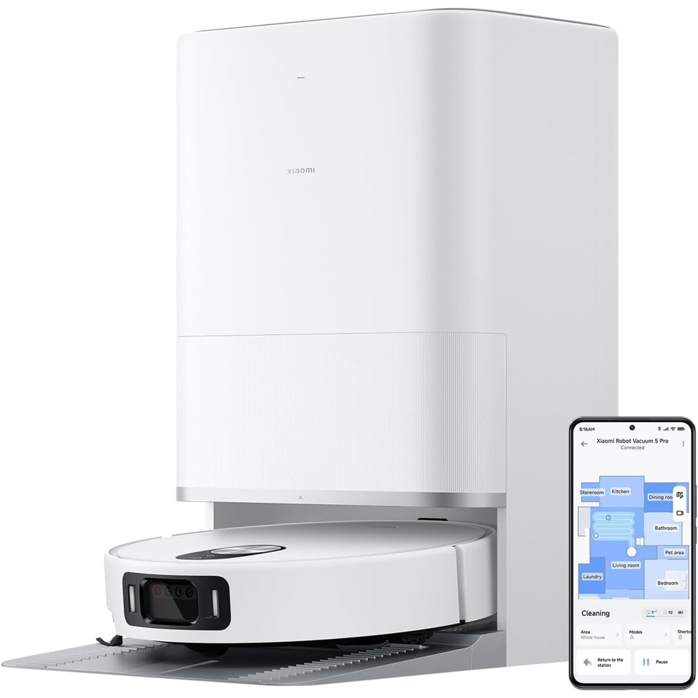
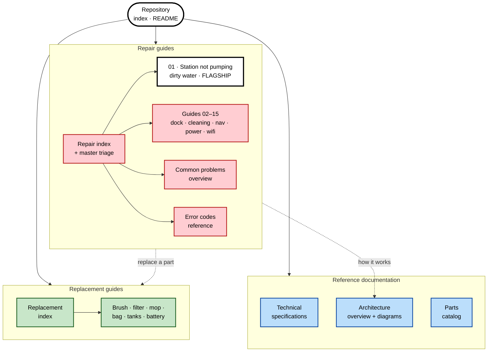
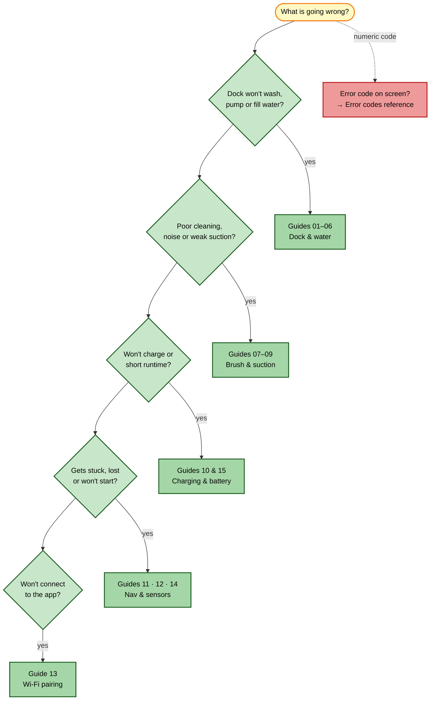

# Xiaomi Robot Vacuum 5 Pro — Technical & Repair Knowledge Base

> Complete, source-verified documentation, troubleshooting and part-replacement guides for the **Xiaomi Robot Vacuum 5 Pro** and its **Omni Station** dock.
> Robot model **OV21GL** (global) / **BHR07WFEU** (EU) · Dock **OV21-JZEU** · Launched September 2025 · App: **Xiaomi Home**.

*Xiaomi Robot Vacuum 5 Pro and Omni Station. Image: [robocleaners.com](https://www.robocleaners.com/en/xiaomi-robot-vacuum-5-pro-eu.html).*

---

## At a glance

| | |
|---|---|
| **Suction** | 20,000 Pa (Silent / Standard / Strong / Turbo) |
| **Navigation** | Retractable dToF LiDAR + LDS + gyroscope |
| **Obstacle avoidance** | Triple-camera 3D system (RGB 5 MP + 2× IR + IR dot projector), 200+ objects / 47 dirt types |
| **Mopping** | Dual rotating microfiber pads, auto-lift 15 mm on carpet |
| **Battery / runtime** | 5,200 mAh (14.4 V) · up to 140 min · charge ≤ 6 h |
| **Dock** | Auto-empty (2.5 L bag), 4 L clean + 3.8 L dirty water, 80 °C hot wash, hot-air dry |
| **Connectivity** | Wi-Fi **2.4 GHz only** (802.11 b/g/n/ax), Bluetooth 5.2, Alexa / Google |

> [!WARNING]
> **Golden rule — water only.** Never add detergent, vinegar, bleach or any cleaning agent to the clean-water tank. It corrodes and seizes the dock's pump and is the **#1 cause of permanent dock failure**.

---

## How this repository is organized

---

## "I have a problem" — quick triage

---

## Reference documentation

| Document | What's inside |
|---|---|
| [Technical specifications](docs/technical-specifications.md) | Full spec sheet — robot + Omni Station, sensors, power, consumables, box contents, model disambiguation |
| [Architecture overview](docs/architecture-overview.md) | Subsystem block diagrams, clean/dirty **water circuits**, full dock-cycle sequence, robot state machine |
| [Parts catalog](docs/parts-catalog.md) | Every part: type, interval, price, official vs third-party, where to buy, service-only parts |

## Repair guides

Start at the **[Repair guides index](repair-guides/README.md)** for the master triage. Companion references: **[Common problems overview](repair-guides/common-problems-overview.md)** · **[Error codes reference](repair-guides/error-codes-reference.md)**.

| # | Problem | Category | Difficulty |
|---|---------|----------|------------|
| **01** | **[Station does not pump dirty water](repair-guides/01-station-not-pumping-dirty-water.md)** ⭐ *flagship, fully illustrated* | Dock / Water | Easy → Hard |
| 02 | [Dirty-water tank false level (false "full")](repair-guides/02-dirty-water-tank-false-level.md) | Dock / Water | Easy |
| 03 | [No mop-wash water output at the dock](repair-guides/03-no-mop-wash-water-output.md) | Dock / Water | Easy → Medium |
| 04 | [Mop not wetting the floor](repair-guides/04-mop-not-wetting-floor.md) | Dock / Water | Easy → Medium |
| 05 | [Self-empty (auto dust collection) not working](repair-guides/05-self-empty-not-working.md) | Dock | Easy → Hard |
| 06 | [Water leaking from the dock](repair-guides/06-water-leak-from-dock.md) | Dock / Water | Medium |
| 07 | [Main brush tangled / Error 5](repair-guides/07-main-brush-tangle.md) | Cleaning | Easy |
| 08 | [Side brush obstruction / Error 6](repair-guides/08-side-brush-obstruction.md) | Cleaning | Easy |
| 09 | [Suction loss / Errors 9, 10, 18](repair-guides/09-suction-loss.md) | Cleaning | Easy → Hard |
| 10 | [Charging failure / Errors 13, 19, 22](repair-guides/10-charging-failure.md) | Power | Easy |
| 11 | [Navigation lost / low-clearance trouble](repair-guides/11-navigation-lost-low-clearance.md) | Navigation | Easy |
| 12 | [Carpet "ghost" map issues](repair-guides/12-carpet-map-ghost.md) | Navigation | Easy |
| 13 | [Wi-Fi / app pairing failure](repair-guides/13-wifi-pairing-failure.md) | Connectivity | Easy |
| 14 | [Dirty sensor errors / Errors 1, 2, 4, 15](repair-guides/14-sensors-dirty-errors.md) | Navigation | Easy |
| 15 | [Battery degradation / Errors 12, 14](repair-guides/15-battery-degradation.md) | Power | Hard |

## Replacement guides

Start at the **[Replacement guides index](replacement-guides/README.md)**.

| Part | Type | Interval |
|------|------|----------|
| [Main brush](replacement-guides/main-brush-replacement.md) | Consumable | 3–6 months |
| [Side brush](replacement-guides/side-brush-replacement.md) | Consumable | 3–6 months |
| [HEPA filter (E11)](replacement-guides/hepa-filter-replacement.md) | Consumable | 3–6 months |
| [Mop pads](replacement-guides/mop-pads-replacement.md) | Consumable | 1–3 months |
| [Dust bag (2.5 L)](replacement-guides/dust-bag-replacement.md) | Consumable | ~75 days |
| [Water tanks & sealing ring](replacement-guides/water-tanks-and-sealing-ring.md) | Spare / wear item | As needed |
| [Battery](replacement-guides/battery-replacement.md) | Spare | When degraded |

---

## Before you open anything — safety

> [!WARNING]
> - **Unplug the dock from mains** before any internal access — water and mains electricity are present together.
> - **Power off the robot** (main switch) before removing brushes, the battery, or sensors.
> - Opening the dock body or robot chassis **may void your warranty** — try the easy fixes first.
> - **Never reinstall a wet HEPA filter** — air-dry it 24 h.
> - **Water only** in the clean-water tank (see golden rule above).
> - Use **genuine batteries** only; recycle Li-ion packs at an approved point.

---

## About this knowledge base

This is an **independent, community-style** documentation and repair reference, not an official Xiaomi publication. Specifications were cross-checked against the Xiaomi global product page, the Xiaomi support knowledge base, professional reviews (Notebookcheck, Mighty Gadget, Tech Advisor), retailer spec sheets and user reports; each document lists its own sources. Where figures varied between regions or sources (e.g. dirty-water tank **3.8 L** vs rounded **4 L**, official **70 dB** vs measured **38–44 dB**), the discrepancy is noted in the relevant document.

Diagrams follow the workspace Mermaid conventions (shared `global-mermaid-diagrams` skill): a consistent colour palette, shape vocabulary and labelled edges. Illustrative images are local copies under [`assets/`](assets/) or hotlinked with their source credited in the caption.

**Primary sources:** [Xiaomi Global — product specs](https://www.mi.com/global/product/xiaomi-robot-vacuum-5-pro/specs/) · [Xiaomi support FAQ KA-617911 (dirty-water pump)](https://www.mi.com/global/support/faq/details/KA-617911/) · [Notebookcheck review](https://www.notebookcheck.net/Good-vacuuming-robot-with-minor-issues-Xiaomi-Robot-Vacuum-5-Pro-review.1208850.0.html) · [Mighty Gadget review](https://mightygadget.com/xiaomi-robot-vacuum-5-review/) · [Gizmochina launch](https://www.gizmochina.com/2025/09/26/xiaomi-robot-vacuum-5-pro-launched-globally/).
