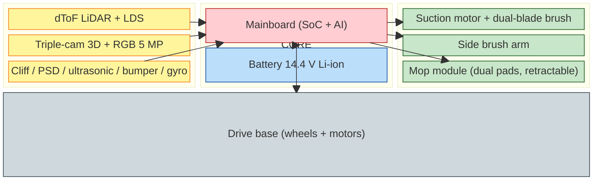
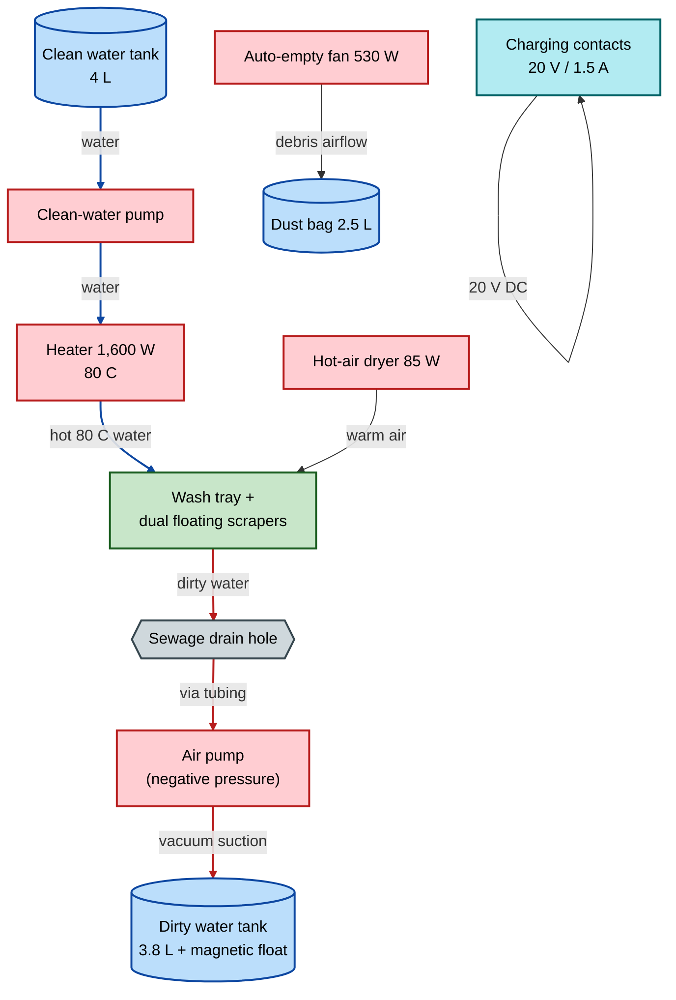
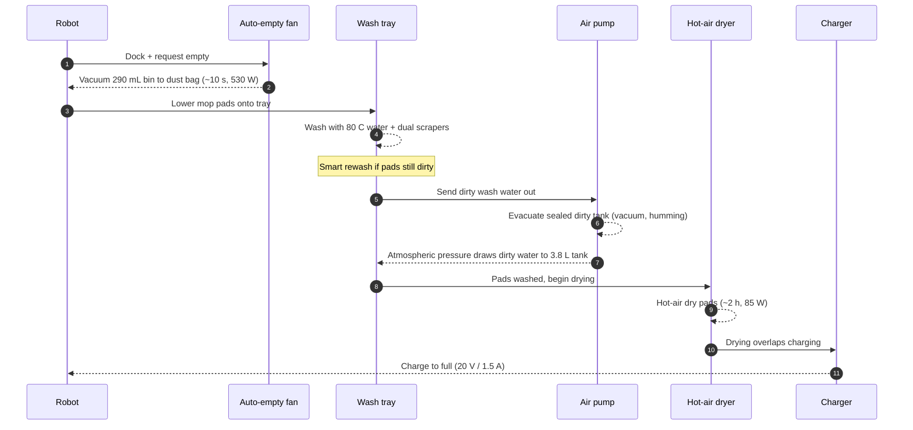
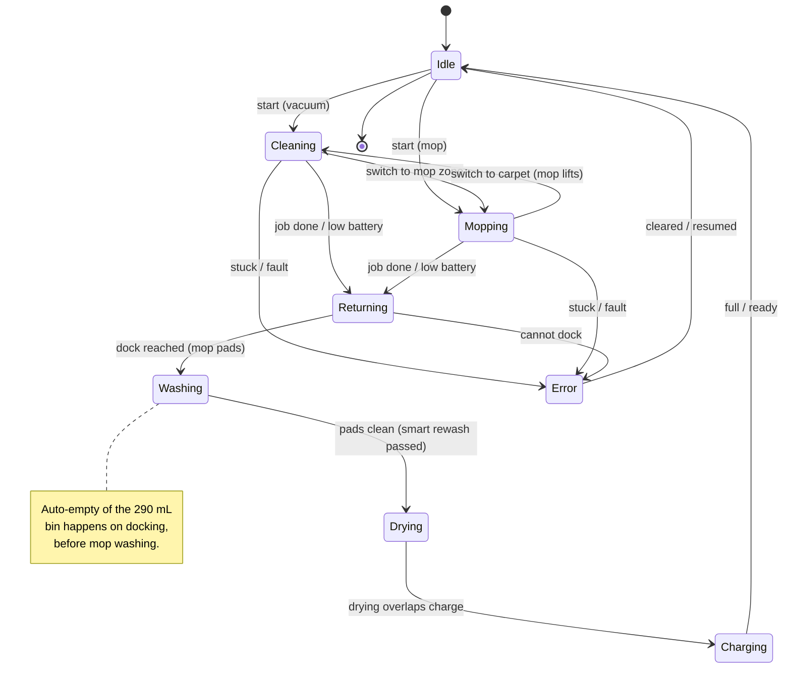

# Xiaomi Robot Vacuum 5 Pro — Architecture Overview

[← Back to repository index](../README.md)

This document describes the system architecture of the **Xiaomi Robot Vacuum 5 Pro** and its **Omni Station** dock (model OV21-JZEU): the robot's subsystems, the dock's subsystems, the clean- and dirty-water circuits, the full automated dock cycle, and the robot's operating states. For exact numbers (suction, capacities, power, model codes), see [technical-specifications.md](./technical-specifications.md). For a known dirty-water transfer fault, see the repair guide [01-station-not-pumping-dirty-water.md](../repair-guides/01-station-not-pumping-dirty-water.md).

*Xiaomi Robot Vacuum 5 Pro and Omni Station. Source: [retailer product image](https://cdn.webshopapp.com/shops/210536/files/485685166/1652x1652x2/xiaomi-xiaomi-robot-vacuum-5-pro-eu.jpg).*

---

## 1. Robot subsystems

The robot is organized around a central mainboard that arbitrates between the drive base, the suction/brush cleaning head, the retractable mop module, the navigation/sensor suite, and the battery.

- **Mainboard:** the central SoC runs navigation, the obstacle-avoidance AI (200+ object types, 47 dirt types), and motor control; it sequences every other subsystem.
- **Navigation & sensors:** the retractable dToF LiDAR + LDS + gyroscope build the map; the triple-camera binocular 3D system (5 MP RGB + 2× IR stereo + IR dot projector) handles obstacle avoidance and remote home-view. Cliff, PSD, ultrasonic carpet, and bumper sensors guard edges and surfaces.
- **Cleaning:** a suction motor (up to 20,000 Pa) paired with the dual-blade rubber brush and an extendable side brush; the retractable mop module carries two rotating pads that lift 15 mm over carpet.
- **Battery:** 14.4 V Li-ion (5,200 mAh nominal) powering the whole robot, recharged via the dock's 20 V contacts.
- **Drive base:** the wheel motors that move and turn the robot and climb up to 20 mm.

---

## 2. Omni Station (dock) subsystems

The dock performs four jobs — auto-empty, mop wash, dirty-water evacuation, and hot-air dry + charge — using the blocks below.

- **Clean-water tank (4 L) → pump → heater:** the pump draws plain water (water only — detergent damages the pump) and the 1,600 W element heats it to 80 °C for washing.
- **Wash tray + dual scrapers:** the asynchronous floating dual scrapers physically scrub the rotating mop pads over the detachable tray while hot water flows.
- **Sewage drain → air pump → dirty tank:** see [§3](#3-water-circuits) — a negative-pressure air pump evacuates the sealed dirty tank so atmospheric pressure pushes dirty wash water in.
- **Dust bag (2.5 L) + auto-empty fan (530 W):** the fan vacuums the robot's 290 mL bin into the bag in ~10 s.
- **Hot-air dryer (85 W):** ~2 h of warm-air drying prevents mold on the pads, combined with charging.
- **Charging contacts:** deliver 20 V DC at 1.5 A to the robot.

---

## 3. Water circuits

Two physically separate paths. The **clean** path is positively pumped and heated; the **dirty** path is *not* pumped as a liquid — a negative-pressure **air** pump evacuates the sealed dirty tank, and atmospheric pressure pushes the dirty wash water in from the tray. This is the key distinction when diagnosing a station that will not transfer dirty water (see [repair guide 01](../repair-guides/01-station-not-pumping-dirty-water.md)).

```mermaid
flowchart LR
    classDef data     fill:#bbdefb,stroke:#0d47a1,stroke-width:2px,color:#000
    classDef compute  fill:#ffcdd2,stroke:#b71c1c,stroke-width:2px,color:#000
    classDef control  fill:#c8e6c9,stroke:#1b5e20,stroke-width:2px,color:#000
    classDef infra    fill:#cfd8dc,stroke:#37474f,stroke-width:2px,color:#000
    classDef output   fill:#b2ebf2,stroke:#006064,stroke-width:2px,color:#000

    CLEAN[("Clean water tank<br/>4 L")]:::data
    CPUMP["Clean-water pump"]:::compute
    HEAT["Heater 1,600 W"]:::compute
    TRAY["Wash tray"]:::control
    MOP["Robot mop pads"]:::output
    DRAIN{{"Sewage drain hole"}}:::infra
    TUBE["Internal tubing"]:::infra
    AIR["Air pump<br/>(negative pressure)"]:::compute
    DIRTY[("Dirty water tank<br/>3.8 L, sealed + float")]:::data

    CLEAN -->|cold water| CPUMP
    CPUMP -->|pressurized water| HEAT
    HEAT -->|hot 80 C water| TRAY
    TRAY -->|wash + wet pads| MOP
    MOP -->|run-off dirty water| TRAY
    TRAY -->|dirty water out| DRAIN
    DRAIN -->|gravity/flow| TUBE
    AIR -->|evacuates air = vacuum| DIRTY
    TUBE -->|pushed by atmospheric pressure| DIRTY

    linkStyle 0,1,2,3 stroke:#0d47a1,stroke-width:3px
    linkStyle 4,5,6,8 stroke:#b71c1c,stroke-width:3px
    linkStyle 7 stroke:#4a148c,stroke-width:2px
```

> **Note:** A humming sound during the dirty-water cycle is the **air pump** creating vacuum — this is normal, not a fault. A sealed magnetic float inside the dirty tank reports "full" and also detects when the tank has been removed.

> **Warning:** Use **water only**. Detergents or cleaning agents in the clean-water tank damage the dock's pump. See [Xiaomi FAQ KA-617911](https://www.mi.com/global/support/faq/details/KA-617911/).

---

## 4. Full dock cycle

When the robot returns, the station runs the following sequence. A *smart rewash* step re-washes the pads if they are still detected as dirty before drying begins.

---

## 5. Robot operating states

- **Idle / Docked:** parked on the dock, charged, awaiting a command.
- **Cleaning:** vacuuming with suction + brushes; ultrasonic sensor raises the mop over carpet.
- **Mopping:** mop pads engaged on hard floors.
- **Returning:** navigating back to the Omni Station (job complete or low battery).
- **Washing:** mop pads washed at 80 °C over the tray, with smart rewash if still dirty.
- **Drying:** ~2 h hot-air dry of the pads to prevent odor and mold.
- **Charging:** 20 V / 1.5 A recharge, overlapping the drying stage.
- **Error:** stuck, cliff/bumper fault, or docking failure; clears on resume or user intervention.

---

## 6. Sources

- [Xiaomi — Robot Vacuum 5 Pro official specifications](https://www.mi.com/global/product/xiaomi-robot-vacuum-5-pro/specs/)
- [Xiaomi support — care / water-only FAQ (KA-617911)](https://www.mi.com/global/support/faq/details/KA-617911/)
- [NotebookCheck — Xiaomi Robot Vacuum 5 Pro review](https://www.notebookcheck.net/Good-vacuuming-robot-with-minor-issues-Xiaomi-Robot-Vacuum-5-Pro-review.1208850.0.html)
- [MightyGadget — Xiaomi Robot Vacuum 5 review](https://mightygadget.com/xiaomi-robot-vacuum-5-review/)
- [Gizmochina — global launch coverage](https://www.gizmochina.com/2025/09/26/xiaomi-robot-vacuum-5-pro-launched-globally/)
- [SpecsVersus — Robot Vacuum 5 Pro](https://specsversus.com/items/xiaomi/robot-vacuum-5-pro)
- Related: [technical-specifications.md](./technical-specifications.md) · [repair-guides/01-station-not-pumping-dirty-water.md](../repair-guides/01-station-not-pumping-dirty-water.md)
