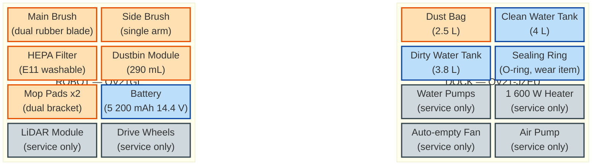

# Parts Catalog — Xiaomi Robot Vacuum 5 Pro (OV21GL / Omni Station OV21-JZEU)

[← Repository index](../README.md)

This catalog lists every replaceable and serviceable part for the **Xiaomi Robot Vacuum 5 Pro** robot body (model OV21GL) and its **Omni Station** dock (model OV21-JZEU). Parts are classified as **consumable** (user-replaceable on a regular schedule), **spare** (user-replaceable on failure), or **service-only** (internal components that require Xiaomi authorized service).

---

## Exploded Overview

> **Legend:** Orange = consumable (regular schedule) · Blue = spare (replace on failure/wear) · Grey = service-only (contact Xiaomi support)

---

## Parts Table

| Part | Type | Replacement Interval | Approx. Price (USD) | Official vs. Third-Party | Replacement Guide | Related Repair Guide |
|------|------|----------------------|---------------------|--------------------------|-------------------|----------------------|
| **Main Brush** (dual rubber anti-tangle blade + cover) | Consumable | 3–6 months | $12–18 | Both available | [main-brush-replacement.md](../replacement-guides/main-brush-replacement.md) | [07-main-brush-tangle.md](../repair-guides/07-main-brush-tangle.md) |
| **Side Brush** (single extendable anti-tangle arm) | Consumable | 3–6 months | $6–10 | Both available | [side-brush-replacement.md](../replacement-guides/side-brush-replacement.md) | [07-main-brush-tangle.md](../repair-guides/07-main-brush-tangle.md) |
| **HEPA Filter** (E11 washable, 290 mL dustbin module) | Consumable | 3–6 months (wash monthly) | $8–14 | Both available | [hepa-filter-replacement.md](../replacement-guides/hepa-filter-replacement.md) | — |
| **Mop Pads x2** (round microfiber, dual mop bracket) | Consumable | 1–3 months | $10–16 | Both available | [mop-pads-replacement.md](../replacement-guides/mop-pads-replacement.md) | — |
| **Dust Bag** (2.5 L, dock auto-empty) | Consumable | ~75 days | $10–18 (multi-pack) | Both available | [dust-bag-replacement.md](../replacement-guides/dust-bag-replacement.md) | — |
| **Battery** (5 200 mAh nominal / 4 800 mAh rated, 14.4 V Li-ion) | Spare | When capacity degrades significantly | $40–70 | Genuine strongly recommended | [battery-replacement.md](../replacement-guides/battery-replacement.md) | [10-charging-failure.md](../repair-guides/10-charging-failure.md) |
| **Clean Water Tank** (4 L, dock) | Spare | On crack/leak | $20–35 | Official preferred | [water-tanks-and-sealing-ring.md](../replacement-guides/water-tanks-and-sealing-ring.md) | — |
| **Dirty Water Tank** (3.8 L with lid, dock) | Spare | On crack/leak | $20–35 | Official preferred | [water-tanks-and-sealing-ring.md](../replacement-guides/water-tanks-and-sealing-ring.md) | [02-dirty-water-tank-false-level.md](../repair-guides/02-dirty-water-tank-false-level.md) |
| **Sealing Ring / O-ring** (dirty water tank lid) | Spare / Wear Item | On deformation, cracking, or pumping failure | $3–8 | Third-party acceptable | [water-tanks-and-sealing-ring.md](../replacement-guides/water-tanks-and-sealing-ring.md) | — |
| **dToF LiDAR Module** (retractable) | Service-only | On malfunction | — | Official only | — | Contact Xiaomi Support |
| **Mainboard** | Service-only | On failure | — | Official only | — | Contact Xiaomi Support |
| **Drive Wheels** (x2) | Service-only | On failure | — | Official only | — | Contact Xiaomi Support |
| **Auto-empty Fan Motor** (dock) | Service-only | On failure | — | Official only | — | Contact Xiaomi Support |
| **Dock Clean-Water Pump** (dock) | Service-only | On failure | — | Official only | — | Contact Xiaomi Support |
| **Dock Sewage Air Pump** (dock) | Service-only | On failure | — | Official only | — | Contact Xiaomi Support |
| **1 600 W Heater** (dock mop drying) | Service-only | On failure | — | Official only | — | Contact Xiaomi Support |

---

## Where to Buy

### Official Xiaomi Accessories

Purchase genuine accessories through the official Xiaomi global accessories store:

- **mi.com/global** → Accessories → Robot Vacuum → Xiaomi Robot Vacuum 5 Pro  
  URL: <https://www.mi.com/global/product/xiaomi-robot-vacuum-5-pro/specs/>

Genuine parts guarantee fit, certified materials, and preserve the warranty. They are identifiable by the Xiaomi holographic authenticity label.

### Verified Third-Party Kits

Third-party accessory kits are widely available and typically contain a main brush, side brushes, HEPA filter(s), mop pads, and dust bags in a single bundle at a significant saving compared to individual genuine parts.

| ASIN | Typical Contents | Approx. Price |
|------|-----------------|---------------|
| [B0FXRB7TZT](https://www.amazon.com/dp/B0FXRB7TZT) | Main brush + side brush + HEPA filters + mop pads + dust bags | ~$20–25 |
| [B0GTQ91823](https://www.amazon.com/dp/B0GTQ91823) | Main brush + side brush + HEPA filters + mop pads + dust bags | ~$25–30 |
| [B0FXRDJM5Z](https://www.amazon.com/dp/B0FXRDJM5Z) | Main brush + side brush + HEPA filters + mop pads + dust bags | ~$25–35 |

**Before purchasing any third-party accessory, always verify the product listing explicitly states compatibility with the "Xiaomi Robot Vacuum 5", "Robot Vacuum 5 Pro", or model number "OV21GL".** Third-party parts may fit slightly less precisely than genuine Xiaomi accessories.

### Counterfeit Warning

Counterfeit accessories — particularly HEPA filters and batteries — are common on secondary marketplaces. Counterfeit filters do not achieve E11 filtration efficiency and may release fine dust. Counterfeit batteries are a fire and safety hazard. Only purchase from reputable sellers with verified compatibility claims and clear return policies.

---

## Service-Only Parts

The following internal components are not designed for user replacement. Attempting to disassemble these parts beyond the consumable/spare layer may void the warranty and can cause permanent damage to sensitive electronics.

| Component | Location | Failure Symptoms |
|-----------|----------|-----------------|
| dToF LiDAR Module (retractable) | Robot top cover | Robot navigates erratically, map errors, LiDAR not spinning |
| Mainboard | Robot underbelly (beneath battery) | Complete failure, no power, persistent app errors |
| Drive Wheels | Robot sides | Robot does not move, uneven movement, wheel grinding |
| Auto-empty Fan Motor | Dock interior | Dock does not empty dustbin, no suction sound |
| Clean-Water Pump | Dock interior | Dock does not dispense clean water to mop tanks |
| Sewage Air Pump | Dock interior | Dock does not drain dirty water from robot — see [repair-guides/01-station-not-pumping-dirty-water.md](../repair-guides/01-station-not-pumping-dirty-water.md) |
| 1 600 W Heater | Dock interior | Mop pads not dried after cleaning cycle |

**For any of the above, contact Xiaomi customer support** or an authorized service center. Provide model number OV21GL (robot) or OV21-JZEU (dock), serial number (on the underbelly label), and a description of the failure symptom.

- Xiaomi Global Support: <https://www.mi.com/global/service/support>

---

## Sources

- Xiaomi Robot Vacuum 5 Pro official specifications: <https://www.mi.com/global/product/xiaomi-robot-vacuum-5-pro/specs/>
- Third-party accessory kit example: <https://www.amazon.com/dp/B0FXRB7TZT>
