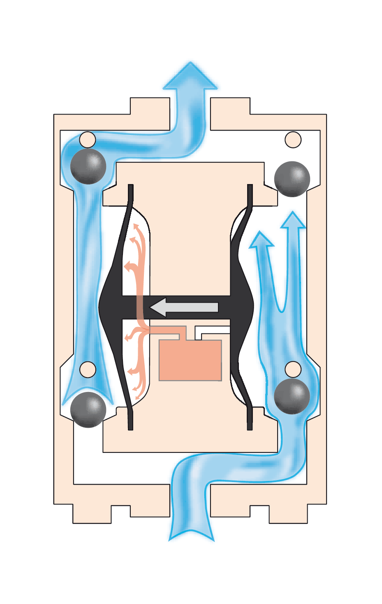
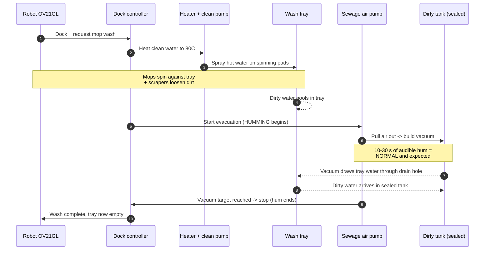
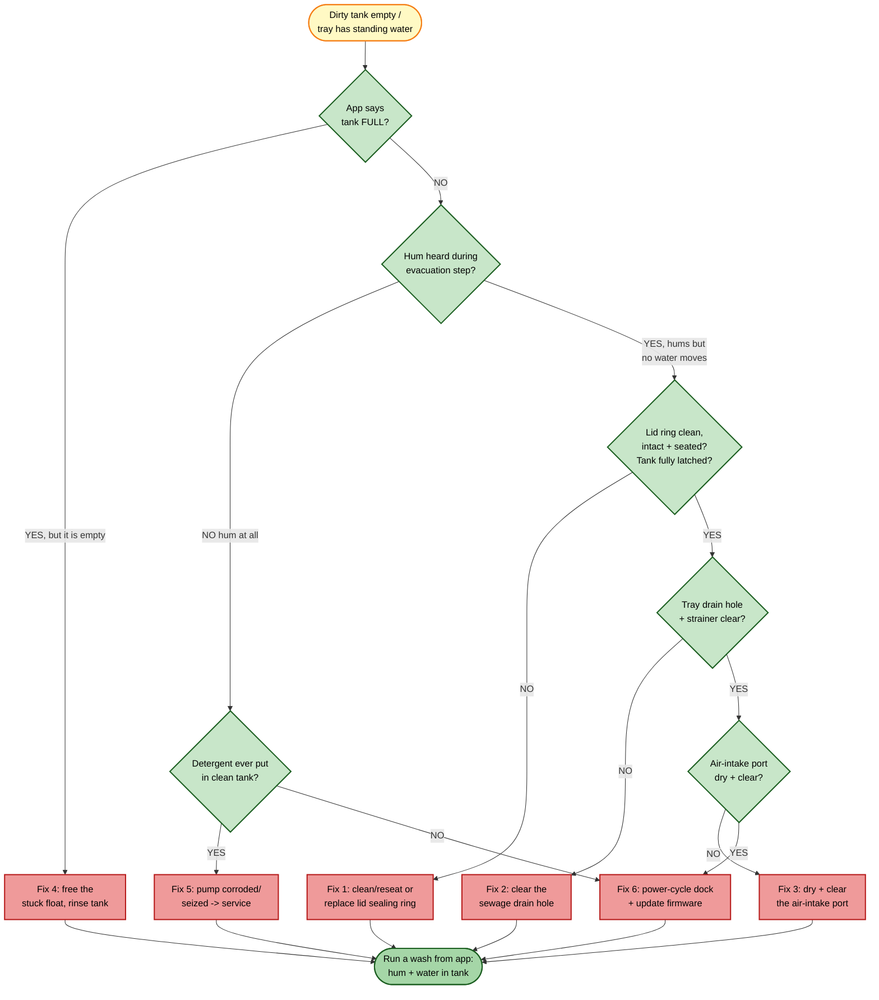
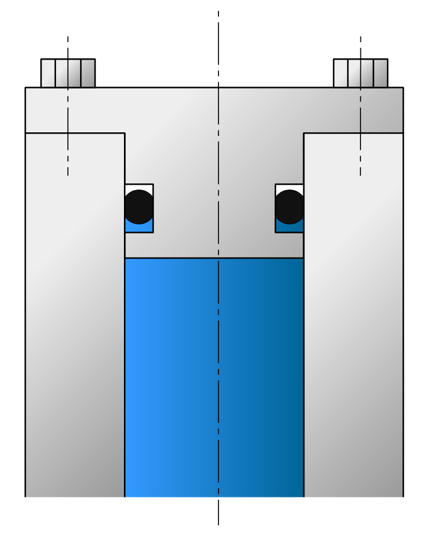
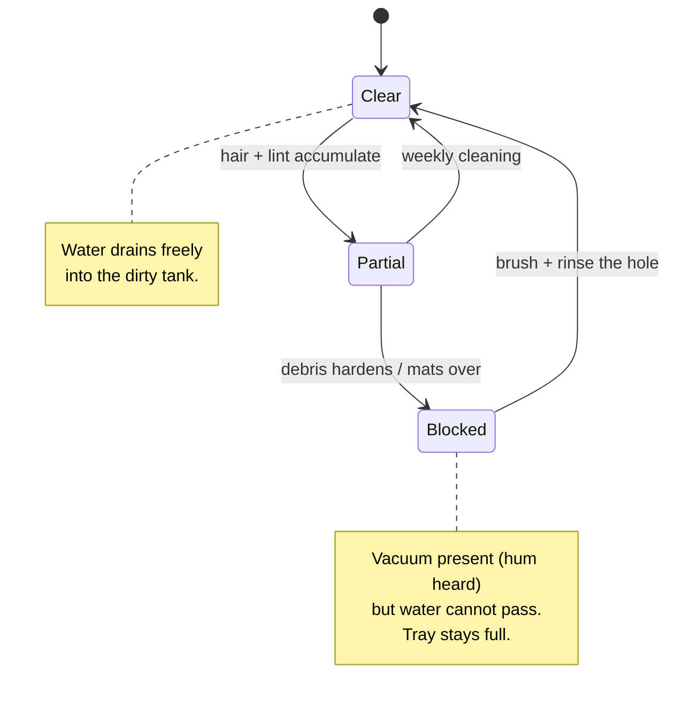
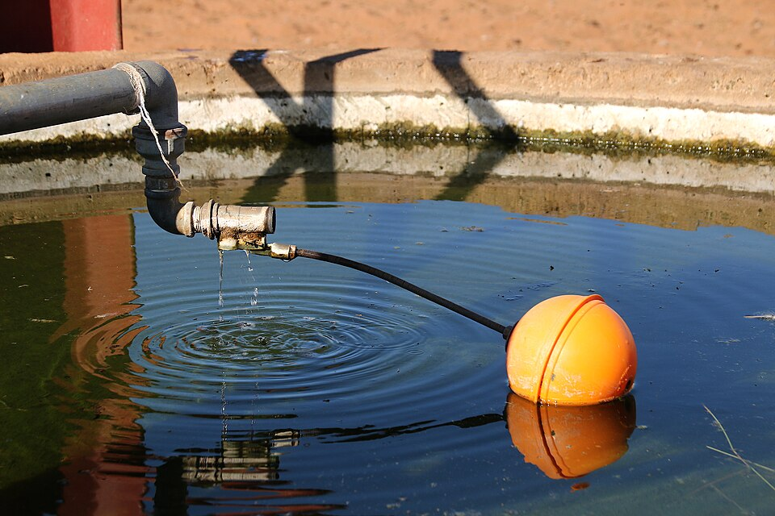
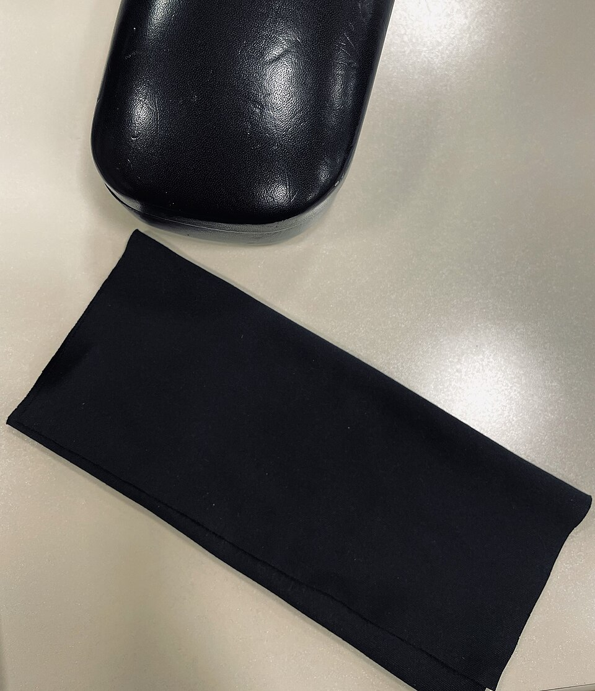

# Omni Station Does NOT Pump Dirty Water

[← Repair guides index](README.md) · [← Repository index](../README.md)

> **The single most useful diagnostic fact:** during the mop-wash cycle the dock should make a clear **humming / suction sound** for 10–30 seconds while it pulls the dirty water from the wash tray into the sealed dirty-water tank. **No hum = the air pump isn't running. A hum but no water moving = a vacuum leak or a clog.** Keep this in mind for every step below.

---

**Applies to:** Xiaomi Robot Vacuum 5 Pro · robot **OV21GL** · Omni Station dock **OV21-JZEU**

| Badge | Value |
|-------|-------|
| **Difficulty** | Easy → Hard (most causes are Easy/Medium; a seized pump is Hard) |
| **Time** | 10 – 45 min |
| **Tools** | Nitrile gloves · soft brush (old toothbrush) · pipe cleaner / cotton bud · clean microfiber cloth · small bowl of warm water · *(optional)* replacement lid sealing ring |
| **Consumables** | Clean tap water only — **never** detergent |
| **Risk level** | Low for external cleaning · **High if you open the dock body** (mains + water) |

*Xiaomi Robot Vacuum 5 Pro and its Omni Station (model OV21-JZEU). The two removable tanks sit behind the top lid: the larger 4 L clean-water tank and the sealed 3.8 L dirty-water tank. Source: [retailer product image](https://cdn.webshopapp.com/shops/210536/files/485685171/1652x1652x2/xiaomi-xiaomi-robot-vacuum-5-pro-eu.jpg).*

---

## 1. Symptoms

You are in the right guide if you observe one or more of these:

- After a mop-wash cycle, the **dirty-water tank stays empty** (or barely fills) even though the mops were clearly dirty.
- **Standing water sits in the wash tray** at the bottom of the dock where the mops park — it never drains away.
- The robot finishes "mop washing" suspiciously fast, or the cycle seems to skip the drain step.
- You **do not hear the usual humming/suction sound** at the end of the wash cycle. *(Or you hear it, but the water still doesn't move — different branch, see the decision tree.)*
- The dock smells stale because dirty water is left stagnating in the tray.
- The mops come out only partially clean / still soapy-grey, because the wash water is never evacuated and refreshed.

**What the Xiaomi Home app may say:**

- *"Dirty water tank is full"* — even though you just emptied it (a stuck float misreporting level).
- *"Please install the dirty water tank"* / *"Check the sewage tank"* — the lid/float magnet is not detected (seating or seal problem).
- A generic *"Station error"* or *"Cleaning interrupted"* notification.
- No alert at all, yet the tray is wet — the dock thinks it pumped successfully but a leak/clog stopped the water.

---

## 2. How it SHOULD work

The Omni Station does **not** use a liquid pump to move dirty water. It uses a **negative-pressure (vacuum) air pump**. The pump sucks air out of the **sealed** dirty-water tank; the resulting vacuum lets normal atmospheric pressure push the dirty water out of the wash tray, through a drain hole, along internal tubing, and up into the tank. This is why **a good airtight seal is everything** — and why the most common failure is a bad O-ring, not a bad pump.

### 2.1 The dirty-water circuit

```mermaid
flowchart LR
    HEAT[Heater 1600W<br/>warms water to 80C]:::compute
    CLEAN[(Clean tank<br/>4 L water only)]:::data
    SPRAY[Spray jets onto<br/>spinning mop pads]:::input
    TRAY[Wash tray<br/>textured plate + scrapers]:::primary
    HOLE{{Sewage drain hole<br/>+ strainer}}:::infra
    TUBE[Internal sewage<br/>tubing]:::infra
    PUMP[Sewage AIR pump<br/>creates vacuum]:::compute
    DIRTY[(Dirty tank 3.8 L<br/>SEALED + float)]:::output
    AIR{{Air-intake port}}:::infra

    CLEAN -->|pumped| HEAT
    HEAT -->|80C clean water| SPRAY
    SPRAY -->|wets + rinses pads| TRAY
    TRAY -->|dirty water pools| HOLE
    PUMP -.->|sucks air out, makes vacuum| DIRTY
    AIR -.->|pump pulls air| PUMP
    HOLE -->|atmospheric pressure pushes water| TUBE
    TUBE -->|into sealed tank| DIRTY

    classDef primary  fill:#ffffff,stroke:#000000,stroke-width:3px,color:#000
    classDef input    fill:#ffe0b2,stroke:#e65100,stroke-width:2px,color:#000
    classDef output   fill:#b2ebf2,stroke:#006064,stroke-width:2px,color:#000
    classDef data     fill:#bbdefb,stroke:#0d47a1,stroke-width:2px,color:#000
    classDef compute  fill:#ffcdd2,stroke:#b71c1c,stroke-width:2px,color:#000
    classDef infra    fill:#cfd8dc,stroke:#37474f,stroke-width:2px,color:#000
    linkStyle 3,4 stroke:#b71c1c,stroke-width:2px
    linkStyle 5,6 stroke:#006064,stroke-width:2px
```

> **Note** — The dashed red edges are **air being pulled out** of the sealed tank (the vacuum). The cyan edges are **dirty water being pushed in** by atmospheric pressure. If the tank lid seal leaks, the pump can run all day and never build enough vacuum to move the water.

The vacuum is produced by a small **diaphragm air pump**. Understanding it helps explain why a leak or detergent damage kills it:

*A diaphragm pump: a flexing membrane with one-way valves moves air on each stroke. In the dock this pulls air out of the sealed dirty tank to create suction. The membrane and valves are easily damaged by corrosive liquids — which is why detergent must never reach the water path. Source: [Wikimedia Commons — "Diaphragm pump animated.gif"](https://commons.wikimedia.org/wiki/File:Diaphragm_pump_animated.gif).*

### 2.2 The normal wash + evacuation cycle (listen for the hum)

> **Tip** — Do one calibration run while everything is healthy: start a mop wash from the app, crouch next to the dock, and **memorize the sound and timing of the hum**. Once you know what "good" sounds like, every future diagnosis takes seconds.

---

## 3. Safety first

> **⚠ WARNING**
> - **Unplug the dock from mains power** before touching anything beyond the two removable tanks and the snap-out wash tray. The dock contains a **1,600 W heater** and mains-voltage wiring next to water.
> - **Water + electricity do not mix.** Dry your hands and the work area. Never pour water near the dock's electrical base.
> - **Opening the dock body (unscrewing the chassis to reach the pump) will void your warranty** and exposes mains wiring. Do not open it while the unit is plugged in, and prefer authorized service for internal repairs.
> - Wear **nitrile gloves** — the dirty water and tray contain bacteria, hair, and grime.
> - The clean water can be sprayed at **80 °C**. Never start a wash cycle with your hand in the tray.

All steps in §5.1 through §5.4 and §5.6 are **external and safe** (tanks, tray, float, firmware). Only §5.5 (seized pump) involves the sealed dock body — that one is a contact-support / specialist task.

---

## 4. Troubleshooting decision tree (start here)

Work top to bottom. Each green check routes you to the matching fix section. The ordering is **easiest and most common first**.

> **Note** — The two big branches are: **(A) no hum at all** → pump isn't being told to run, or is dead (firmware, or detergent damage); **(B) hums but no water** → mechanical: a vacuum leak (seal), a clog (drain hole), or a flooded air line. Most real-world cases land on **Fix 1 (seal)**.

---

## 5. The fixes

> **🥇 GOLDEN RULE — read before doing anything else:**
> **NEVER add detergent, cleaning solution, vinegar, bleach, descaler, soap, or "robot mop fluid" to the CLEAN water tank. Water only.** Cleaning agents foam, leave residue that clogs the drain path and float, and — most importantly — **corrode and seize the air pump**, which is the #1 cause of *permanent* failure. If a fragrance/cleaner is needed, only use the dedicated detergent slot if your model has one; otherwise nothing but tap water goes in.

---

### Fix 1 — Dirty-water tank lid sealing ring (O-ring / gasket) — START HERE

**Why this is the most common cause.** The dirty tank must be **airtight** for the vacuum to form. A single hair across the lid gasket, a twisted or stretched O-ring, grime on the sealing face, or a tank that isn't fully latched is enough to break the seal. The pump then runs (**you hear humming**) but can't build vacuum, so little or no water is drawn up. This is also the cheapest and fastest thing to fix.

*How an O-ring seals: it is compressed in its groove to block any air path. A torn, twisted, dried-out, or dirty ring leaves a leak gap — exactly what defeats the dock's vacuum. Source: [Wikimedia Commons — "O-ring static seal usage example.png"](https://commons.wikimedia.org/wiki/File:O-ring_static_seal_usage_example.png).*

**Steps**

1. Open the dock's top lid and **lift out the dirty-water tank** (the smaller, sealed one — it has the lid with the rubber ring and the float).
2. Empty and rinse the tank with **plain warm water**. Tip the water out fully.
3. Locate the **rubber sealing ring** around the tank lid / the mating face on the tank opening. Run a fingertip around its whole circumference.
4. Look for: **hair or fibres** lying across it, **grime/limescale** build-up, a section that has **popped out of its groove**, or any **tear, flat spot, or permanent stretch/warp**.
5. **Clean it:** wipe the ring and the sealing face with a damp microfiber cloth; remove every hair. If it has slipped out of its groove, gently press it fully and evenly back in.
6. **Inspect for damage:** if the ring is torn, hardened, cracked, or so stretched it no longer sits flush, it must be **replaced** (see [replacement guide](../replacement-guides/water-tanks-and-sealing-ring.md)). A damaged ring cannot be "cleaned" back to airtight.
7. Refit the lid squarely so the ring seats all the way around — no pinching, no gaps.
8. **Reinstall the tank firmly** until it clicks / fully latches. A half-seated tank leaks at the dock interface even with a perfect ring. Confirm the app no longer shows a "check/install tank" message.

> **Tip** — Quick airtightness sanity check: with the tank closed, the lid should give slight resistance when you try to open it (a tiny "pop"). If the lid lifts with zero resistance, the seal is not engaging.

**✅ Verify:** Start a mop-wash cycle from the Xiaomi Home app. Confirm you hear the **hum** *and* that **dirty water now arrives in the tank** and the tray drains. If it hums but still no water, continue to Fix 2.

---

### Fix 2 — Clogged sewage drain hole / strainer in the wash tray

**Why.** The dirty water leaves the tray through a small **drain hole protected by a strainer**. Hair, lint, and hardened debris mat over it. Even with perfect vacuum, no water can pass a blocked hole — you'll hear the hum but the tray stays full.

**Steps**

1. Unplug the dock (you'll be working in the tray). Remove both tanks for clearance.
2. **Detach the wash tray** — on the Omni Station the tray (the textured plate where the mops park, with its scrapers) lifts/snaps out for cleaning. Lift it free.
3. Find the **drain hole** (the recessed opening, usually at the low point of the tray, covered by a small strainer/grid).
4. Pull out the visible **hair and debris** by hand (gloves on).
5. Work a **soft brush** (old toothbrush) over the strainer, then push a **pipe cleaner or cotton bud** gently into the hole to clear the matted plug. Do **not** use a metal pick that could pierce internal tubing.
6. **Rinse** the tray and hole under running water until water flows straight through the hole freely.
7. While the tray is out, wipe the **floating scrapers** and the textured surface clean (these are also part of how the mops get scrubbed).
8. Dry the tray seating area, refit the tray until it locks, and reinstall the tanks.

**✅ Verify:** Run a wash cycle. The tray should drain within the normal hum window and the dirty tank should fill. If water still won't move, continue to Fix 3.

---

### Fix 3 — Flooded / wet air-intake port

**Why.** On this Omni-Station generation (and the closely related X20 series, where it's a documented design quirk), dirty-water spray can over time creep into the **air line that feeds the vacuum pump**, wetting or flooding the port. A water-blocked air path means the pump can't draw a clean vacuum — you may hear a strained or gurgling hum, and water doesn't transfer.

**Steps**

1. Unplug the dock. Remove both tanks and the wash tray.
2. Locate the **air-intake port** for the sewage system (a small air opening in the tray well / near the dirty-tank dock interface — not the water drain hole). It should be **dry**.
3. If you see standing water or moisture in/around it, **soak it up** with a dry cotton bud or twist of microfiber. Do not blow water deeper in.
4. Gently clear any **residue or film** around the port mouth with a dry cotton bud.
5. Leave the dock **unplugged and open to air for 1–2 hours** so the internal air line can dry, especially if it was visibly flooded.
6. Reassemble tray and tanks once everything is dry.

> **Note** — If the port re-floods every few weeks, that points to a more internal issue (or detergent foaming forcing liquid into the air line — see the Golden Rule). Track it; if it recurs, contact support (§7).

**✅ Verify:** Run a wash cycle and listen for a **clean, steady hum** (not gurgling) with normal water transfer. If still no good and you *do* hear a hum, recheck Fixes 1–2; if there's **no hum at all**, go to Fix 5/6.

---

### Fix 4 — Stuck float in the dirty tank (false "FULL")

**Why.** A **sealed magnetic float** inside the dirty tank reports the water level and whether the tank is present. If detergent residue, grime, or debris **jams the float in the "up/full" position**, the dock believes the tank is already full and **skips pumping entirely** — so the tray never drains. The classic tell is the app saying **"dirty water tank full" right after you emptied it**, and **no hum** (the dock chose not to pump).

*A float rises and falls with the liquid level to signal "full" / "empty". If it sticks high, the controller thinks the tank is full and won't pump. Source: [Wikimedia Commons — "Float switch"](https://commons.wikimedia.org/wiki/File:Float_switch.jpg).*

**Steps**

1. Remove the dirty-water tank and empty it.
2. Locate the **float** inside the tank (a small buoyant piece, often near the lid/inlet, that moves up and down). Don't force or pry it off its post.
3. **Rinse the tank thoroughly** with warm water to flush out detergent film and residue. Swirl water around the float housing.
4. With a fingertip, **gently push the float down and let it rise** several times to free it. It should move smoothly with no stickiness.
5. Wipe any slime off the float and its guide. If residue is heavy (a sign detergent was used), rinse repeatedly — water only.
6. Refit the lid and reinstall the tank until it latches. The app should now read the tank as **present and empty**.

**✅ Verify:** Confirm the app no longer reports "full". Run a wash cycle: the dock should now decide to pump — listen for the **hum** and check the tank fills. If it now hums but water lags, revisit Fix 1. If the false-full persists, see the dedicated guide: [02 — Dirty water tank false level](../repair-guides/02-dirty-water-tank-false-level.md).

---

### Fix 5 — Pump motor damaged / seized (NO hum at all) — HARD

**Why.** If the evacuation step produces **absolutely no humming** and Fixes 4 and 6 don't restore it, the **air pump itself may be seized or burned out**. By far the most common cause is **detergent / vinegar / bleach / cleaning solution having been put in the clean-water tank**, which corrodes the pump's diaphragm and valves until it locks up. There is **no official user-replaceable pump** on this dock; reaching it means opening the sealed body (mains voltage), which voids the warranty.

> **⚠ WARNING** — Do **not** disassemble the dock body yourself unless you are qualified for mains-adjacent water-pump repair. This is a service-center / specialist task.

**Steps (diagnosis only, then escalate)**

1. Confirm the negative: start a wash, listen carefully at the evacuation step — **no hum, no vibration, no suction** at all.
2. Rule out the easy "no hum" causes first: do **Fix 6** (power-cycle + firmware) and **Fix 4** (stuck float makes the dock *skip* pumping). If a hum returns, it was never the pump.
3. Recall your usage: **was any cleaning agent ever added to the clean tank?** If yes, a corroded pump is the likely outcome and confirms the diagnosis.
4. If still dead and silent: **stop**. Note the dock model (**OV21-JZEU**), the symptom, and your troubleshooting steps, and **contact Xiaomi support** (§7). Under warranty this should be a repair/replacement.

**✅ Verify:** Only the service technician can verify a pump repair. After service, run a wash cycle and confirm hum + water transfer.

---

### Fix 6 — Firmware glitch / interrupted cycle (no hum, but pump is fine)

**Why.** A software hiccup or a cycle that was interrupted (power blip, robot lifted off mid-wash, app crash) can leave the dock in a state where it skips evacuation. A clean power-cycle and firmware update resolves this without any hardware work.

**Steps**

1. **Power-cycle the dock:** unplug it from the mains, wait a full **30 seconds**, plug it back in. This resets the dock controller.
2. **Reseat both tanks** (clean and dirty) and the wash tray so all sensors re-detect them.
3. Open **Xiaomi Home** → your vacuum → settings → **firmware/version**, and install any pending **firmware update** for both robot and dock.
4. Re-dock the robot fully and start a fresh mop-wash from the app (don't lift the robot mid-cycle).

**✅ Verify:** Run a wash cycle. The hum should return and the tank fill. If there's still no hum after this and Fix 4, treat it as a hardware pump fault (Fix 5).

---

## 6. Preventive maintenance

Keeping the seal, tray, and float clean prevents almost every case in this guide. The microfiber pads and water path stay healthy only with regular, **water-only** care.

*Microfiber mop pads trap fine dirt; rinse and air-dry them so they don't shed lint into the drain hole. Source: [Wikimedia Commons — "Microfiber towel / cloth"](https://commons.wikimedia.org/wiki/File:Microfiber_cloth.jpg).*

| Task | Frequency | Why it prevents this fault |
|------|-----------|-----------------------------|
| Rinse the dirty-water tank | Every empty / weekly | Stops residue jamming the float (Fix 4) and fouling the seal |
| Clean the wash tray + drain hole / strainer | Weekly | Prevents the hair/lint clog (Fix 2) |
| Inspect + wipe the lid sealing ring | Monthly | Keeps the vacuum airtight (Fix 1) — the #1 cause |
| Wipe floating scrapers + tray surface | Weekly | Better mop scrubbing, less debris into the drain |
| Check the air-intake port is dry | Monthly | Catches early flooding (Fix 3) |
| **Use water only in the clean tank** | **Always** | Prevents pump corrosion/seizure (Fix 5) — the worst, permanent failure |
| Descale the heater / water path | Per app reminder / monthly in hard-water areas | Limescale won't narrow the water path or coat the float |
| Keep robot + dock firmware updated | When prompted | Avoids cycle-skip glitches (Fix 6) |
| Air-dry mop pads (and run a self-clean cycle) | Weekly | Less lint shedding into the drain hole; no stale smell |

> **Tip** — Photograph the sealing ring once a month. Comparing photos makes a developing tear or flat spot obvious before it causes a failure.

---

## 7. When to contact Xiaomi support / replace the pump

Escalate when:

- The evacuation step produces **no hum at all** after you've done **Fix 6** (power-cycle + firmware) and **Fix 4** (free the float). That points to a **seized/dead pump** (Fix 5).
- The air-intake port **re-floods repeatedly** despite drying and water-only use.
- You suspect detergent damage — be honest with support about what went into the clean tank; it affects the repair path.
- The fault persists with a **verified-good seal, clear drain hole, free float, dry air port, and current firmware**.

**Before you call, have ready:**
- Dock model **OV21-JZEU** and robot **OV21GL**, purchase date, and proof of purchase (for warranty).
- A one-line history: "no hum during evacuation" vs "hums but no water", and which fixes you tried.
- Whether any non-water liquid ever entered the clean tank.

> **⚠ WARNING** — There is **no official user-replaceable pump**, and opening the dock body voids the warranty and exposes mains wiring. Prefer an **authorized Xiaomi service center**. Use Xiaomi's official support/warranty channels in your region (start at the [Xiaomi global support](https://www.mi.com/global/support/) site) rather than third-party teardowns while under warranty.

---

## 8. Related guides

- [02 — Dirty water tank false level](../repair-guides/02-dirty-water-tank-false-level.md) — deep dive on the magnetic float and "tank full" false alarms.
- [03 — No mop-wash water output](../repair-guides/03-no-mop-wash-water-output.md) — the *clean*-water side (heater / clean pump / jets).
- [06 — Water leak from dock](../repair-guides/06-water-leak-from-dock.md) — leaks at tanks, seals, and tray.
- [Architecture overview](../docs/architecture-overview.md) — how the dock's water, heating, and vacuum subsystems fit together.
- [Replacement guide — water tanks and sealing ring](../replacement-guides/water-tanks-and-sealing-ring.md) — part numbers and how to swap a worn O-ring.

---

## 9. Sources

- Xiaomi official support — [KA-617911](https://www.mi.com/global/support/faq/details/KA-617911/) (Omni Station dirty-water / sewage system FAQ).
- Xiaomi official support — KA-605084 (station cleaning & maintenance).
- Xiaomi official support — KA-605221 (water tank, seal, and float handling).
- RedditRecs — owner-reported issues for the [Xiaomi Robot Vacuum 5 Pro (OV21GL)](https://redditrecs.com/robot-vacuum/model/xiaomi-robot-vacuum-5-pro-ov21gl/).
- NotebookCheck — [Xiaomi Robot Vacuum 5 Pro review](https://www.notebookcheck.net/Good-vacuuming-robot-with-minor-issues-Xiaomi-Robot-Vacuum-5-Pro-review.1208850.0.html) (documents station behavior and minor issues).
- Mechanism illustrations: Wikimedia Commons — [diaphragm pump](https://commons.wikimedia.org/wiki/File:Diaphragm_pump_animated.gif), [O-ring seal](https://commons.wikimedia.org/wiki/File:O-ring_static_seal_usage_example.png), [float switch](https://commons.wikimedia.org/wiki/File:Float_switch.jpg), [microfiber cloth](https://commons.wikimedia.org/wiki/File:Microfiber_cloth.jpg).
- Product imagery: retailer CDN ([dock product photos](https://cdn.webshopapp.com/shops/210536/files/485685171/1652x1652x2/xiaomi-xiaomi-robot-vacuum-5-pro-eu.jpg)).

> **Note** — Internal mechanism details (air-pump vacuum method, sealed 3.8 L tank, 80 °C / 1,600 W heater, magnetic float, drain-hole path) reflect the documented behavior of the Omni Station generation. Always defer to the official manual and Xiaomi support for your specific unit and warranty terms.
