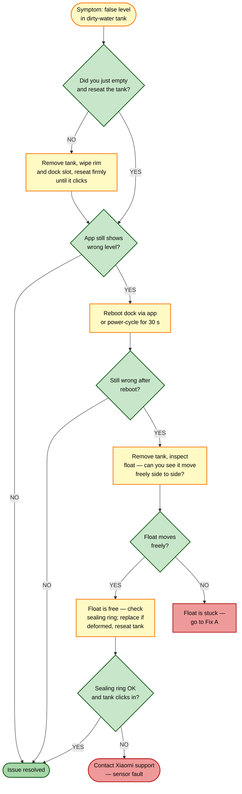

# Guide 02 — Dirty-Water Tank Reports False Level

[← Repair guides index](README.md) | [← Repository index](../README.md)

  

---

## Symptoms

- App shows dirty-water tank as **FULL** even after emptying it.
- App shows dirty-water tank as **EMPTY** even when it contains water.
- Dock refuses to begin the mop-wash cycle because it believes the dirty tank is full.
- Mop-wash cycle starts but stops prematurely with a "dirty tank full" notification.

---

## How the float sensor works

The dirty-water tank contains a **sealed magnetic float** — a small buoy that rises with the water level. A reed or Hall-effect sensor in the dock housing reads the magnet's position through the tank wall without any direct contact with the water.

When residue, slime, or debris builds up inside the tank, the float can stick in the raised (FULL) or lowered (EMPTY) position, sending a false reading regardless of actual fill level.

*Float-to-sensor signal path — the float never leaves the tank body.*

*Generic magnetic float switch principle. Source: [Wikimedia Commons](https://commons.wikimedia.org/wiki/File:Float_switch_diagram.svg)*

---

## Root causes

| # | Cause | Likelihood |
|---|-------|-----------|
| A | Float stuck in raised position due to biofilm / mineral scale on float or tank wall | High |
| B | Float stuck in lowered position due to debris wedging it down | Medium |
| C | Dirty-water tank not fully seated — sensor gap too large to read | Medium |
| D | Tank sealing ring missing, deformed, or pinched — tank slightly cocked when inserted | Low |
| E | Firmware glitch — sensor value not refreshed after tank removal | Low |

---

## Troubleshooting decision tree

---

## Fixes

### Fix A — Clean the float and tank interior (stuck float)

**Tools:** Warm water, soft bottle brush or sponge, white vinegar or citric acid solution (1 tsp per 500 mL water).

1. Remove the dirty-water tank from the dock by pressing the release tab and sliding it out.
2. Empty any remaining water down the sink.
3. Rinse the interior with warm water to remove loose debris.
4. Fill the tank one-quarter full with a citric acid or diluted white-vinegar solution to dissolve mineral scale.
5. Shake the tank gently for 30 seconds, then tilt it so the solution contacts all inner surfaces.
6. Locate the float (a small cylindrical or spherical buoy, usually white or grey, resting on a vertical guide rail or sliding freely along the tank wall). Push it up and down several times with a finger or the back end of a brush — it should slide without resistance.
7. If the float is still sticky, let the solution soak for 5–10 minutes, then repeat.
8. Rinse thoroughly with clean water at least three times until no vinegar odor remains.
9. Wipe the tank exterior, especially the sensor-contact window (typically a clear or thinned area on one face of the tank).
10. Dry the exterior completely before reinserting.

**Verification:** Reinsert the tank, open the Xiaomi Home app, navigate to Omni Station settings, and confirm the dirty-water level reads correctly. Fill with a small amount of water and re-check that the reading rises.

---

### Fix B — Reseat the tank properly

1. Remove the dirty-water tank fully.
2. Inspect the dock slot for debris or a buildup of fluff that could prevent full insertion.
3. Clean the dock slot rim with a dry cloth.
4. Inspect the tank's sealing ring (O-ring or gasket on the tank spigot/outlet). If it looks flattened, twisted, or cracked, refer to the replacement guide for the sealing ring.
5. Reinsert the tank with both hands, pressing firmly and evenly until you hear or feel a distinct click.
6. Attempt a manual mop-wash cycle from the app to confirm the dock recognizes the tank.

*O-ring sealing principle — a deformed or missing ring prevents proper seating. Source: [Wikimedia Commons](https://commons.wikimedia.org/wiki/File:O-Ring.svg)*

**Verification:** The app level indicator should update within 5 seconds of seating.

---

### Fix C — Firmware-glitch level reset

1. In Xiaomi Home, navigate to **Omni Station > Settings > Maintenance**.
2. Tap **Reset tank status** if available, or perform a **Reset dock** (this does not affect robot settings or maps).
3. Alternatively, unplug the dock power cable for 30 seconds, plug back in, and wait for the dock to complete its boot sequence (LED steady).
4. Remove and reinsert the dirty-water tank once more.

**Verification:** Confirm the level indicator updates immediately.

---

## Preventive tips

- Empty and rinse the dirty-water tank after every 2–3 cleaning sessions, or whenever the app shows it reaching 75% full.
- Use distilled or softened water in the clean-water tank to reduce mineral deposits that migrate into the dirty tank.
- Once a week, shake the dirty tank gently and verify the float moves freely before reinserting.
- Do not use detergents or cleaning agents in the dirty-water tank — doing so can leave a sticky residue that immobilises the float faster.

---

## Related guides

- [Guide 01 — Station not pumping dirty water](01-station-not-pumping-dirty-water.md) — if the pump itself is not moving dirty water out of the wash tray.
- [Guide 03 — No mop-wash water output at dock](03-no-mop-wash-water-output.md) — if no water flows onto the wash tray during the cleaning cycle.
- [Guide 06 — Water leak from dock](06-water-leak-from-dock.md) — if water is escaping from around the dirty-water tank area.

---

## Sources

- Xiaomi Global Support — FAQ KA-605084: [mi.com/global/support/faq/details/KA-605084](https://www.mi.com/global/support/faq/details/KA-605084/)
- Hjalp.ai — Xiaomi Robot Vacuum water tank troubleshooting: [hjalp.ai/article/xiaomi-robot-vacuum-water-tank-not-working](https://www.hjalp.ai/article/xiaomi-robot-vacuum-water-tank-not-working/)
