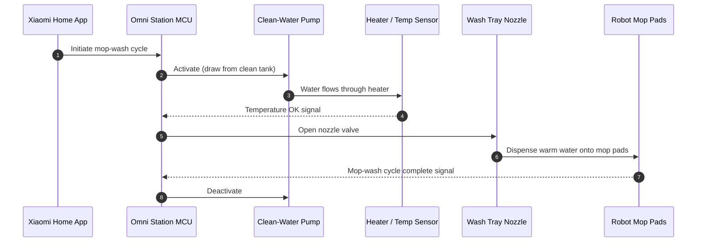
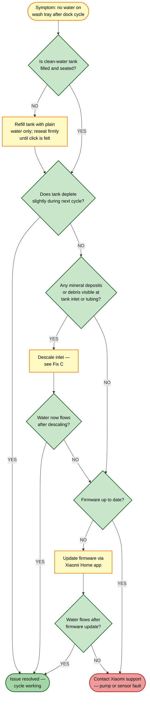

# Guide 03 — No Mop-Wash Water Output at Dock

[← Repair guides index](README.md) | [← Repository index](../README.md)

  

---

## Symptoms

- Robot docks for the mop-wash cycle but **no water appears on the wash tray**.
- Robot mop pads return to the dock visibly **still dirty** — no rinsing has occurred.
- The **clean-water tank level does not decrease** after a wash cycle.
- App reports the wash cycle completed but mop pads smell dirty or remain soiled.

> **Scope note:** This guide covers the **dock side** — specifically the failure of the Omni Station to dispense clean water onto the wash tray. If water is dispensed correctly at the dock but the robot's mop pads remain dry during cleaning, see [Guide 04 — Mop not wetting floor](04-mop-not-wetting-floor.md).

---

## GOLDEN RULE

> **NEVER put detergent, cleaning fluid, or any agent other than plain water in the clean-water tank.** Doing so will damage the pump seals and internal tubing, void the warranty, and cause exactly the symptom described in this guide.

---

## How mop-wash water delivery works

When the robot docks for a wash cycle, the Omni Station:
1. Detects the robot's presence via IR or contact sensor.
2. Activates the clean-water pump to draw water from the clean-water tank.
3. Routes water through internal tubing to a heating element (for warm-water wash).
4. Dispenses the heated water through a nozzle onto the wash tray below the mop pads.
5. Agitates or vibrates the mop pads against the tray, then drains dirty water via the dirty-water channel.

*Clean-water delivery sequence from app trigger to mop-pad contact.*

---

## Root causes

| # | Cause | Likelihood |
|---|-------|-----------|
| A | Clean-water tank empty | High |
| B | Clean-water tank not fully seated (pump inlet gap) | High |
| C | Water inlet filter or tubing blocked by mineral scale / debris | Medium |
| D | Clean-water pump fault or seized impeller | Low |
| E | Heating element or temperature sensor fault causing safety shutoff | Low |
| F | Firmware bug — cycle state machine stuck | Low |

---

## Troubleshooting decision tree

---

## Fixes

### Fix A — Refill and reseat the clean-water tank

1. Lift the clean-water tank lid or remove the tank per your model's design (the OV21-JZEU tank is top-loading with a hinged or removable cap).
2. Fill with **plain, clean water only** — tap water is acceptable; use distilled water if you are in a very hard-water area to minimise scale build-up.
3. Do not add any soap, detergent, descaler, or cleaning fluid to the tank; this will damage the pump.
4. Replace the cap firmly. Replace the tank in the dock slot and press down until it clicks or seats flush.
5. Trigger a manual mop-wash cycle from the Xiaomi Home app (Robot settings > Mop Wash) and observe the wash tray.

**Verification:** Water should appear on the tray within 10–15 seconds of cycle start.

---

### Fix B — Check the tank inlet seal and seating

1. Remove the clean-water tank.
2. Inspect the tank's outlet port and the dock's inlet coupling for visible obstructions, bent pins, or a dislodged gasket.
3. Wipe both surfaces with a dry cloth.
4. Check the inlet O-ring or sealing gasket on the dock coupling — if deformed, refer to the sealing ring replacement guide.
5. Reseat the tank, pressing firmly until fully engaged.

*O-ring seal principle — a damaged or missing ring creates an air gap that prevents pump suction. Source: [Wikimedia Commons](https://commons.wikimedia.org/wiki/File:O-Ring.svg)*

**Verification:** After reseating, run a wash cycle and confirm the tank level decreases by approximately 80–150 mL per cycle.

---

### Fix C — Descale the inlet filter and tubing

Mineral scale from hard water is the most common cause of partial or complete flow blockage after several months of use.

> **Important:** Xiaomi does not endorse running any chemical solution through the internal pump circuit directly. The procedure below targets the **visible inlet filter screen** only. If scale has advanced into the pump body, request service.

1. Remove the clean-water tank.
2. Locate the inlet filter screen at the base of the dock's tank coupling — it is a fine mesh or perforated disc, approximately 8–12 mm in diameter.
3. Use a soft toothbrush dipped in a citric acid solution (1 teaspoon citric acid powder per 200 mL warm water) to gently scrub the screen. Do not press hard enough to deform the mesh.
4. Rinse the area with a clean damp cloth, then a dry cloth.
5. If scale is visible inside the tubing connector, use a cotton swab dampened with the citric acid solution to dissolve it. Rinse with a clean damp swab.
6. Refill the clean-water tank with plain water and reseat.
7. Run a wash cycle to flush any residual citric acid from the inlet.

**Verification:** Water flows freely onto the tray; clean-tank level decreases normally.

---

### Fix D — Firmware update

Firmware bugs can cause the pump to fail to activate despite no hardware fault.

1. Open Xiaomi Home app and navigate to your robot's device page.
2. Tap the **three-dot menu > Firmware Update**.
3. If an update is available for the robot or the Omni Station, apply it and allow the system to reboot.
4. After the update, trigger a mop-wash cycle.

**Verification:** Pump activates audibly; water appears on tray.

---

### Fix E — Pump or sensor fault (service required)

If all the above steps fail to restore water output, the most probable remaining causes are:

- **Pump impeller seized** — the pump motor runs but the impeller does not rotate due to scale or debris lodged in the pump body.
- **Temperature sensor fault** — the heater circuit shuts off the pump as a safety measure because the temperature sensor reads an erroneous high value.

In either case, **contact Xiaomi support** or an authorised service centre. Do not attempt to disassemble the dock pump assembly without professional guidance, as doing so may void the warranty.

---

## Preventive tips

- Use distilled or filtered water if your tap water is classified as "hard" (above 200 mg/L total dissolved solids) to reduce scale accumulation.
- Run a plain-water flush through a full mop-wash cycle at least once a week if the dock is used daily.
- **Never add any detergent or cleaning agent to the clean-water tank** — this is the single most common cause of pump damage and blockage.
- Inspect the inlet filter screen monthly and clean it as described in Fix C if visible deposits appear.
- After extended storage (more than two weeks), empty the clean-water tank fully and refill with fresh water before resuming use.

---

## Related guides

- [Guide 04 — Mop not wetting floor](04-mop-not-wetting-floor.md) — if dock wash works but the robot's mop pads stay dry during cleaning.
- [Guide 02 — Dirty-water tank false level](02-dirty-water-tank-false-level.md) — if the cycle is blocked by a false "dirty tank full" reading.
- [Guide 06 — Water leak from dock](06-water-leak-from-dock.md) — if water is escaping from the dock rather than being dispensed onto the tray.

---

## Sources

- Xiaomi Global Support — FAQ KA-605221: [mi.com/global/support/faq/details/KA-605221](https://www.mi.com/global/support/faq/details/KA-605221/)
- Hjalp.ai — Xiaomi Robot Vacuum water tank troubleshooting: [hjalp.ai/article/xiaomi-robot-vacuum-water-tank-not-working](https://www.hjalp.ai/article/xiaomi-robot-vacuum-water-tank-not-working/)
