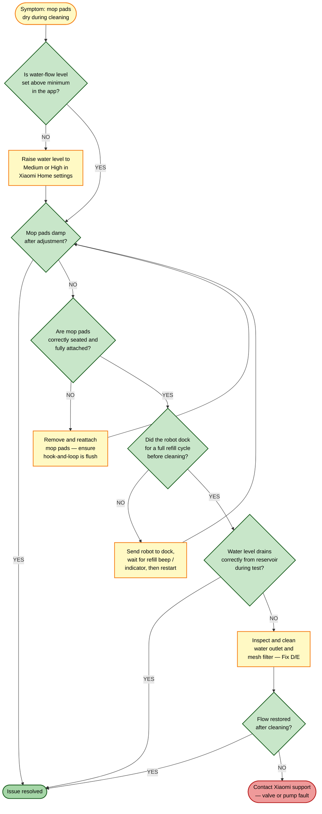

# Guide 04 — Mop Not Wetting Floor During Cleaning

[← Repair guides index](README.md) | [← Repository index](../README.md)

  

---

## Symptoms

- Robot completes a mop cycle but the floor remains **visibly dry** after the robot passes.
- Mop pads look **dry or barely damp** when the robot returns to dock.
- App water-level setting shows medium or high, but no wetness on the floor.
- Mop pads seem to clean dust rather than wipe wet smears.

---

## Scope: robot side vs. dock side

This guide covers **robot-side** causes — why the robot fails to dispense water from its internal reservoir onto the mop pads during cleaning.

If no water is dispensed by the dock onto the wash tray at all (so the robot never receives a refill in the first place), see [Guide 03 — No mop-wash water output at dock](03-no-mop-wash-water-output.md).

```mermaid
flowchart LR
    DOCK[Omni Station<br/>clean-water pump]:::input
    REFILL[Robot reservoir<br/>refill port]:::data
    RES[Robot internal<br/>reservoir ~70–80 mL]:::data
    VALVE[Internal mop<br/>valve / flow regulator]:::compute
    FILTER[Small mesh<br/>filter in robot]:::compute
    PAD[Mop pad<br/>on floor]:::output
    FLOOR[Floor surface]:::output

    DOCK -->|refill during dock cycle| REFILL
    REFILL --> RES
    RES -->|controlled flow| VALVE
    VALVE -->|filtered water| FILTER
    FILTER -->|drip / flow| PAD
    PAD -->|wet contact| FLOOR

    classDef input   fill:#ffe0b2,stroke:#e65100,stroke-width:2px,color:#000
    classDef data    fill:#bbdefb,stroke:#0d47a1,stroke-width:2px,color:#000
    classDef compute fill:#ffcdd2,stroke:#b71c1c,stroke-width:2px,color:#000
    classDef output  fill:#b2ebf2,stroke:#006064,stroke-width:2px,color:#000
```

*Water path from dock refill to floor — this guide focuses on everything from the robot reservoir onward.*

---

## Root causes

| # | Cause | Likelihood |
|---|-------|-----------|
| A | Water-flow level set too low in Xiaomi Home app | High |
| B | Mop pad not properly seated on the robot's mop plate | High |
| C | Robot reservoir empty — dock did not complete a refill during last dock cycle | Medium |
| D | Robot's internal water outlet / valve clogged or blocked | Medium |
| E | Small mesh filter in the robot's water channel clogged | Medium |
| F | Robot did not dock correctly for reservoir refill (misalignment) | Low |

---

## Troubleshooting decision tree

---

## Fixes

### Fix A — Raise the water-flow level in the app

The Xiaomi Robot Vacuum 5 Pro supports multiple water-flow levels (typically Off, Low, Medium, High). If the level is set too low, the valve barely opens and the mop pads receive insufficient moisture.

1. Open the **Xiaomi Home** app and select your robot.
2. On the main control screen, tap the **Mop** or **Water Level** icon.
3. Select **Medium** or **High** water level.
4. Start a short cleaning run on a hard-floor area and check whether the pads are visibly damp within 60 seconds.

**Verification:** Run the robot over a dry paper towel on the floor — a uniform damp patch should appear.

*Microfiber mop pad — should be visibly damp when operating at Medium or High water level. Source: [Wikimedia Commons](https://commons.wikimedia.org/wiki/File:Microfiber_cloth.jpg)*

---

### Fix B — Reseat the mop pads

Improperly seated pads can block the water outlet holes or prevent water from spreading across the pad surface.

1. Place the robot upside down on a soft surface.
2. Locate the mop plate at the rear of the robot's underside.
3. Peel off both mop pads (hook-and-loop / Velcro attachment) completely.
4. Inspect the mop plate's water outlet holes (small holes or slits) — confirm they are not blocked by pad fibres or debris. Use tweezers to remove any fibres.
5. Reattach each mop pad from the centre outward, pressing firmly so the entire hook-and-loop surface is engaged without creases or lifted edges.
6. Confirm the pad lies flat and covers the outlet holes without being folded over them.

**Verification:** After reattachment, run a damp-finger test across the pad surface within 2 minutes of starting a Medium-level cleaning run.

---

### Fix C — Confirm dock refills the robot reservoir

The robot's internal reservoir (approximately 70–80 mL) must be refilled by the dock after every mop-wash cycle or when the reservoir is empty.

1. Send the robot to the dock manually from the app.
2. Wait for the dock's refill sequence to complete. You should hear a faint click or brief pump noise from the dock, and the app should show the mop-water indicator fill.
3. If no refill sound occurs, verify the dock's clean-water tank is full and properly seated (see [Guide 03](03-no-mop-wash-water-output.md)).
4. Check the robot's refill port (located on the rear or top of the robot where it mates with the dock's dispense nozzle) for debris or scale. Wipe with a damp cloth.
5. Confirm the dock alignment pins and robot docking contacts are clean and free of dust.

**Verification:** App shows mop reservoir at or near full after docking; cleaning run produces damp pads.

---

### Fix D — Clean the robot's internal water outlet and valve

Scale, dried mineral deposits, or lint can partially or fully obstruct the valve that meters water from the robot's internal reservoir to the mop plate.

1. Place the robot upside down.
2. Remove the mop pads as described in Fix B.
3. Locate the water outlet holes or nozzle on the mop plate. Depending on firmware, these are typically a row of 2–6 small holes approximately 1 mm in diameter.
4. Use a soft toothbrush or the bristle end of a cleaning tool dampened with warm water to scrub the outlet holes.
5. For mineral deposits, apply a small amount of citric acid solution (1 tsp per 200 mL warm water) to the holes using a cotton swab. Allow to sit for 3 minutes, then scrub gently.
6. Rinse by wiping with a clean damp cloth — do not pour water directly onto the robot.
7. Dry with a cloth before turning the robot right-side up.

**Verification:** After reassembly and a fresh dock refill, run a test clean and confirm damp pads.

---

### Fix E — Clean the internal mesh filter

The robot has a small mesh filter in the water channel that prevents debris from reaching the valve. Over time this filter can become clogged with mineral scale or fibres.

1. Consult the Xiaomi Robot Vacuum 5 Pro user manual for the location of the internal water filter (typically accessible from the mop plate area after removing the mop assembly).
2. Remove the filter screen carefully using tweezers.
3. Rinse the filter under running warm water while gently brushing with a soft toothbrush.
4. For heavy scale, soak in citric acid solution for 5 minutes, then rinse thoroughly.
5. Allow the filter to dry completely before reinstalling.
6. Reseat the filter, reattach the mop pads, and run a dock refill followed by a test clean.

**Verification:** Water flows freely; pads are damp within 60 seconds of cleaning start.

---

## Preventive tips

- Replace mop pads every 1–3 months depending on usage intensity — worn pads absorb and distribute water poorly even when flow is adequate.
- Use distilled or filtered water in the dock's clean-water tank if your tap water is hard, to reduce scale that can travel into the robot's internal filter and valve.
- Run a cleaning cycle at Medium or High water level at least once a week to keep the valve and filter from drying out and sticking.
- After extended storage, prime the system by running a short 2-minute mop cycle on a spare cloth before mopping your floors.

---

## Related guides

- [Guide 03 — No mop-wash water output at dock](03-no-mop-wash-water-output.md) — if the dock itself fails to dispense water onto the wash tray.
- [Guide 02 — Dirty-water tank false level](02-dirty-water-tank-false-level.md) — if a false dirty-tank reading is preventing wash cycles from running.

---

## Sources

- Hjalp.ai — Xiaomi Robot Vacuum water tank troubleshooting: [hjalp.ai/article/xiaomi-robot-vacuum-water-tank-not-working](https://www.hjalp.ai/article/xiaomi-robot-vacuum-water-tank-not-working/)
- Xiaomi Robot Vacuum 5 Pro product image: [cdn.webshopapp.com/shops/210536/files/485685171/1652x1652x2/xiaomi-xiaomi-robot-vacuum-5-pro-eu.jpg](https://cdn.webshopapp.com/shops/210536/files/485685171/1652x1652x2/xiaomi-xiaomi-robot-vacuum-5-pro-eu.jpg)
