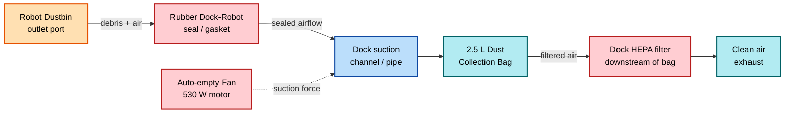
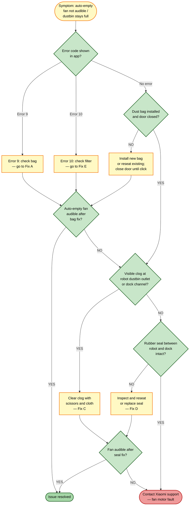

# Guide 05 — Self-Empty Not Working

[← Repair guides index](README.md) | [← Repository index](../README.md)

  

---

## Symptoms

- Robot docks after cleaning but the **loud auto-empty fan cycle (~10 seconds) is never heard**.
- Robot's **dustbin remains full** after every dock session.
- App shows **Error 9** (dust bag/filter missing or full) or **Error 10** (filter blocked).
- App notification: "Please check the dust bag" or "Auto-empty failed."
- Suction performance during cleaning appears unaffected, but dust never transfers to the dock's bag.

---

## How auto-empty works

When the robot docks after a cleaning run, the Omni Station's auto-empty system activates a dedicated 530 W high-suction fan. This fan creates a strong airflow that evacuates debris from the robot's dustbin through a sealed suction channel into the dock's 2.5 L dust collection bag. A typical cycle lasts approximately 10 seconds.

*Auto-empty airflow path from robot dustbin through the dock's sealed channel into the collection bag.*

*HEPA filter cross-section — the dock filter sits downstream of the bag and must be kept clean. Source: [Wikimedia Commons](https://commons.wikimedia.org/wiki/File:HEPA_Filter_diagram.svg)*

---

## Error codes

| Code | Meaning | First action |
|------|---------|-------------|
| **9** | Dust bag missing, door not closed, or bag full | Replace / reseat bag; close door firmly |
| **10** | Dock HEPA filter blocked | Clean or replace dock filter |

---

## Root causes

| # | Cause | Likelihood |
|---|-------|-----------|
| A | Dust bag full (reached capacity — ~75-day life at daily use) | High |
| B | Dust bag not installed or bag door not fully closed | High |
| C | Clog in robot dustbin outlet port or dock suction channel | Medium |
| D | Rubber seal between robot dustbin port and dock inlet damaged / missing | Medium |
| E | Dock HEPA filter clogged (triggers Error 10) | Medium |
| F | Auto-empty fan motor fault | Low |

---

## Troubleshooting decision tree

---

## Fixes

### Fix A — Replace or reseat the dust collection bag

The 2.5 L dust bag has an expected life of approximately **75 days** at one cleaning cycle per day. A full bag triggers Error 9 and prevents auto-empty from running regardless of other conditions.

1. Open the Omni Station's dust compartment door (top lid or front panel depending on configuration).
2. Grasp the dust bag by its cardboard collar and pull it straight out. The collar seals the opening automatically to prevent dust release.
3. Dispose of the bag in a bin — do not try to empty and reuse a disposable bag.
4. If installing a new bag: slide the new bag's collar into the dock compartment until it clicks into the inlet port. The collar arrow or alignment indicator should face forward.
5. Close the dust compartment door firmly until it clicks. Confirm it is flush with the dock body.
6. Trigger an auto-empty cycle from the Xiaomi Home app (**Device > Auto-empty > Run now**) or by re-docking the robot.

**Verification:** The fan runs audibly for approximately 10 seconds; the robot's dustbin is empty after the cycle.

---

### Fix B — Close the dust bag door properly

Error 9 is also triggered when the bag door is not fully latched — the dock's lid sensor detects an open door and disables the fan as a safety measure.

1. Press the dust compartment door firmly at both the top and bottom edges until you hear a definite click.
2. Check that no bag collar tab is caught in the door hinge.
3. Trigger an auto-empty cycle and confirm the fan activates.

---

### Fix C — Clear a clog in the suction channel

Clogs most commonly form at two points: the robot's dustbin outlet port (a rectangular or oval opening on the robot's rear/underside), and the dock's suction channel (the internal pipe that connects the robot's outlet to the bag).

1. Remove the robot from the dock.
2. Open the robot's dustbin and inspect the outlet port at the base — look for compressed hair, string, or debris blocking the opening. Use scissors to cut through tangled hair and remove it with tweezers or a cloth.
3. Shine a flashlight into the dock's suction inlet (the recessed opening the robot's dustbin port mates with). If debris is visible, use a thin bottle brush or a folded cloth on a stick to dislodge it. A vacuum cleaner nozzle held to the opening can also extract loose clogs.
4. Check the dock's internal channel as far as is accessible (do not force tools further than the visible channel).
5. Wipe all surfaces with a dry cloth.
6. Replace the robot in the dock and trigger an auto-empty cycle.

**Verification:** Audible fan cycle; dustbin empties completely.

---

### Fix D — Inspect and reseat the rubber seal

The rubber gasket between the robot's dustbin port and the dock inlet creates an airtight seal that is essential for generating sufficient suction. If the seal is torn, missing, or out of position, air bypasses the channel and suction collapses.

1. Remove the robot from the dock.
2. Inspect the rubber seal around the dock's suction inlet — it should be a continuous ring with no tears, cracks, or compressed flat spots.
3. If the seal has slipped out of its groove, press it firmly back in with your fingers, working around the circumference.
4. If the seal is torn or missing, contact Xiaomi support or your retailer for a replacement part — this seal is not user-serviceable with improvised materials.
5. Re-dock the robot and trigger an auto-empty cycle.

**Verification:** The connection point between robot and dock should feel tight with no air gap visible; fan cycle completes successfully.

---

### Fix E — Clean the dock HEPA filter (Error 10)

The HEPA filter downstream of the dust bag captures fine particles that pass through. When it is clogged, static back-pressure prevents the fan from evacuating the dustbin and triggers Error 10.

1. Open the dust compartment and remove the dust bag.
2. Locate the HEPA filter behind or beneath the bag chamber (a flat, pleated filter panel — typically grey or white).
3. Remove the filter by sliding it out or unlatching its frame.
4. Tap the filter gently over a bin to dislodge loose dust. Do not wash the HEPA filter with water unless the filter is specifically labelled as washable.
5. If the filter is heavily loaded or deformed, replace it with a genuine Xiaomi replacement filter.
6. Reinstall the filter, replace the dust bag, close the door, and trigger an auto-empty cycle.

**Verification:** Error 10 clears; fan runs without unusual noise.

---

## Preventive tips

- Replace the dust bag every 60–75 days, or when the app shows the bag at 80% capacity, whichever comes first.
- Clean the dock HEPA filter every 2–3 bag changes, or when Error 10 appears.
- Inspect the robot's dustbin outlet port and the dock's suction seal monthly — hair and string accumulate at this junction.
- After picking up unusually large amounts of debris (e.g., after renovations or pet shedding season), run an immediate manual auto-empty cycle to prevent the channel from compacting.
- Use only genuine Xiaomi dust bags — third-party bags may have poorly fitting collars that break the seal and trigger Error 9.

---

## Related guides

- [Guide 04 — Mop not wetting floor](04-mop-not-wetting-floor.md) — if the robot's mop system is the problem area.
- [Guide 06 — Water leak from dock](06-water-leak-from-dock.md) — if water is also escaping from the dock simultaneously.

---

## Sources

- Xiaomi error codes 9 and 10: referenced in Xiaomi Home app in-app help.
- Hjalp.ai — Xiaomi Robot Vacuum troubleshooting general reference: [hjalp.ai/article/xiaomi-robot-vacuum-water-tank-not-working](https://www.hjalp.ai/article/xiaomi-robot-vacuum-water-tank-not-working/)
- Xiaomi Robot Vacuum 5 Pro product image: [cdn.webshopapp.com/shops/210536/files/485685171/1652x1652x2/xiaomi-xiaomi-robot-vacuum-5-pro-eu.jpg](https://cdn.webshopapp.com/shops/210536/files/485685171/1652x1652x2/xiaomi-xiaomi-robot-vacuum-5-pro-eu.jpg)
