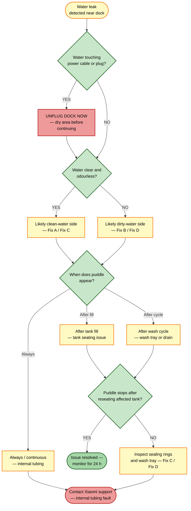
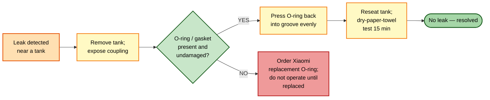

# Guide 06 — Water Leak from Dock

[← Repair guides index](README.md) | [← Repository index](../README.md)

  

---

## Symptoms

- Puddle of water **under or around the dock** after a wash cycle or while the dock is idle.
- Visible dripping from the dock's underside, side panel, or rear.
- App shows no error, but the clean-water tank depletes faster than expected.
- Wet floor near the dock despite no cleaning cycle having run recently.

---

## SAFETY FIRST

> **If water is pooling near the dock's power cable, plug, or electrical base: unplug the dock immediately before touching any component.** Water near mains-voltage connections is a shock and fire hazard. Allow the area to dry completely before reconnecting power.

---

## GOLDEN RULE

> **NEVER put detergent, soap, or any cleaning agent in the clean-water tank.** Detergent causes foaming inside the pump and tubing, which can force water past seals and trigger or worsen leaks.

---

## Identifying the source: clean water or dirty water?

Before disassembling anything, identify which tank is the leak source. This narrows the repair significantly.

| Clue | Likely source |
|------|--------------|
| Clear, odourless water | Clean-water tank or tubing |
| Slightly murky or grey water, faint detergent / mop smell | Dirty-water tank or wash tray drain |
| Puddle appears immediately after tank refill | Clean-water tank seating issue |
| Puddle appears after a mop-wash cycle | Dirty-water tank, wash tray, or drain path |
| Puddle appears continuously without any cycle | Internal tubing connection loose |

---

## Root causes

| # | Cause | Likely water | Likelihood |
|---|-------|-------------|-----------|
| A | Clean-water tank not fully seated / sealing ring damaged | Clean | High |
| B | Dirty-water tank not fully seated / sealing ring damaged | Dirty | High |
| C | Wash tray cracked, misaligned, or debris blocking drain | Dirty | Medium |
| D | Internal tubing connection loose or disconnected | Clean or dirty | Low |
| E | Overfill of clean-water tank (filled above max line) | Clean | Low |

---

## Fixes

### Fix A — Reseat the clean-water tank and inspect its sealing ring

1. **Unplug the dock** if any water has reached the base or power area.
2. Dry the immediate area around the dock with a cloth.
3. Remove the clean-water tank by pressing its release tab and lifting it out.
4. Inspect the tank's outlet coupling and the dock's inlet port: look for the rubber O-ring or gasket. It should be seated evenly in its groove with no twists, flat spots, cracks, or missing sections.

*A deformed or missing O-ring allows water to bypass the seal and drip internally. Source: [Wikimedia Commons](https://commons.wikimedia.org/wiki/File:O-Ring.svg)*

5. If the O-ring appears deformed, gently press it back into its groove with a fingernail or a plastic pry tool. If it is cracked or torn, **do not continue using the dock until the O-ring is replaced** — contact Xiaomi support for a replacement part.
6. Wipe the dock inlet port with a dry cloth to remove any water or debris.
7. Refill the clean-water tank to no more than the MAX fill line — never overfill.
8. Reseat the tank, pressing firmly until it clicks into place.
9. Place a dry paper towel under the dock and observe for 15 minutes without running any cycle. If the towel stays dry, plug the dock back in and run a test wash cycle, monitoring for new dripping.

**Verification:** No pooling for a full 24-hour cycle including at least one mop-wash run.

---

### Fix B — Reseat the dirty-water tank and inspect its sealing ring

1. Ensure the dock is unplugged if water is near the electrical base.
2. Empty and remove the dirty-water tank.
3. Inspect the tank outlet / dock coupling in the same way as described for Fix A — look for a deformed, missing, or twisted O-ring or gasket.
4. Check the tank body itself for hairline cracks along the seams or base — hold it up to a light source and look for transparency differences.
5. Reseat the tank firmly until it clicks.
6. See also [Guide 01 — Station not pumping dirty water](01-station-not-pumping-dirty-water.md) if leaking coincides with the dirty-water pump not activating — the two issues can occur together.
7. See also [Guide 02 — Dirty-water tank false level](02-dirty-water-tank-false-level.md) if the tank also reports a false level reading.

**Verification:** Dry paper towel test — no moisture after a complete mop-wash cycle.

---

### Fix C — Inspect and reseat the wash tray

The wash tray sits at the base of the dock directly below the mop pads. It is the basin that collects dispensed water during the wash cycle before draining to the dirty-water tank. If the tray is misaligned, cracked, or its drain is blocked, water overflows onto the dock base.

1. After unplugging, remove the robot from the dock.
2. Locate the wash tray — the shallow basin at the front-bottom of the dock.
3. Lift or slide the tray out (on the OV21-JZEU it clips in place; depress the release points at either end and tilt forward).
4. Inspect for:
   - **Cracks or crazing** in the tray body — any crack will leak.
   - **Debris blocking the drain port** (the hole at the lowest point of the tray that connects to the dirty-water path) — remove debris with tweezers or a soft brush.
   - **Misalignment** — the tray must sit level and flush; a slight tilt to one side will cause water to run off the edge.
5. Clean the tray with warm water and a soft cloth. Do not use abrasive pads that could deepen hairline cracks.
6. Reseat the tray, confirming both sides click in and it sits level.
7. Run a wash cycle while observing the tray edge — water should drain centrally, not overflow the sides.

**Verification:** No overflow or dripping from the tray area during or after a full wash cycle.

---

### Fix D — Check for loose internal tubing connections

Internal tubing leaks are the least accessible and most likely to require professional service. You can perform a basic check without disassembling the dock:

1. Remove both the clean and dirty water tanks.
2. Shine a flashlight into each tank cavity and look down into the dock body — any visible tubing near the tank couplings should appear to have intact, firmly seated connections (push-fit or barbed fittings with no gap or drip stain).
3. If a drip stain or damp patch is visible inside the dock cavity but no tank O-ring is damaged, the leak is internal.
4. Do not attempt to re-seat internal tubing unless you are comfortable with appliance disassembly and have documented the original routing — an incorrectly reseated tube can make the leak worse.
5. In this scenario, **contact Xiaomi support or an authorised repair centre**.

---

### Fix E — Overfill check

1. Remove the clean-water tank and check the fill line marking.
2. If the water level was above the MAX line, empty down to the MAX line before reinserting.
3. Never use the dock as a supply reservoir and fill beyond MAX — internal overflow protection may not fully contain excess water.

---

## Sealing ring replacement reference

---

## Preventive tips

- After every mop-wash cycle, visually check the dock base for any moisture — early detection prevents accumulated water damage to the floor or the dock's electronics.
- Inspect tank O-rings monthly. Keep one spare O-ring per tank available.
- Fill the clean-water tank to the MAX line only — never above it.
- **Never add detergent or cleaning agents to the clean-water tank.** Foaming can push water past seals and cause leaks.
- If you move or transport the dock, empty both tanks first — sloshing water can dislodge O-rings or widen micro-cracks.
- Place the dock on a waterproof mat as a precaution — this makes early leak detection easy and protects the floor.

---

## Related guides

- [Guide 01 — Station not pumping dirty water](01-station-not-pumping-dirty-water.md) — related issue; dirty-water pump failure can cause backpressure leading to leaks.
- [Guide 02 — Dirty-water tank false level](02-dirty-water-tank-false-level.md) — a misseated dirty tank causing false level may also leak.
- [Guide 03 — No mop-wash water output at dock](03-no-mop-wash-water-output.md) — if the clean-water side also has a flow problem alongside the leak.

---

## Sources

- Hjalp.ai — Xiaomi Robot Vacuum water tank troubleshooting: [hjalp.ai/article/xiaomi-robot-vacuum-water-tank-not-working](https://www.hjalp.ai/article/xiaomi-robot-vacuum-water-tank-not-working/)
- Xiaomi Global Support — FAQ KA-605219: [mi.com/global/support/faq/details/KA-605219](https://www.mi.com/global/support/faq/details/KA-605219/)
