# Guide 07 — Main Brush Tangle

[← Repair guides index](README.md) | [← Repository index](../README.md)

| Difficulty | Estimated Time | Tools Required |
|------------|----------------|----------------|
| Beginner | 10–20 min | Cleaning tool (included), scissors, flat-head screwdriver |

---

## Symptoms

- Grinding or straining noise during cleaning
- Robot pauses mid-run and displays **Error 5** ("Clean main brush / bearings")
- Reduced brush rotation or brush visibly not spinning
- Hair, string, or thread wound tightly around the brush body or end-cap axles
- Increased suction motor sound as motor compensates for drag

> **Error code reference:** Error 5 = clean main brush bearings / remove fishing line.
> Source: [Xiaomi Mi Vacuum Cleaner Error Codes](https://finderrorcode.com/xiaomi-mi-vacuum-cleaner-error-codes.html)

---

## Root Causes

1. **Hair or thread tangled on the axle / bearing caps** — long hair bypasses the anti-tangle rubber blades and wraps the plastic bearing caps at both ends of the brush.
2. **Debris build-up in the bearing seat** — accumulated dust compresses around the bearing and increases rotational resistance.
3. **Worn or deformed brush blades** — degraded rubber fins grip debris and accelerate tangling.
4. **End-cap not fully seated** — a loose cap allows the brush to wobble, increasing friction.

---

## Troubleshooting Decision Tree

```mermaid
flowchart TD
    START([Error 5 or grinding noise]):::action

    Q1{Brush rotating<br/>at all?}:::control
    Q2{Hair / thread<br/>visible on brush?}:::control
    Q3{Hair on axle<br/>or bearing caps?}:::control
    Q4{Brush spins freely<br/>by hand after cleaning?}:::control
    Q5{End-caps fully<br/>seated and locked?}:::control
    Q6{Rubber blades<br/>intact, not worn?}:::control

    F1[Remove brush cover,<br/>lift out brush]:::action
    F2[Cut and remove hair<br/>with tool or scissors]:::action
    F3[Pull off bearing caps,<br/>clear axle hair]:::action
    F4[Clean bearing seat<br/>with dry cloth]:::action
    F5[Press end-caps firmly<br/>until they click]:::action
    REPLACE[Replace main brush<br/>-- see replacement guide --]:::fail
    OK([Reinstall brush,<br/>run test cycle]):::ok

    START --> Q1
    Q1 -->|NO| F1
    Q1 -->|YES - slow/noisy| F1
    F1 --> Q2
    Q2 -->|YES| F2
    Q2 -->|NO| Q3
    F2 --> Q3
    Q3 -->|YES| F3
    Q3 -->|NO| Q4
    F3 --> F4
    F4 --> Q4
    Q4 -->|NO| Q5
    Q4 -->|YES| Q6
    Q5 -->|NO - loose| F5
    Q5 -->|YES| REPLACE
    F5 --> Q6
    Q6 -->|YES - blades OK| OK
    Q6 -->|NO - worn/cracked| REPLACE

    classDef primary fill:#ffffff,stroke:#000000,stroke-width:3px,color:#000
    classDef input   fill:#ffe0b2,stroke:#e65100,stroke-width:2px,color:#000
    classDef output  fill:#b2ebf2,stroke:#006064,stroke-width:2px,color:#000
    classDef data    fill:#bbdefb,stroke:#0d47a1,stroke-width:2px,color:#000
    classDef compute fill:#ffcdd2,stroke:#b71c1c,stroke-width:2px,color:#000
    classDef event   fill:#fff59d,stroke:#f57f17,stroke-width:2px,color:#000
    classDef control fill:#c8e6c9,stroke:#1b5e20,stroke-width:2px,color:#000
    classDef aux     fill:#e1bee7,stroke:#4a148c,stroke-width:2px,color:#000
    classDef infra   fill:#cfd8dc,stroke:#37474f,stroke-width:2px,color:#000
    classDef ok      fill:#a5d6a7,stroke:#1b5e20,stroke-width:2px,color:#000
    classDef fail    fill:#ef9a9a,stroke:#b71c1c,stroke-width:2px,color:#000
    classDef action  fill:#fff9c4,stroke:#f57f17,stroke-width:2px,color:#000
    classDef probe   fill:#ffffff,stroke:#000000,stroke-width:1px,stroke-dasharray:4 2,color:#000
```

---

## Repair Procedures

### Cause 1 — Hair or thread tangled on the brush body

1. **Power off the robot** completely. Do not attempt brush removal while powered on.
2. **Flip the robot** upside down on a clean, flat surface.
3. **Open the main brush cover**: locate the two locking tabs on either side of the brush bay and press them inward simultaneously. Lift the cover away.
4. **Lift out the main brush**: grasp the rubber brush body and pull it straight up out of its socket.
5. **Cut tangled material**: using the included cleaning tool (comb blade) or scissors, make lengthwise cuts through the wrapped hair along the brush body. Work from the center outward toward each end.
6. **Pull the loosened material free**: use your fingers or tweezers to remove all cut strands. Ensure no fibres remain wound under the rubber blades.
7. **Verification**: hold the brush at both ends and spin it — it should rotate with no resistance and with no scraping sound.

### Cause 2 — Hair on the axle or bearing caps

1. Complete steps 1–4 from Cause 1.
2. **Remove the end bearing caps**: pinch and pull the cap at each end of the brush axle. They are friction-fit; pull firmly in line with the axle.
3. **Cut and remove hair from the axle stub**: use scissors or the cleaning-tool comb to cut hair wrapped around the exposed plastic axle between the brush body and the bearing cap socket.
4. **Inspect the bearing seat on the robot** (the socket the cap inserts into). Remove any compacted dust or debris with a dry cloth or a soft brush.
5. **Reassemble bearing caps**: press each cap firmly back onto its axle end until you feel it seat. Confirm it does not rock side-to-side.
6. **Verification**: spin the brush axle by hand; it should turn freely in both sockets on the robot chassis.

### Cause 3 — Debris build-up in the bearing seat

1. After removing the brush and end-caps (see Cause 2, steps 1–4), inspect the two brush sockets on the robot chassis.
2. Wipe the interior of each socket with a dry cotton swab or lint-free cloth. Remove visible dust compaction.
3. Do **not** apply lubricant — it attracts dust and worsens future tangling.
4. Reassemble and verify free rotation as above.

### Cause 4 — End-cap loose or not fully seated

1. With the brush removed, inspect both end-caps for cracks or deformation.
2. Press each cap firmly onto its axle stub; you should hear/feel a click or firm stop.
3. Gently try to pull the cap off — it should resist. If it slides off with light force, the cap or axle is worn and the brush assembly should be replaced.

### Final reassembly

1. Slide the cleaned brush back into the brush bay, aligning both axle ends with their sockets.
2. Press the brush cover back on until both tabs click into place.
3. Flip the robot upright and power it on.
4. Run a short cleaning cycle on a hard floor and verify the grinding noise is gone.

---

## Maintenance Interval

| Component | Replace Every |
|-----------|---------------|
| Main brush (rubber dual-blade) | Every **3–6 months**, or sooner if blades show cracks, flattening, or significant wear |
| Bearing cap cleaning | Every **1–2 months** if long hair is frequently vacuumed |

**Pro tip:** brush the axle area with the cleaning tool after each session if your household has occupants with long hair. This prevents the hard-packed tangles that require cutting.

---

## Product Reference

*Xiaomi Robot Vacuum 5 Pro (OV21GL). Source: webshopapp CDN — product listing image.*

*Typical hair accumulation pattern on a robot vacuum roller brush. Source: [Wikimedia Commons](https://commons.wikimedia.org/wiki/File:Roomba_internal_gears_%26_brushes.jpg) — CC BY-SA 3.0.*

---

## Replace the Part

If cleaning does not resolve Error 5, or if the brush blades are visibly worn, proceed to:

- [Main Brush Replacement Guide](../replacement-guides/main-brush-replacement.md)

---

## Sources

- Xiaomi Mi Vacuum Cleaner Error Codes: <https://finderrorcode.com/xiaomi-mi-vacuum-cleaner-error-codes.html>
- Xiaomi Robot Vacuum 5 Pro (OV21GL) User Manual — Maintenance chapter
- Mermaid diagram conventions: internal skill `global-mermaid-diagrams`
