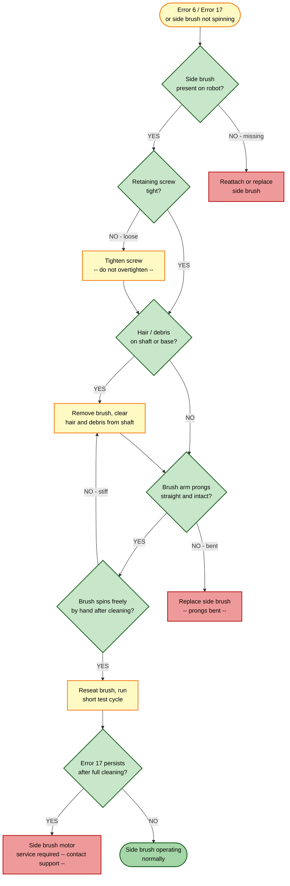

# Guide 08 — Side Brush Obstruction

[← Repair guides index](README.md) | [← Repository index](../README.md)

| Difficulty | Estimated Time | Tools Required |
|------------|----------------|----------------|
| Beginner | 5–15 min | Phillips screwdriver (PH1), cleaning tool (included), tweezers |

---

## Symptoms

- Robot displays **Error 6** ("Clean side brush") or **Error 17** ("Side brush malfunction")
- Side brush not spinning during operation
- Side brush not extending outward from the robot's body (the anti-tangle arm stays retracted)
- Audible clicking or grinding from the side brush area
- Poor edge and corner cleaning — debris left along walls and baseboards

> **Error code reference:** Error 6 = clean side brush; Error 17 = side brush malfunction.
> Source: [Xiaomi Mi Vacuum Cleaner Error Codes](https://finderrorcode.com/xiaomi-mi-vacuum-cleaner-error-codes.html)

---

## Root Causes

1. **Hair or thread wound around the side brush shaft** — the most common cause; fibers accumulate on the motor post and generate resistance.
2. **Debris lodged under the brush base** — gravel, carpet threads, or food particles jam between the brush and the chassis mounting point.
3. **Loose or cross-threaded retaining screw** — the single screw holding the brush to its post backs out during vibration, causing intermittent rotation.
4. **Bent or deformed brush arms** — a collision or hard impact bends the plastic arm prongs, creating drag or preventing correct extension.
5. **Motor post or extension mechanism fault** — persistent Error 17 after cleaning may indicate a failed side brush motor or a jammed extendable arm mechanism.

---

## Troubleshooting Decision Tree

---

## Repair Procedures

### Cause 1 — Hair or thread wound around the side brush shaft

1. **Power off the robot** completely before proceeding.
2. **Flip the robot** upside down on a clean, flat surface.
3. **Remove the side brush**: using a PH1 Phillips screwdriver, turn the central retaining screw counter-clockwise and remove it. Set the screw in a safe location — it is small and easy to lose.
4. **Pull the brush off the post**: lift the brush straight up off the motor post. The brush is friction-fit over the post after the screw is removed.
5. **Clear hair from the motor post**: use the cleaning tool comb, tweezers, or scissors to cut and remove any hair or thread wound around the base of the post. Work carefully to avoid scratching the post surface.
6. **Inspect the underside of the brush hub**: remove any tangled fibers from the hub opening that mates with the post.
7. **Wipe the post and hub** with a dry lint-free cloth.
8. **Reinstall the brush**: press the brush hub down onto the post until it sits flush. Insert the retaining screw and turn clockwise until snug. Do **not** overtighten — the post is plastic and the thread strips easily. Finger-tight plus a quarter-turn is sufficient.
9. **Verification**: with the robot still inverted, spin the brush by hand — it should rotate smoothly with no resistance.

### Cause 2 — Debris lodged under the brush base

1. Complete Cause 1 steps 1–4 to remove the brush.
2. Inspect the recessed mounting area on the robot chassis where the brush base sits.
3. Remove any gravel, seed husks, carpet threads, or compacted dust using tweezers and a dry cloth.
4. Confirm the chassis surface is clean and flat so the brush hub seats fully.
5. Reinstall as described in Cause 1 steps 8–9.

### Cause 3 — Loose or cross-threaded retaining screw

1. Remove the brush (Cause 1 steps 1–4).
2. Inspect the retaining screw and the motor post thread. If the screw thread is stripped or the post threads are damaged, the screw will not hold and the brush must be replaced.
3. If threads are intact, reinstall the brush and screw. Tighten to snug plus a quarter-turn only.
4. If the screw continues to back out during use, apply a small amount of non-permanent thread locker (blue Loctite 243 or equivalent) to the screw thread before reinstalling.

### Cause 4 — Bent or deformed brush arm prongs

1. Remove the brush (Cause 1 steps 1–4).
2. Lay the brush flat on the work surface and inspect the three arm prongs. Each prong should be evenly spaced (120° apart) and lie in the same plane.
3. Minor bends on a single prong can sometimes be gently straightened by hand, but the plastic may crack if overcorrected.
4. If two or more prongs are bent or if any prong is cracked, replace the side brush. A deformed brush does not sweep effectively even if it spins.
5. Proceed to the [Side Brush Replacement Guide](../replacement-guides/side-brush-replacement.md).

### Cause 5 — Motor post or extension mechanism fault (Error 17 persists)

If Error 17 continues after all cleaning and brush replacement:

1. Confirm the retaining screw is properly seated and the brush hub engages the post drive flat correctly (the post has a D-shaped cross-section on some units — align the flat).
2. Power cycle the robot fully (hold the power button for 5 seconds).
3. Run a test cycle on hard flooring. If Error 17 persists, the side brush motor or extension mechanism has failed internally and requires service or replacement by a qualified technician. Contact Xiaomi support.

---

## Maintenance Interval

| Component | Replace Every |
|-----------|---------------|
| Side brush | Every **3–6 months**, or sooner if arm prongs are bent, shortened below 3 cm, or bristle tips worn flat |
| Shaft cleaning | Every **1–2 months** in high-hair environments |

**Pro tip:** a quick visual check at the start of each week takes under 30 seconds — look at the side brush from the side while the robot charges. If you see a hair spool building on the shaft, remove it before it hardens into a tight ring.

---

## Product Reference

*Xiaomi Robot Vacuum 5 Pro (OV21GL) underside, showing side brush position. Source: webshopapp CDN — product listing image.*

---

## Replace the Part

If cleaning does not resolve the error, or if the brush arms are bent, proceed to:

- [Side Brush Replacement Guide](../replacement-guides/side-brush-replacement.md)

---

## Sources

- Xiaomi Mi Vacuum Cleaner Error Codes: <https://finderrorcode.com/xiaomi-mi-vacuum-cleaner-error-codes.html>
- Xiaomi Robot Vacuum 5 Pro (OV21GL) User Manual — Maintenance chapter
- Mermaid diagram conventions: internal skill `global-mermaid-diagrams`
