# Guide 09 — Suction Loss

[← Repair guides index](README.md) | [← Repository index](../README.md)

| Difficulty | Estimated Time | Tools Required |
|------------|----------------|----------------|
| Beginner | 10–25 min | Flat-head screwdriver (optional), dry cloth, running tap water |

---

## Symptoms

- Debris left on floor after a cleaning pass
- Robot fails to pick up larger particles (crumbs, pet food)
- Noticeably weaker airflow from the exhaust vent
- Higher-pitch or strained fan motor whine during operation
- Robot displays **Error 9** ("Dustbin bag / filter missing or full"), **Error 10** ("Filter clogged or dirty"), or **Error 18** ("Suction fan error")

> **Error code reference:** Error 9 = dustbin/filter missing or full; Error 10 = filter clogged/dirty; Error 18 = suction fan motor error.
> Source: [Xiaomi Mi Vacuum Cleaner Error Codes](https://finderrorcode.com/xiaomi-mi-vacuum-cleaner-error-codes.html)

---

## Root Causes (in diagnostic order)

1. **Filter clogged** — the E11 HEPA filter is the most frequent cause; dust load accumulates and blocks airflow within a few weeks in heavy-use environments.
2. **Dustbin full** — the 290 mL dustbin reaches capacity quickly when vacuuming pet hair, sand, or fine debris.
3. **Main brush blockage restricting airflow** — a tangled main brush creates backpressure at the intake, reducing suction even when the filter is clean.
4. **Blocked dustbin inlet** — a large object (piece of paper, coin, food wrapper) partially blocks the inlet port between the brush bay and the dustbin.
5. **Air leak** — dustbin not fully seated, dustbin lid ajar, or a cracked/missing seal allows unfiltered air to bypass the fan and lowers effective suction pressure.
6. **Suction fan motor fault (Error 18)** — internal fan motor failure; requires service if all other causes are ruled out.

---

## Airflow Path

```mermaid
flowchart LR
    FLOOR[(Floor surface)]:::input
    BRUSH[Main brush<br/>pickup zone]:::compute
    INLET[Dustbin inlet<br/>port]:::infra
    DUSTBIN[(290 mL<br/>dustbin)]:::data
    FILTER[E11 HEPA<br/>filter]:::aux
    FAN[Fan motor]:::compute
    EXHAUST[Exhaust vent]:::output

    FLOOR -->|debris + air| BRUSH
    BRUSH -->|air + particles| INLET
    INLET -->|particles settle| DUSTBIN
    DUSTBIN -->|filtered air| FILTER
    FILTER -->|clean air| FAN
    FAN -->|pressurized air| EXHAUST

    classDef primary fill:#ffffff,stroke:#000000,stroke-width:3px,color:#000
    classDef input   fill:#ffe0b2,stroke:#e65100,stroke-width:2px,color:#000
    classDef output  fill:#b2ebf2,stroke:#006064,stroke-width:2px,color:#000
    classDef data    fill:#bbdefb,stroke:#0d47a1,stroke-width:2px,color:#000
    classDef compute fill:#ffcdd2,stroke:#b71c1c,stroke-width:2px,color:#000
    classDef event   fill:#fff59d,stroke:#f57f17,stroke-width:2px,color:#000
    classDef control fill:#c8e6c9,stroke:#1b5e20,stroke-width:2px,color:#000
    classDef aux     fill:#e1bee7,stroke:#4a148c,stroke-width:2px,color:#000
    classDef infra   fill:#cfd8dc,stroke:#37474f,stroke-width:2px,color:#000
    classDef ok      fill:#a5d6a7,stroke:#1b5e20,stroke-width:2px,color:#000
    classDef fail    fill:#ef9a9a,stroke:#b71c1c,stroke-width:2px,color:#000
    classDef action  fill:#fff9c4,stroke:#f57f17,stroke-width:2px,color:#000
    classDef probe   fill:#ffffff,stroke:#000000,stroke-width:1px,stroke-dasharray:4 2,color:#000
```

---

## Troubleshooting Decision Tree

```mermaid
flowchart TD
    START([Weak suction / debris<br/>left on floor]):::action

    Q1{Error 9 or 10<br/>displayed?}:::control
    Q2{Dustbin full<br/>or nearly full?}:::control
    Q3{HEPA filter<br/>visibly dirty / grey?}:::control
    Q4{Main brush tangled<br/>or blocked?}:::control
    Q5{Dustbin inlet port<br/>obstructed?}:::control
    Q6{Dustbin fully seated<br/>and lid closed?}:::control
    Q7{Suction improved<br/>after all steps?}:::control
    Q8{Error 18<br/>displayed?}:::control

    F1[Empty dustbin,<br/>remove and rinse]:::action
    F2[Remove HEPA filter,<br/>rinse and AIR-DRY 24 h]:::action
    F3[Clear main brush --<br/>see Guide 07]:::action
    F4[Remove dustbin, clear<br/>inlet port obstruction]:::action
    F5[Reseat dustbin firmly,<br/>close lid until it clicks]:::action
    MOTOR[Fan motor fault --<br/>contact Xiaomi support]:::fail
    REPLACE_F[Replace HEPA filter<br/>if still restricted]:::fail
    OK([Suction restored --<br/>run test cycle]):::ok

    START --> Q1
    Q1 -->|YES - Error 9| Q2
    Q1 -->|YES - Error 10| Q3
    Q1 -->|NO - no error| Q2
    Q2 -->|YES| F1
    Q2 -->|NO| Q3
    F1 --> Q3
    Q3 -->|YES - dirty| F2
    Q3 -->|NO - clean| Q4
    F2 --> Q4
    Q4 -->|YES - tangled| F3
    Q4 -->|NO| Q5
    F3 --> Q5
    Q5 -->|YES - blocked| F4
    Q5 -->|NO| Q6
    F4 --> Q6
    Q6 -->|NO - unseated| F5
    Q6 -->|YES| Q7
    F5 --> Q7
    Q7 -->|NO - still weak| Q8
    Q7 -->|YES| OK
    Q8 -->|YES| MOTOR
    Q8 -->|NO| REPLACE_F

    classDef primary fill:#ffffff,stroke:#000000,stroke-width:3px,color:#000
    classDef input   fill:#ffe0b2,stroke:#e65100,stroke-width:2px,color:#000
    classDef output  fill:#b2ebf2,stroke:#006064,stroke-width:2px,color:#000
    classDef data    fill:#bbdefb,stroke:#0d47a1,stroke-width:2px,color:#000
    classDef compute fill:#ffcdd2,stroke:#b71c1c,stroke-width:2px,color:#000
    classDef event   fill:#fff59d,stroke:#f57f17,stroke-width:2px,color:#000
    classDef control fill:#c8e6c9,stroke:#1b5e20,stroke-width:2px,color:#000
    classDef aux     fill:#e1bee7,stroke:#4a148c,stroke-width:2px,color:#000
    classDef infra   fill:#cfd8dc,stroke:#37474f,stroke-width:2px,color:#000
    classDef ok      fill:#a5d6a7,stroke:#1b5e20,stroke-width:2px,color:#000
    classDef fail    fill:#ef9a9a,stroke:#b71c1c,stroke-width:2px,color:#000
    classDef action  fill:#fff9c4,stroke:#f57f17,stroke-width:2px,color:#000
    classDef probe   fill:#ffffff,stroke:#000000,stroke-width:1px,stroke-dasharray:4 2,color:#000
```

---

## Repair Procedures

### Cause 1 — HEPA filter clogged (most common)

1. **Power off the robot.**
2. **Open the dustbin lid**: press the release button on the top of the robot and lift the dustbin straight up out of its bay.
3. **Open the dustbin**: press the latch on the dustbin itself and swing the lid open over a trash bin to empty the contents.
4. **Remove the E11 HEPA filter**: the filter sits in the rear compartment of the dustbin. Pull it straight out.
5. **Tap the filter gently** over a trash bin to dislodge loose dry dust. Do not tap hard — the filter media tears.
6. **Rinse the filter under cold running water** from the clean (outer) side inward, until the water runs clear.

   > **WARNING — critical drying step:** the filter **must** be allowed to air-dry completely for a minimum of **24 hours** before reinstalling. Installing a wet or damp filter restricts airflow more than a clogged one and may damage the fan motor. Never use heat (hair dryer, oven, microwave) to accelerate drying.

7. After 24 hours, confirm the filter is bone-dry by pressing it between your fingers. No dampness should be felt.
8. **Reinstall the filter** into the dustbin, then snap the dustbin back into the robot.
9. **Verification**: power on, run a short cycle, and confirm suction is strong and no errors are displayed.

### Cause 2 — Dustbin full

1. Remove and empty the dustbin as described in Cause 1, steps 2–3.
2. Rinse the dustbin interior with water, shake out excess, and allow to air-dry before reseating (15–30 minutes is sufficient for the plastic shell).
3. Wipe the rubber lip seal around the dustbin opening on the robot chassis with a dry cloth to ensure a clean seal on reinstallation.
4. Reinstall the dustbin until it clicks.
5. **Verification**: power on and confirm Error 9 is cleared.

### Cause 3 — Main brush blockage restricting airflow

A tangled main brush creates drag that reduces airflow through the intake port.

1. Follow the complete procedure in [Guide 07 — Main Brush Tangle](07-main-brush-tangle.md) to remove and clean the main brush.
2. After reinstalling the brush, run a test cycle and check whether suction has improved.

### Cause 4 — Blocked dustbin inlet port

1. Remove the dustbin (Cause 1, step 2).
2. Shine a light into the inlet port opening in the brush bay — the rectangular slot that leads into the dustbin bay.
3. If an object (paper, plastic wrapper, large leaf) is visible, use tweezers or a flat-head screwdriver (carefully, edge-on) to dislodge and retrieve it. Do not push it further inward.
4. After clearing, reinstall the dustbin and run a test cycle.

### Cause 5 — Air leak (dustbin not seated or lid ajar)

An unseated dustbin bypasses the filter — the fan draws air through the gap rather than through the intake, and effective suction drops sharply.

1. Remove the dustbin and visually inspect the rubber seal around its body. Look for cracks, compression deformation, or missing sections.
2. Inspect the dustbin lid latch: the lid should close with an audible snap and not spring open when released.
3. If seals are intact, clean any debris from the sealing surfaces on both the dustbin and the chassis bay using a dry cloth.
4. Firmly reinsert the dustbin until you feel a positive click. Attempt to lift it out without pressing the release button — it should not come free.
5. **Verification**: run a test cycle. If a cracked seal is found, replacement dustbin or seal kit is required.

### Cause 6 — Fan motor fault (Error 18)

Error 18 indicates the fan motor is not reaching operational speed or has stopped entirely.

1. Confirm that all prior causes (1–5) have been ruled out by completing those checks first. A severely clogged system can trigger Error 18 as a protective measure.
2. Power cycle the robot fully (hold power for 5 seconds, wait 15 seconds, power on again).
3. Run a test cycle. If Error 18 persists with a clean filter, empty dustbin, clear brush, and properly seated dustbin, the fan motor has failed internally.
4. Contact Xiaomi support or an authorized service center. Fan motor replacement requires disassembly of the lower chassis and is beyond routine user maintenance.

---

## Maintenance Interval

| Component | Action | Frequency |
|-----------|--------|-----------|
| Dustbin | Empty | After every 1–2 cleaning sessions, or whenever visibly full |
| E11 HEPA filter | Rinse and air-dry (24 h) | Every **2–4 weeks** in normal use |
| E11 HEPA filter | Replace | Every **3–6 months**, or when filter media is discolored grey/brown even after washing |
| Dustbin inlet port | Visual inspection + clear | Monthly |
| Dustbin seal | Visual inspection | Monthly |

---

## Product Reference

*Xiaomi Robot Vacuum 5 Pro (OV21GL). Source: webshopapp CDN — product listing image.*

*Cross-section of a HEPA filter showing pleated media. Source: [Wikimedia Commons](https://commons.wikimedia.org/wiki/File:HEPA_filter.jpg) — CC BY-SA 3.0.*

---

## Replace the Parts

- [HEPA Filter Replacement Guide](../replacement-guides/hepa-filter-replacement.md)
- [Main Brush Replacement Guide](../replacement-guides/main-brush-replacement.md)

---

## Sources

- Xiaomi Mi Vacuum Cleaner Error Codes: <https://finderrorcode.com/xiaomi-mi-vacuum-cleaner-error-codes.html>
- Xiaomi Robot Vacuum 5 Pro (OV21GL) User Manual — Maintenance chapter
- Mermaid diagram conventions: internal skill `global-mermaid-diagrams`
