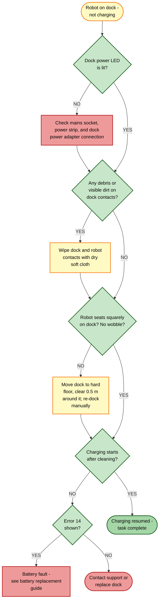

# Guide 10 — Charging Failure

[← Repair guides index](README.md) | [← Repository index](../README.md)

---

## Symptoms

- Robot sits on the dock but the charging LED never lights up or shows solid red
- Battery level does not increase after leaving the robot on the dock for an hour or more
- Battery drains completely even while docked
- **Error 13** — Charging contact issue (robot-side contacts not making connection)
- **Error 19** — No charging current detected at the dock
- **Error 22** — Contact contamination detected
- **Error 14** — Battery temperature fault (separate path; see Fix 5 below)

*Xiaomi Robot Vacuum 5 Pro with dock. The two gold charging contacts on the dock face must align with the two contacts on the robot's underside.*
Source: [webshopapp.com](https://cdn.webshopapp.com/shops/210536/files/485685171/1652x1652x2/xiaomi-xiaomi-robot-vacuum-5-pro-eu.jpg)

---

## Root Causes

| # | Cause | Typical error |
|---|-------|---------------|
| 1 | Dirty or oxidized charging contacts (robot underside or dock face) | 13, 22 |
| 2 | Poor dock alignment — robot did not seat squarely | 13, 19 |
| 3 | Dock unplugged, mains socket switched off, or power strip off | 19 |
| 4 | Dock placed on carpet or obstructions within 0.5 m around it | 13 |
| 5 | Battery temperature fault or hardware failure | 14 |

---

## Troubleshooting Decision Tree

---

## Fixes

### Fix 1 — Clean the charging contacts

**Errors addressed:** 13, 22

The robot has two gold-plated spring contacts on its underside near the front bumper. The dock has two matching flat contacts on its face. Dust, pet hair, and skin oils all build up an insulating layer over time.

1. Power off the robot: press and hold the power button for 3 seconds until the LED turns off.
2. Tip the robot on its side to access the underside contacts. Inspect with good lighting.
3. Using a dry microfibre cloth or a cotton swab, gently wipe both contacts on the robot.
4. Wipe the two contacts on the dock face with the same cloth.
5. If oxidation (dark or greenish film) is visible, dampen the cloth very lightly with isopropyl alcohol (IPA ≥70 %). Do **not** apply liquid directly — dampen the cloth only.
6. Allow the contacts to dry fully before re-docking.

**Verification:** Place the robot back on the dock manually. The charging LED should turn on within 30 seconds and the Xiaomi Home app should report "Charging."

---

### Fix 2 — Re-seat and re-position the dock

**Errors addressed:** 13, 19

The dock must be on a firm, level hard-floor surface so the robot can approach it straight. Carpet or uneven surfaces tilt the dock, causing the contacts to miss.

1. Lift the dock and place it on a hard floor (tile, wood, laminate) against a flat wall.
2. Ensure the area 0.5 m to either side and 1.5 m in front of the dock is clear of obstacles.
3. Run the robot to the dock manually via the Xiaomi Home "Return to dock" command.
4. If the robot misses the dock, press the dock button to trigger a re-alignment approach.

**Verification:** Confirm the LED shows solid blue/white (model-specific) after docking.

---

### Fix 3 — Check the mains power supply

**Error addressed:** 19

The dock output is **20 V DC / 1.5 A** (30 W). Voltage drop from extension cords, worn sockets, or switched power strips can cause intermittent charging.

1. Check the wall socket using another device (phone charger, lamp).
2. If using a power strip, switch it on and confirm the strip indicator is lit.
3. Verify the dock power adapter is firmly seated in both the dock and the wall socket.
4. Where possible, plug the dock directly into a dedicated wall socket rather than a strip.

**Verification:** Error 19 should clear immediately once power is restored.

---

### Fix 4 — Reboot robot and dock

A firmware hang can cause the charge circuit to stop reporting correctly without any hardware fault.

1. Remove the robot from the dock.
2. Hold the power button on the robot for 10 seconds to force a full shutdown.
3. Unplug the dock from the wall for 30 seconds, then plug it back in.
4. Place the robot on the dock and wait 60 seconds.

**Verification:** The Xiaomi Home app should update to "Charging" status.

---

### Fix 5 — Battery temperature fault (Error 14)

**Error addressed:** 14

Error 14 means the battery management system (BMS) is reporting a temperature outside the safe charging window (typically 0–45 °C) or a cell-voltage anomaly.

1. Move the robot to a room temperature environment (15–30 °C).
2. Wait 30 minutes for the battery to reach ambient temperature.
3. Re-dock; the error may clear if temperature was the sole cause.
4. If Error 14 persists after the robot has reached ambient temperature, the battery pack itself is faulty and must be replaced.

> **See:** [Battery Replacement Guide](../replacement-guides/battery-replacement.md)

**Verification:** Error 14 no longer appears and the robot charges normally.

---

## Prevention

- Clean the charging contacts monthly as part of routine maintenance.
- Keep the dock on a hard floor; avoid carpet.
- Use the original power adapter — third-party adapters may not deliver the required 20 V DC 1.5 A and will cause Error 19.
- Store and operate the robot in a 15–30 °C environment.

---

## Related Links

- [Battery Replacement Guide](../replacement-guides/battery-replacement.md)
- [Guide 15 — Battery Degradation](15-battery-degradation.md)
- [Guide 14 — Sensors Dirty / Error Codes](14-sensors-dirty-errors.md)

---

## Sources

- Xiaomi Robot Vacuum 5 Pro user manual (EU variant OV21GL / dock OV21-JZEU)
- Error code reference: [finderrorcode.com — Xiaomi Mi Vacuum Cleaner Error Codes](https://finderrorcode.com/xiaomi-mi-vacuum-cleaner-error-codes.html)
- Dock power specification: 20 V DC 1.5 A (printed on dock underside label)
