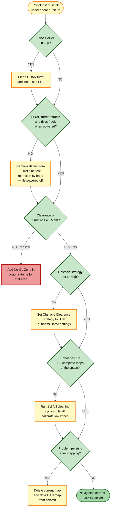

# Guide 11 — Navigation Lost / Low-Clearance Failures

[← Repair guides index](README.md) | [← Repository index](../README.md)

---

## Symptoms

- Robot gets stuck under furniture or reports being "lost" mid-clean
- Robot refuses to enter spaces you know it should fit under (sofas, low beds)
- Robot bumps repeatedly into furniture legs without navigating around them
- Erratic or looping path pattern on the map in Xiaomi Home
- **Error 1** — LiDAR obstacle/obstruction detected
- **Error 21** — LiDAR sensor abnormality

---

## Hardware Background: Retractable dToF LiDAR

The Xiaomi Robot Vacuum 5 Pro uses a **retractable direct Time-of-Flight (dToF) LiDAR** turret:

| State | Height from floor |
|-------|-------------------|
| Raised (normal cleaning) | 106 mm |
| Retracted (low-clearance mode) | 88 mm |
| Minimum room clearance required | **95 mm (9.5 cm)** |

When the robot detects an overhead obstacle via its top-mounted IR proximity sensor, it retracts the LiDAR turret and switches to camera-assisted and ultrasonic navigation. If the turret cannot retract due to debris or a mechanical obstruction, the robot will either stop at the entrance or become stuck.

*A rotating LiDAR module similar in principle to the retractable dToF unit used in the Xiaomi Robot Vacuum 5 Pro.*
Source: [Wikimedia Commons — LIDAR P1240048.jpg](https://commons.wikimedia.org/wiki/File:LIDAR_P1240048.jpg) (CC BY-SA 3.0)

---

## Root Causes

| # | Cause | Related error |
|---|-------|---------------|
| 1 | Debris or pet hair jammed around the LiDAR turret, preventing retraction | 1, 21 |
| 2 | LiDAR lens dirty — range readings incorrect | 1, 21 |
| 3 | Obstacle-avoidance strategy set too conservative in app | — |
| 4 | Map not calibrated — robot does not know low-clearance zones | — |
| 5 | Furniture height is below the 95 mm hard minimum | — |

---

## Troubleshooting Decision Tree

---

## Fixes

### Fix 1 — Clean and inspect the LiDAR turret

**Errors addressed:** 1, 21

1. Power the robot off completely (hold power button 3 seconds).
2. Locate the LiDAR turret on the robot's top surface — a small cylindrical tower that rotates during operation.
3. Inspect the gap at the base of the turret for accumulated hair, dust, or debris.
4. Use a soft dry cloth to wipe the turret body and the transparent lens window.
5. Use a can of compressed air (held upright, short bursts) to blow out any debris from the retraction slot around the turret base.
6. Do **not** use solvents, wet wipes, or abrasive materials on the lens — they scratch the optical surface and degrade range accuracy.
7. Power the robot back on and observe the turret: it should rise smoothly and rotate within a few seconds.

**Verification:** Error 1/21 should no longer appear at startup. Run a short cleaning cycle and confirm the robot navigates smoothly.

---

### Fix 2 — Verify LiDAR retraction mechanism

The retraction motor is spring-loaded. If debris is lodged under the turret skirt, the spring cannot pull the turret down.

1. With the robot **powered off**, gently press down on the LiDAR turret with one finger.
2. It should depress approximately 18 mm (from 106 mm to 88 mm) with mild resistance and spring back up when released.
3. If it does not depress, or feels gritty/stiff:
   - Use a toothpick or non-metallic pick to carefully remove visible debris from the gap around the turret base.
   - Re-test the spring action.
4. If the turret is physically cracked or the spring does not return it to the raised position, the LiDAR module requires replacement.

**Verification:** Turret depresses and returns freely. Robot enters low-clearance spaces without stopping.

---

### Fix 3 — Adjust obstacle-clearance strategy in Xiaomi Home

The Xiaomi Home app allows three obstacle-clearance strategies that control how closely the robot approaches detected obstacles:

1. Open **Xiaomi Home** > select the robot > **Settings** > **Cleaning Preferences** > **Obstacle Clearance Strategy**.
2. Change from "Moderate" or "Conservative" to **"High"** (closest approach, most aggressive navigation).
3. Save the setting and restart a cleaning cycle.

> Note: "High" strategy may increase collision frequency with very thin chair legs; adjust to taste.

**Verification:** Robot visibly approaches furniture more closely and navigates underneath low items it previously avoided.

---

### Fix 4 — Allow 1–2 mapping weeks for AI calibration

The robot's AI carpet and low-clearance detection improves over 1–2 full cleaning cycles as it builds confidence in the floor plan. If the map is recent:

1. Do not delete the current map.
2. Run a full room cleaning cycle once per day for 5–7 days.
3. Check after each cycle whether the robot navigates the problematic area more confidently.

**Verification:** After 1–2 weeks, the robot should reliably retract the LiDAR and pass under the same furniture.

---

### Fix 5 — Mark low-clearance zones or add No-Go Zones

For persistent problem areas — especially furniture with clearance between 95 mm and approximately 120 mm — you can give the robot explicit instructions:

**Option A — Mark as low-clearance zone (if firmware supports it):**
1. In Xiaomi Home, open the interactive map.
2. Tap and hold the area under the furniture.
3. If "Low clearance" zone marking is available, apply it. The robot will auto-retract its LiDAR upon entry.

**Option B — No-Go Zone (furniture below 95 mm hard minimum):**
1. In Xiaomi Home, tap the map edit icon.
2. Draw a **No-Go Zone** over the furniture footprint.
3. Save. The robot will not attempt to enter this zone.

**Verification:** Robot either navigates the zone with the LiDAR retracted, or avoids it entirely depending on the option used.

---

### Fix 6 — Full remap

If the map has accumulated errors over many cycles (phantom walls, incorrect room boundaries, lost zones):

1. In Xiaomi Home > robot settings > **Map** > **Delete Map**.
2. Manually position the robot in the centre of the largest room.
3. Start a full cleaning cycle from the app.
4. Allow the robot to complete the full home map before adding zones or modifications.

**Verification:** New map is clean and accurate. Reapply any custom zones after the first successful full-home map.

---

## Prevention

- Clean the LiDAR turret lens and slot monthly.
- Do not leave power cables, clothing, or small objects on the floor near furniture the robot navigates under — they can jam the retraction mechanism from outside.
- Raise furniture feet above 9.5 cm if possible; furniture risers (bed-risers) are a practical solution for low beds.
- Keep Xiaomi Home and robot firmware updated — navigation algorithms improve with each release.

---

## Related Links

- [Guide 14 — Sensors Dirty / Error Codes](14-sensors-dirty-errors.md)
- [Guide 12 — Carpet Map Ghost](12-carpet-map-ghost.md)

---

## Sources

- Xiaomi Robot Vacuum 5 Pro user manual (EU variant OV21GL / dock OV21-JZEU) — hardware dimensions
- Error code reference: [finderrorcode.com — Xiaomi Mi Vacuum Cleaner Error Codes](https://finderrorcode.com/xiaomi-mi-vacuum-cleaner-error-codes.html)
- User experience reports: [redditrecs.com — Xiaomi Robot Vacuum 5 Pro OV21GL](https://redditrecs.com/robot-vacuum/model/xiaomi-robot-vacuum-5-pro-ov21gl/)
