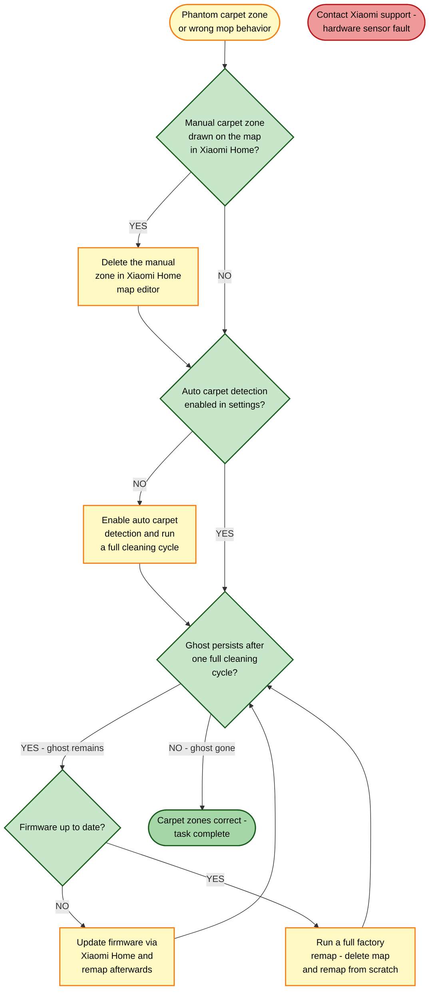

# Guide 12 — Carpet Map Ghost (Phantom Carpet Detection)

[← Repair guides index](README.md) | [← Repository index](../README.md)

---

## Symptoms

- Robot lifts its mop attachment or refuses to mop an area where a carpet used to be, even though the carpet has been removed
- Robot treats a bare-floor area as carpet (avoids it or changes behavior) for no apparent reason
- Conversely, robot does not lift the mop over a carpet you recently placed, because the map predates the carpet
- Custom carpet zones you deleted from the map persist after the next cleaning cycle
- Firmware update appears to have reset zone behavior unexpectedly

---

## Background: How Carpet Detection Works

The Xiaomi Robot Vacuum 5 Pro uses two complementary systems to identify carpets:

1. **Ultrasonic carpet sensor** (underside) — detects the change in surface texture and density in real time during a cleaning pass.
2. **AI-saved carpet map** — after multiple cleaning cycles the robot's firmware caches detected carpet zones. This cached map persists across reboots and informs subsequent runs before the robot physically reaches those areas.

When you remove a carpet, the cached map does not update automatically — the robot "remembers" the old layout until it runs over the area again and overwrites the cache, or until you explicitly reset the map.

---

## Root Causes

| # | Cause | Notes |
|---|-------|-------|
| 1 | Cached AI carpet-detection map not invalidated after carpet removal | Most common cause |
| 2 | Auto carpet detection disabled — robot never updates zones | Less common; robot treats everything as non-carpet |
| 3 | Manual carpet zone still drawn on the interactive map | Survives remap if zones are re-imported |
| 4 | Outdated firmware with a carpet-detection calibration bug | Rare; resolved in recent firmware |

---

## Troubleshooting Decision Tree

---

## Fixes

### Fix 1 — Delete manual carpet zones from the interactive map

Manual zones survive cleaning cycles and override the sensor data.

1. Open **Xiaomi Home** and select the Xiaomi Robot Vacuum 5 Pro.
2. Tap the **Map** icon to open the interactive floor plan.
3. Tap the **Edit** (pencil) icon.
4. Look for any orange or highlighted carpet regions drawn over your floor plan.
5. Tap each carpet zone and select **Delete**.
6. Save the map.
7. Start a full cleaning cycle and observe whether the robot now mops the previously ghosted area.

**Verification:** Robot mops the formerly ghosted area without lifting the pad.

---

### Fix 2 — Re-enable or toggle auto carpet detection

Auto carpet detection uses the ultrasonic sensor to refresh zone data on each pass.

1. In Xiaomi Home > robot settings > **Cleaning Preferences** (or **Advanced Settings** depending on firmware version).
2. Find **Auto Carpet Detection** (sometimes labelled "Carpet Boost" or "Carpet Identification").
3. If disabled, **enable** it.
4. If already enabled, toggle it off, wait 10 seconds, then toggle it back on to force a settings refresh.
5. Run a full cleaning cycle.

> Tip: if you want to mop the entire floor regardless of carpet presence, you can **disable** auto carpet detection entirely. The robot will keep the mop pad down over all surfaces, including real carpets — only do this if you have no carpets or have removed them all.

**Verification:** Robot correctly identifies the removed carpet area as hard floor on the next pass.

---

### Fix 3 — Manually edit carpet regions on the map

If the ghost zone is only affecting one specific area, you can override it without a full remap:

1. Open Xiaomi Home > **Map** > **Edit**.
2. Locate the ghost carpet region.
3. Use the carpet-zone drawing tool to **mark it as a non-carpet (floor) region**, effectively overriding the cached sensor data.
4. Alternatively, add the area to a **custom room** that is set to "Mop only" or "Vacuum and mop."
5. Save and run a cycle.

**Verification:** Robot mops the area on the next cycle.

---

### Fix 4 — Full factory remap

The most reliable fix for a heavily corrupted carpet cache is to delete the entire map and let the robot re-learn the space from scratch.

> Warning: all custom zones, room names, no-go zones, and schedules tied to the map will be deleted. Export a map screenshot first if you want a reference.

1. In Xiaomi Home > robot settings > **Map** > **Delete Map** (or "Clear Map Data").
2. Confirm the deletion.
3. Position the robot in the centre of the largest room.
4. Tap **Start Cleaning** to begin a full home discovery run.
5. Allow the robot to complete one or two full cycles before adding custom zones again.

**Verification:** New map shows no ghost carpet zones. Carpet detection reflects the current state of your floor.

---

### Fix 5 — Update firmware

Xiaomi has released several firmware updates addressing carpet-detection accuracy and map-cache persistence bugs.

1. In Xiaomi Home > robot settings > **Firmware Update** (or tap the version number at the bottom of the device page).
2. If an update is available, install it while the robot is on the dock and charging.
3. After the update, the robot will reboot automatically.
4. It is recommended to perform a full remap (Fix 4) after a major firmware update to ensure the new algorithms start with a clean map.

**Verification:** Firmware version shown in the app matches the latest release. Ghost zones do not reappear after a remap.

---

## Prevention

- When you permanently remove or reposition a carpet, immediately start a "quick clean" pass over the affected area so the ultrasonic sensor updates the cache before the next scheduled run.
- Avoid toggling auto carpet detection frequently — each toggle can introduce a brief calibration delay.
- Keep firmware updated for the latest carpet-detection algorithm improvements.

---

## Related Links

- [Guide 11 — Navigation Lost / Low-Clearance Failures](11-navigation-lost-low-clearance.md)
- [Guide 14 — Sensors Dirty / Error Codes](14-sensors-dirty-errors.md)

---

## Sources

- Xiaomi Robot Vacuum 5 Pro user manual (EU variant OV21GL / dock OV21-JZEU)
- User experience reports: [redditrecs.com — Xiaomi Robot Vacuum 5 Pro OV21GL](https://redditrecs.com/robot-vacuum/model/xiaomi-robot-vacuum-5-pro-ov21gl/)
