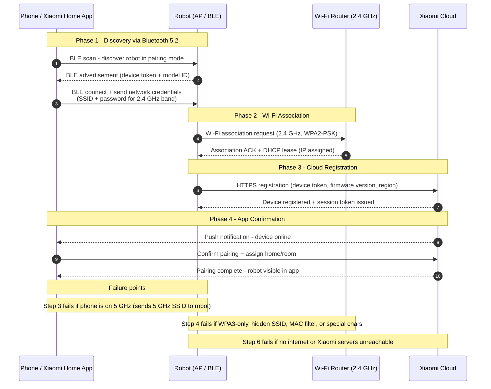

# Guide 13 — Wi-Fi Pairing Failure

[← Repair guides index](README.md) | [← Repository index](../README.md)


---

## Symptoms

- Cannot add the robot to Xiaomi Home — the app gets stuck at "Connecting" or "Searching for device"
- Robot indicator light is **solid orange** — this means Wi-Fi is disconnected or pairing failed
- Robot was previously connected but dropped off the network after a router change
- App shows the robot as offline even though it is powered on and near the router
- Pairing completes on the phone but the robot never appears as online in the app

---

## Hardware Wi-Fi Specification

| Spec | Value |
|------|-------|
| Wi-Fi standard | **802.11 b/g/n/ax (2.4 GHz ONLY)** |
| Security | WPA2-PSK (recommended), WPA3 support is firmware-dependent |
| Bluetooth | 5.2 (used to assist the initial pairing handshake) |
| Indicator: solid orange | Wi-Fi disconnected / not paired |
| Indicator: blinking orange | Pairing mode active |
| Indicator: solid blue/white | Connected to network and Xiaomi Cloud |

> **Critical:** The Xiaomi Robot Vacuum 5 Pro does **not** connect to 5 GHz Wi-Fi. If your router broadcasts a single merged SSID that includes both 2.4 GHz and 5 GHz (common on newer routers using Band Steering), the robot may fail to pair or connect because it cannot use the 5 GHz portion.

---

## Root Causes

| # | Cause | Symptom |
|---|-------|---------|
| 1 | Router is 5 GHz-only or band-steered SSID without true 2.4 GHz | Pairing fails entirely |
| 2 | Router uses WPA3-only (SAE) security — robot needs WPA2-PSK | Pairing completes on phone but robot never connects |
| 3 | SSID or password contains special characters (spaces, `#`, `@`, `"`, `'`) | Silent pairing failure |
| 4 | Hidden SSID — router not broadcasting SSID name | Robot cannot discover the network |
| 5 | Phone is on 5 GHz during pairing — Bluetooth handoff sends wrong band | Robot receives 5 GHz credentials |
| 6 | MAC address filtering enabled on router | Robot MAC blocked at association |
| 7 | Captive portal / guest network requires browser login | Robot cannot authenticate |
| 8 | Robot Wi-Fi credentials corrupted (after firmware update or power cut) | Previously paired robot now offline |

---

## App Pairing Handshake — Sequence Diagram



---

## Troubleshooting Decision Tree

```mermaid
flowchart TD
    START([Robot shows solid orange /<br/>pairing fails in app]):::action

    Q1{Router has a<br/>2.4 GHz band<br/>available?}:::control
    FX1[Enable 2.4 GHz band<br/>in router admin;<br/>split into separate SSID<br/>if band-steered]:::action

    Q2{Phone is on<br/>2.4 GHz SSID<br/>during pairing?}:::control
    FX2[Connect phone to<br/>2.4 GHz SSID before<br/>starting Xiaomi Home<br/>pairing]:::action

    Q3{SSID/password uses<br/>only simple alphanumeric<br/>characters?}:::control
    FX3[Rename SSID and<br/>change password to<br/>simple alphanumeric only<br/>then retry pairing]:::action

    Q4{Router security<br/>is WPA2-PSK<br/>or WPA2/WPA3 mixed?}:::control
    FX4[Change router security<br/>to WPA2-PSK or<br/>WPA2/WPA3 mixed mode]:::action

    Q5{SSID is visible<br/>(not hidden)?}:::control
    FX5[Unhide SSID in<br/>router admin and<br/>retry pairing]:::action

    Q6{MAC filtering<br/>disabled on router?}:::control
    FX6[Add robot MAC to<br/>router allowlist<br/>(see label on underside)]:::action

    Q7{Reset robot Wi-Fi<br/>and retry?}:::control
    FX7[Hold Wi-Fi reset<br/>buttons per manual;<br/>restart Xiaomi Home<br/>pairing flow]:::action

    OK([Robot online -<br/>solid blue indicator]):::ok
    ESC([Update app;<br/>contact Xiaomi support]):::fail

    START --> Q1
    Q1 -->|NO| FX1
    FX1 --> Q2
    Q1 -->|YES| Q2
    Q2 -->|NO| FX2
    FX2 --> Q3
    Q2 -->|YES| Q3
    Q3 -->|NO| FX3
    FX3 --> Q4
    Q3 -->|YES| Q4
    Q4 -->|NO| FX4
    FX4 --> Q5
    Q4 -->|YES| Q5
    Q5 -->|NO| FX5
    FX5 --> Q6
    Q5 -->|YES| Q6
    Q6 -->|NO| FX6
    FX6 --> Q7
    Q6 -->|YES| Q7
    Q7 -->|NO| FX7
    Q7 -->|YES| OK
    FX7 --> ESC

    classDef action  fill:#fff9c4,stroke:#f57f17,stroke-width:2px,color:#000
    classDef control fill:#c8e6c9,stroke:#1b5e20,stroke-width:2px,color:#000
    classDef fail    fill:#ef9a9a,stroke:#b71c1c,stroke-width:2px,color:#000
    classDef ok      fill:#a5d6a7,stroke:#1b5e20,stroke-width:2px,color:#000
```

---

## Fixes

### Fix 1 — Enable and separate the 2.4 GHz Wi-Fi band

**Cause addressed:** 1 (5 GHz-only or merged-band SSID)

Modern routers often use Band Steering, which presents a single SSID for both 2.4 GHz and 5 GHz. Phones and laptops typically get steered to 5 GHz automatically. The robot cannot use 5 GHz and may receive 5 GHz credentials during pairing.

1. Log in to your router admin panel (typically `192.168.1.1` or `192.168.0.1`).
2. Navigate to **Wireless** or **Wi-Fi Settings**.
3. If you see only one SSID with both bands: look for a **Band Steering** or **Smart Connect** toggle and **disable** it.
4. Once Band Steering is off, two SSIDs should appear — for example `Home_2.4G` and `Home_5G`.
5. Set both to the same password for convenience, or a different one — the robot only needs to see the 2.4 GHz one.
6. Save and wait for the router to apply the change (30 seconds).


*Wi-Fi is a trademark of the Wi-Fi Alliance. The Xiaomi Robot Vacuum 5 Pro requires a 2.4 GHz 802.11 b/g/n/ax connection.*
Source: [Wikimedia Commons — Wi-Fi Logo](https://commons.wikimedia.org/wiki/File:Wi-Fi_Logo.svg) (Trademark)

**Verification:** Two separate SSIDs now visible on your phone. Proceed with pairing using the 2.4 GHz SSID.

---

### Fix 2 — Connect your phone to the 2.4 GHz band before pairing

**Cause addressed:** 5 (phone on 5 GHz during pairing)

During the Bluetooth-assisted pairing handshake, the Xiaomi Home app reads the network credentials from the phone's current Wi-Fi connection and transmits them to the robot via Bluetooth 5.2. If the phone is on the 5 GHz band, the robot receives 5 GHz credentials it cannot use.

1. On your phone, go to **Settings > Wi-Fi**.
2. Connect to the **2.4 GHz SSID** (the `_2.4G` or `_2G` variant if your router uses separate names).
3. Confirm connection — do not start pairing until the phone shows this SSID as connected.
4. Open **Xiaomi Home**, tap the **+** icon, and follow the pairing flow.
5. When the app asks you to confirm the network name, verify it shows the 2.4 GHz SSID.

**Verification:** App sends the correct 2.4 GHz credentials; robot indicator transitions from blinking orange (pairing) to solid blue/white.

---

### Fix 3 — Simplify SSID name and password

**Cause addressed:** 3 (special characters)

Some router firmware and the robot's Wi-Fi chipset do not correctly escape special characters in SSIDs or passwords during the BLE credential transfer.

1. In your router admin panel, rename the 2.4 GHz SSID to a short name using only letters and numbers (e.g., `HomeNet24`).
2. Change the Wi-Fi password to letters and numbers only (8–20 characters; avoid spaces, `#`, `@`, `!`, `"`, `'`, `\`).
3. Reconnect your phone to the renamed network.
4. Retry the Xiaomi Home pairing flow.

> Note: after renaming the SSID you will need to reconnect all other devices on your network.

**Verification:** Pairing completes within 60 seconds after entering the simplified credentials.

---

### Fix 4 — Set router security to WPA2-PSK (or WPA2/WPA3 mixed)

**Cause addressed:** 2 (WPA3-only)

1. In your router admin panel, navigate to **Wireless Security** or **Encryption**.
2. Change the security mode from **WPA3-SAE** (or WPA3-only) to **WPA2-PSK (AES)** or **WPA2/WPA3 mixed** (also called "WPA3 Transition Mode").
3. Save and allow the router to restart.
4. Retry pairing.

**Verification:** Robot connects after selecting WPA2 or mixed mode. The robot's BLE-assisted setup completes without timing out.

---

### Fix 5 — Unhide the SSID

**Cause addressed:** 4 (hidden SSID)

A hidden SSID prevents the robot from performing its network discovery scan.

1. In your router admin panel, find the **SSID Broadcast** or **Hide SSID** setting for the 2.4 GHz band.
2. Enable SSID broadcast (disable the "hidden" option).
3. Save and retry pairing.
4. After successful pairing, you may re-hide the SSID if desired — the robot will reconnect using cached credentials.

**Verification:** SSID is now visible in your phone's Wi-Fi scan list. Pairing succeeds.

---

### Fix 6 — Add robot MAC address to router allowlist

**Cause addressed:** 6 (MAC filtering)

If MAC address filtering is enabled on your router, the robot's MAC must be explicitly permitted.

1. Find the robot's MAC address: it is printed on a label on the robot's underside, or visible in **Xiaomi Home > Device Info** once partially paired.
2. In your router admin panel, go to **MAC Filter** or **Access Control**.
3. Add the robot's MAC address to the allowlist.
4. Save and retry pairing.

**Verification:** Router association log shows the robot's MAC as accepted; robot appears online in the app.

---

### Fix 7 — Reset the robot's Wi-Fi module and re-pair

**Cause addressed:** 8 (corrupted credentials)

1. Place the robot on the dock and ensure it is powered on.
2. Press and hold the **Wi-Fi reset button** (consult your model's manual — on many Xiaomi robots this is a combination of the dock/clean buttons held simultaneously for 5 seconds) until the indicator flashes orange rapidly.
3. The robot will reboot into pairing mode (blinking orange).
4. Open **Xiaomi Home**, tap **+** > **Add Device** > find the robot.
5. Follow the full pairing flow from the beginning.

**Verification:** Indicator transitions to solid blue/white; robot shown as online in the app.

---

### Fix 8 — Update the Xiaomi Home app

An outdated version of the app may use a deprecated pairing API that is no longer accepted by Xiaomi Cloud servers.

1. Open the App Store (iOS) or Google Play Store (Android).
2. Search for **Xiaomi Home** and update to the latest version.
3. Force-close and reopen the app.
4. Retry pairing.

**Verification:** App version shown in settings is current. Pairing completes successfully.

---

## Prevention

- Keep your 2.4 GHz SSID permanently separate from the 5 GHz band (or always know which is which).
- Avoid changing the SSID or password without also updating the robot's stored credentials via the app.
- Use WPA2-PSK or WPA2/WPA3 mixed — do not upgrade to WPA3-only without checking device compatibility first.
- Keep both the Xiaomi Home app and the robot firmware updated.

---

## Related Links

- [Guide 10 — Charging Failure](10-charging-failure.md)
- [Xiaomi Home app (iOS)](https://apps.apple.com/app/xiaomi-home/id1186264719)
- [Xiaomi Home app (Android)](https://play.google.com/store/apps/details?id=com.xiaomi.smarthome)

---

## Sources

- Xiaomi Robot Vacuum 5 Pro user manual (EU variant OV21GL / dock OV21-JZEU) — Wi-Fi spec: 802.11 b/g/n/ax 2.4 GHz, BT 5.2
- Error code reference: [finderrorcode.com — Xiaomi Mi Vacuum Cleaner Error Codes](https://finderrorcode.com/xiaomi-mi-vacuum-cleaner-error-codes.html)
- User experience reports: [redditrecs.com — Xiaomi Robot Vacuum 5 Pro OV21GL](https://redditrecs.com/robot-vacuum/model/xiaomi-robot-vacuum-5-pro-ov21gl/)
