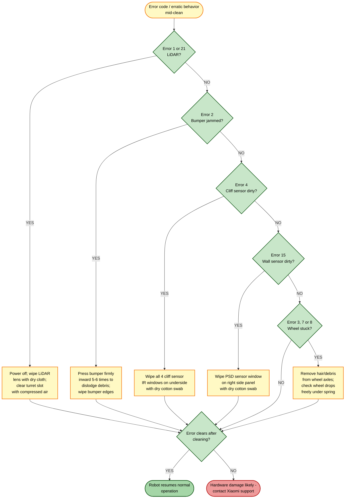

# Guide 14 — Sensors Dirty / Sensor Error Codes

[← Repair guides index](README.md) | [← Repository index](../README.md)

---

## Symptoms

- Robot stops mid-clean and returns to dock with an error code
- Robot follows erratic, looping, or repetitive paths
- Robot refuses to start a cleaning cycle
- App shows persistent error notifications after cleaning
- **Error 1** — LiDAR obstructed (laser sensor abnormality)
- **Error 2** — Collision sensor / bumper jammed or stuck
- **Error 3** — Left wheel stuck or raised
- **Error 4** — Cliff sensor dirty or blocked (fall-prevention sensor)
- **Error 7** — Right wheel stuck or raised
- **Error 8** — Both wheels stuck
- **Error 15** — Wall / PSD (Position Sensitive Detector) sensor dirty
- **Error 21** — LiDAR sensor abnormality (extended version of Error 1)

---

## Sensor Map

The table below lists every sensor relevant to these errors, its location on the robot, and the cleaning method.

| Sensor | Location | What it does | Errors |
|--------|----------|--------------|--------|
| **LiDAR turret** | Top surface, center | 360° range scanning for navigation and obstacle mapping | 1, 21 |
| **Front bumper / collision sensors** | Front arc, around the entire bumper | Detects physical contact with obstacles | 2 |
| **Cliff sensors (IR)** | Underside, 4 sensors near the front and sides | Detects stair edges and drops; stops the robot from falling | 4 |
| **Wall / PSD sensor** | Right-side panel, forward-facing IR window | Measures distance to walls for edge cleaning | 15 |
| **Camera / Visual OA sensor** | Front face, below bumper | Optical obstacle avoidance (recognizes object types) | 1 (indirectly) |
| **Drive wheels** | Underside, left and right | Movement; suspension spring retracts on carpet | 3, 7, 8 |
| **Charging contacts** | Underside, front | Power transfer from dock | (see Guide 10) |

---

## Troubleshooting Decision Tree

---

## Fixes

> **Safety first:** Power the robot off completely before cleaning any sensor. Hold the power button for 3 seconds until the LED turns off.
>
> **Never use:** solvents (acetone, alcohol on plastic lenses), abrasive cloths, or wet wipes directly on sensor windows — these scratch optical surfaces and permanently degrade sensor accuracy.

---

### Fix 1 — Clean the LiDAR turret (Errors 1, 21)

The LiDAR emits and receives near-infrared laser pulses through a small transparent window on the rotating turret. Dust, pet dander, and cooking grease film on this window cause range errors.

**Where it is:** Center-top of the robot. A cylindrical tower that spins during operation.

**How to clean:**
1. Power off the robot.
2. Dampen a clean microfibre cloth or cotton swab very lightly with water (no solvent). The cloth should be just barely moist, not wet.
3. Gently wipe the transparent lens window in a single circular motion. Do not press hard.
4. Use a dry swab to remove any moisture residue.
5. Use compressed air (held upright, short 1-second bursts, held at least 15 cm away) to clear the turret rotation slot of dust and hair.
6. Visually confirm the turret spins freely when you lightly tap it.

**Verification:** Power on; Error 1/21 does not reappear. LiDAR turret spins continuously within 5 seconds of startup.

---

### Fix 2 — Free a stuck bumper (Error 2)

The front bumper floats on spring-loaded posts. If a piece of debris (corn kernel, small toy, gravel) lodges between the bumper and the robot body, the bumper stays depressed and the robot thinks it is permanently colliding with an obstacle.

**Where it is:** The entire curved front section of the robot that can be pressed inward.

**How to fix:**
1. Power off the robot.
2. Press the bumper firmly inward at different points around its arc (left, centre, right) 5–6 times each. You should feel and hear a slight spring-back click.
3. Run your fingertip along the gap between the bumper and the robot body, feeling for any hard foreign object.
4. If an object is felt, tilt the robot forward and gently tap to dislodge it.
5. Wipe the bumper edges and the gap with a dry cloth to remove accumulated dust.

**Verification:** Bumper springs back promptly when pressed. Error 2 does not reappear on next startup.

---

### Fix 3 — Clean the cliff sensors (Error 4)

The cliff sensors are downward-facing infrared emitter/receiver pairs. They detect floor reflectance: when the robot reaches a stair edge, reflectance drops and the robot stops. Dust or dark residue on the lens windows causes false "cliff detected" readings on flat floors.

**Where they are:** Underside of the robot, near the front corners and sides — typically 4 small round or rectangular windows visible when the robot is tipped on its side.

**How to clean:**
1. Power off the robot and place it upside-down on a soft surface.
2. Locate the cliff sensor windows (small clear or dark-tinted plastic lenses, approximately 4 mm diameter).
3. Use a dry cotton swab to gently wipe each window in a circular motion.
4. If stubborn residue remains (dried liquid, sticky dust), dampen the swab minimally with distilled water only.
5. Allow to dry before powering on.

**Verification:** Place the robot on the floor (away from stairs). Error 4 does not appear. Robot does not hesitate or back away from the centre of the room.

---

### Fix 4 — Clean the wall / PSD sensor (Error 15)

The PSD (Position Sensitive Detector) is an IR distance sensor on the robot's right side panel. It keeps the robot a precise distance from walls during edge cleaning. Dust or smudges cause inaccurate readings, leading to Error 15 or poor wall-following behavior.

**Where it is:** Right-side panel of the robot, a small window typically located mid-height, just above the side brush.

**How to clean:**
1. Power off the robot.
2. Inspect the right side panel for the small IR window (may appear black or dark-tinted).
3. Wipe the window with a dry cotton swab using gentle circular strokes.
4. Do not use glass cleaner or any solvent.

**Verification:** Error 15 clears. Robot follows walls with a consistent gap of approximately 1–2 cm during edge cleaning.

---

### Fix 5 — Clean the camera / Visual OA sensor windows

The robot's front face contains one or more camera or IR windows used for optical obstacle avoidance. These do not have dedicated error codes but dirty windows reduce the robot's ability to identify and avoid objects.

**Where they are:** Front face of the robot, below the bumper line — small rectangular or circular windows.

**How to clean:**
1. Power off the robot.
2. Wipe each window with a dry microfibre cloth.
3. If there is a greasy film, use a cotton swab barely moistened with distilled water.

**Verification:** Robot resumes normal obstacle-avoidance behavior after the next cleaning cycle.

---

### Fix 6 — Clear wheel drive and axles (Errors 3, 7, 8)

Hair and string wrap around the wheel axles over time, reducing wheel rotation and eventually stalling the drive motor.

**Where they are:** Left and right drive wheels on the underside. Each wheel can be pressed down against a spring to check suspension travel.

**How to clean:**
1. Power off the robot and place it on its side.
2. Inspect the gap around each wheel and the axle stub visible between the wheel and the robot body.
3. Use scissors or a seam ripper to cut and remove any wrapped hair or string.
4. Pull the hair out by hand or with tweezers.
5. Press each wheel down by hand: it should travel approximately 10 mm against spring resistance and return fully.
6. Rotate each wheel by hand — it should turn freely with only light resistance.

**Verification:** Errors 3, 7, 8 clear after restart. Robot drives straight without veering.

---

## Prevention

- **Weekly:** Remove hair from the side brush, suction inlet, and wheel axles.
- **Monthly:** Wipe LiDAR lens, cliff sensors, PSD sensor, and camera windows with a dry cloth.
- **After each wet-mop session:** Ensure no water has splashed onto sensor windows. Wipe the underside dry before storing.
- Do not operate the robot on very dark or highly reflective floors (polished black tiles) without testing cliff sensor sensitivity first — these surfaces can trigger false cliff readings.

---

## Related Links

- [Guide 10 — Charging Failure](10-charging-failure.md) — charging contact cleaning
- [Guide 11 — Navigation Lost / Low-Clearance Failures](11-navigation-lost-low-clearance.md) — LiDAR retraction issues
- [Guide 15 — Battery Degradation](15-battery-degradation.md)

---

## Sources

- Xiaomi Robot Vacuum 5 Pro user manual (EU variant OV21GL / dock OV21-JZEU)
- Error code reference: [finderrorcode.com — Xiaomi Mi Vacuum Cleaner Error Codes](https://finderrorcode.com/xiaomi-mi-vacuum-cleaner-error-codes.html)
- User experience reports: [redditrecs.com — Xiaomi Robot Vacuum 5 Pro OV21GL](https://redditrecs.com/robot-vacuum/model/xiaomi-robot-vacuum-5-pro-ov21gl/)
