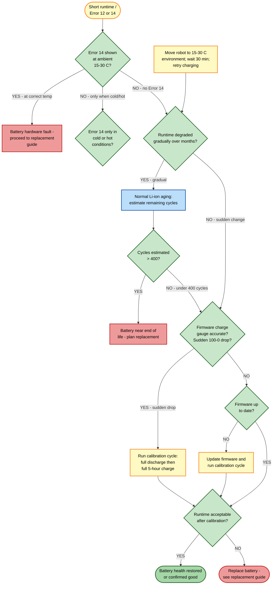

# Guide 15 — Battery Degradation

[← Repair guides index](README.md) | [← Repository index](../README.md)

%20%2F%20Hard%20(replacement)-orange)

---

## Symptoms

- Runtime far below the rated **140 minutes** on a full charge (hard floors, standard suction)
- Robot returns to dock to recharge after only 30–60 minutes of cleaning
- Robot shuts down suddenly mid-clean without a low-battery warning
- Battery percentage shown in the app drops rapidly from 100 % to near 0 % in minutes
- Robot will not complete large homes in a single charge even after a dock pause
- **Error 12** — Battery critically low (charge immediately)
- **Error 14** — Battery fault or temperature out of range

---

## Battery Specifications

| Parameter | Value |
|-----------|-------|
| Chemistry | Lithium-ion (Li-ion) |
| Nominal capacity | 5,200 mAh |
| Rated (minimum) capacity | 4,800 mAh |
| Nominal voltage | 14.4 V |
| Rated runtime (hard floor, standard suction) | Up to 140 min |
| Expected cycle life | 300–500 full charge/discharge cycles |
| Safe operating temperature | 0–40 °C |
| Safe charging temperature | 10–45 °C |
| Recommended storage temperature | 15–30 °C |

*Lithium-ion 18650 cylindrical cells — the type used in most high-capacity robot vacuum packs. The Xiaomi Robot Vacuum 5 Pro uses a pack rated at 14.4 V / 5,200 mAh.*
Source: [Wikimedia Commons — Liion-18650-AA-battery.jpg](https://commons.wikimedia.org/wiki/File:Liion-18650-AA-battery.jpg) (CC BY-SA 3.0)

---

## Root Causes

| # | Cause | Symptoms |
|---|-------|----------|
| 1 | Li-ion aging — normal capacity fade after 300–500 cycles | Gradually shorter runtime over months/years |
| 2 | Heat damage — robot stored or operated in >40 °C environment | Sudden capacity loss, Error 14 |
| 3 | Cold damage — charging attempted at <10 °C | Battery refuses to charge; Error 14 |
| 4 | Deep discharge — battery drained to 0 V multiple times | Accelerated aging, sudden shutdowns |
| 5 | Firmware charge-gauge drift — reported % does not match reality | Sudden 100 → 0 % drop without runtime loss |
| 6 | Cell or BMS hardware failure | Error 14 persists even at correct temperature |

---

## Troubleshooting Decision Tree

---

## Fixes

### Fix 1 — Full charge/discharge calibration cycle

**Addresses:** Firmware charge-gauge drift (Cause 5)

Over time the battery management system (BMS) loses track of the real charge/discharge endpoints, causing the reported percentage to jump erratically. A full calibration cycle re-anchors the BMS.

1. Start a cleaning cycle from the app with no area restrictions — allow the robot to run until it returns to the dock due to a **low battery warning** (not a forced return).
2. Leave the robot on the dock continuously for **at least 5 hours** (a full slow charge). Do not start a cleaning cycle during this time.
3. After 5 hours, confirm the app shows 100 % charged.
4. Optionally repeat the discharge and charge one more time for a stronger calibration.

> Note: do **not** force a full discharge to 0 V repeatedly — this accelerates Li-ion aging. One calibration cycle every 3–6 months is sufficient.

**Verification:** Battery percentage moves smoothly from 100 % down to 20–30 % over the expected ~140-minute runtime. No sudden drops.

---

### Fix 2 — Temperature management

**Addresses:** Heat and cold damage (Causes 2, 3)

1. **Hot environment (>40 °C):** Relocate the dock to a shaded, ventilated room. Do not place the dock in direct sunlight, next to radiators, or in unventilated utility rooms.
2. **Cold environment (<10 °C):** Bring the robot to a room at 15–30 °C for at least 30 minutes before charging. Li-ion cells charged below 10 °C can suffer permanent lithium plating damage.
3. After relocating, retry a normal charging and cleaning cycle.

**Verification:** Error 14 no longer appears. Runtime returns to near-normal if temperature was the only factor. If Error 14 persists at correct temperature, the battery has sustained permanent damage (see Fix 5).

---

### Fix 3 — Prevent deep discharge

**Addresses:** Deep discharge (Cause 4)

Deep discharge occurs when the robot is left without charging for extended periods or the dock loses power.

1. Ensure the dock is always powered and accessible.
2. Enable **Auto Return to Dock** in Xiaomi Home > robot settings so the robot docks when the battery reaches approximately 15–20 %.
3. If storing the robot for more than two weeks, charge it to approximately 50–60 % first, then power it off (do not leave it fully charged or fully discharged during storage).

**Verification:** Robot always returns to dock before critically low battery; Error 12 no longer appears during normal operation.

---

### Fix 4 — Update firmware

**Addresses:** Charge-gauge calibration bugs (Cause 5)

Xiaomi periodically releases firmware updates that improve BMS calibration accuracy.

1. In Xiaomi Home, go to the robot device page and tap the firmware version or **Check for Updates**.
2. If an update is available, install it while the robot is docked and charging.
3. After the update completes and the robot reboots, run a full calibration cycle (Fix 1).

**Verification:** Battery percentage reporting is stable after the update and calibration cycle.

---

### Fix 5 — Battery replacement

**Addresses:** End-of-life aging, hardware BMS failure, heat/cold damage (Causes 1, 2, 3, 6)

If runtime is below 60 minutes after a calibration cycle, or Error 14 persists at correct operating temperature, the battery pack requires physical replacement.

> **Battery replacement is rated HARD difficulty** — it requires disassembling the robot body and working with a live Li-ion pack. Read the full replacement guide before proceeding.

> See: [Battery Replacement Guide](../replacement-guides/battery-replacement.md)

**Safety warnings:**
- Use only a **genuine Xiaomi replacement battery** or a certified equivalent with the same voltage (14.4 V) and capacity (5,200 mAh / 4,800 mAh rated). Third-party cells without a certified BMS can cause thermal runaway.
- Li-ion batteries can cause **fire or explosion** if punctured, short-circuited, or overcharged. Do not bend, cut, or crush the battery pack.
- Do not disassemble the battery pack itself — replace it as a complete unit.
- If the old battery is swollen (pack is visibly puffy or the robot body feels tight): stop use immediately, do not charge, and take it to a certified battery recycling facility.

**Recycling:** Do not dispose of Li-ion batteries in household waste. Take them to an electronics retailer or municipal hazardous-waste collection point.

**Verification:** After replacement, run a full calibration cycle (Fix 1). Runtime should be at or near the rated 140 minutes on hard floors.

---

## Expected Battery Lifespan

| Cycles completed (approx.) | Expected remaining capacity | Action |
|----------------------------|----------------------------|--------|
| 0–200 | >90 % of rated | Normal — no action |
| 200–350 | 80–90 % of rated | Monitor runtime; calibrate if drift observed |
| 350–450 | 70–80 % of rated | Consider replacement if runtime is insufficient |
| >450 | <70 % of rated | Replace battery |

To estimate your cycle count: most Xiaomi Home firmware versions expose a battery cycle counter under **Device Info > Battery Cycles** (availability varies by firmware version).

---

## Prevention

- Keep the dock powered and accessible at all times — avoid full discharges.
- Operate and store the robot at 15–30 °C.
- Update firmware regularly for BMS calibration improvements.
- Run one calibration cycle every 3–6 months.
- After 300+ cycles, check runtime every month to plan ahead for replacement.

---

## Related Links

- [Battery Replacement Guide](../replacement-guides/battery-replacement.md)
- [Guide 10 — Charging Failure](10-charging-failure.md)
- [Guide 14 — Sensors Dirty / Error Codes](14-sensors-dirty-errors.md)

---

## Sources

- Xiaomi Robot Vacuum 5 Pro user manual (EU variant OV21GL / dock OV21-JZEU) — battery spec: 14.4 V / 5,200 mAh (4,800 mAh rated), 140 min runtime
- Error code reference: [finderrorcode.com — Xiaomi Mi Vacuum Cleaner Error Codes](https://finderrorcode.com/xiaomi-mi-vacuum-cleaner-error-codes.html)
- Li-ion cycle life reference: [Battery University — BU-808: How to Prolong Lithium-based Batteries](https://batteryuniversity.com/article/bu-808-how-to-prolong-lithium-based-batteries)
- User experience reports: [redditrecs.com — Xiaomi Robot Vacuum 5 Pro OV21GL](https://redditrecs.com/robot-vacuum/model/xiaomi-robot-vacuum-5-pro-ov21gl/)
