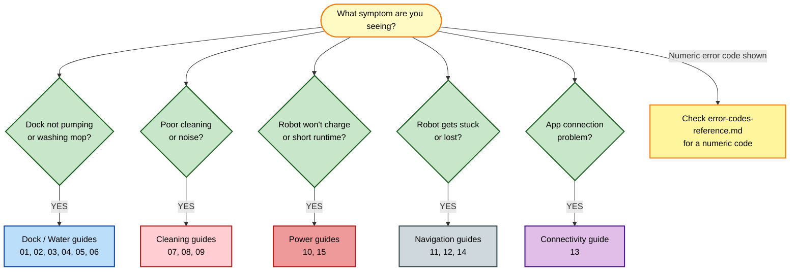

[← Repository index](../README.md)

# Xiaomi Robot Vacuum 5 Pro — Repair Guides

This section contains step-by-step repair and troubleshooting guides for every major failure mode of the Xiaomi Robot Vacuum 5 Pro. Use the triage flowchart below to identify the right guide for your symptom, or browse the full table.

> **See also:** [Common Problems Overview](common-problems-overview.md) · [Error Codes Reference](error-codes-reference.md)

---

> **SAFETY — Read before opening any hardware**
>
> - **Unplug the dock from mains power** before opening the station body or touching internal components. The dock contains a pump and water reservoir — water and electricity are lethal in combination.
> - **Water + electricity:** dry all surfaces completely before reconnecting to power; never power on with a wet tank or wet dock interior.
> - **Opening the dock body voids the manufacturer warranty.** Proceed only on out-of-warranty units or when the risk is acceptable.
> - **NEVER put detergent, descaler, vinegar, or any chemical in the clean water tank.** The clean water tank is for **water only**. Chemicals damage the pump seals and void the warranty. Use only Xiaomi-approved cleaning solution in the mop-wash tray if applicable.

---

## Guide index

| # | Problem | Category | Difficulty | Est. time |
|---|---------|----------|------------|-----------|
| **01** ⭐ | **[Station not pumping dirty water — FLAGSHIP guide](01-station-not-pumping-dirty-water.md)** | Dock / Water | Medium | 30–60 min |
| 02 | [Dirty water tank shows false full level](02-dirty-water-tank-false-level.md) | Dock / Water | Easy | 10–20 min |
| 03 | [No mop-wash water output](03-no-mop-wash-water-output.md) | Dock / Water | Easy–Medium | 15–30 min |
| 04 | [Mop not wetting the floor](04-mop-not-wetting-floor.md) | Dock / Water | Easy | 10–20 min |
| 05 | [Self-empty not working](05-self-empty-not-working.md) | Dock / Water | Medium | 20–40 min |
| 06 | [Water leak from dock](06-water-leak-from-dock.md) | Dock / Water | Medium | 20–45 min |
| 07 | [Main brush tangle](07-main-brush-tangle.md) | Cleaning | Easy | 10–15 min |
| 08 | [Side brush obstruction](08-side-brush-obstruction.md) | Cleaning | Easy | 5–10 min |
| 09 | [Suction loss](09-suction-loss.md) | Cleaning | Easy–Medium | 10–30 min |
| 10 | [Charging failure](10-charging-failure.md) | Power | Easy–Medium | 15–30 min |
| 11 | [Navigation lost / low clearance stuck](11-navigation-lost-low-clearance.md) | Navigation | Easy | 5–15 min |
| 12 | [Carpet map ghost / phantom obstacle](12-carpet-map-ghost.md) | Navigation | Easy | 10–20 min |
| 13 | [Wi-Fi pairing failure](13-wifi-pairing-failure.md) | Connectivity | Easy | 10–20 min |
| 14 | [Sensor-related error codes](14-sensors-dirty-errors.md) | Navigation | Easy | 10–20 min |
| 15 | [Battery degradation / short runtime](15-battery-degradation.md) | Power | Easy–Hard | 15–60 min |

> ⭐ Guide 01 is the **flagship** — it covers the most common service call for the 5 Pro and links to all related dock/water guides.

**Category key:** Dock / Water · Cleaning · Navigation · Power · Connectivity

---

## Master triage — where to start

---

## Related resources

- [Error Codes Reference](error-codes-reference.md) — full numeric error code table with actions
- [Common Problems Overview](common-problems-overview.md) — symptom-to-guide router and preventive maintenance calendar
- [Architecture Overview](../docs/architecture-overview.md) — how the robot and dock subsystems interconnect
- [Technical Specifications](../docs/technical-specifications.md) — motor ratings, tank volumes, sensor specs
- [Replacement Guides](../replacement-guides/README.md) — consumable and spare-part replacement procedures
