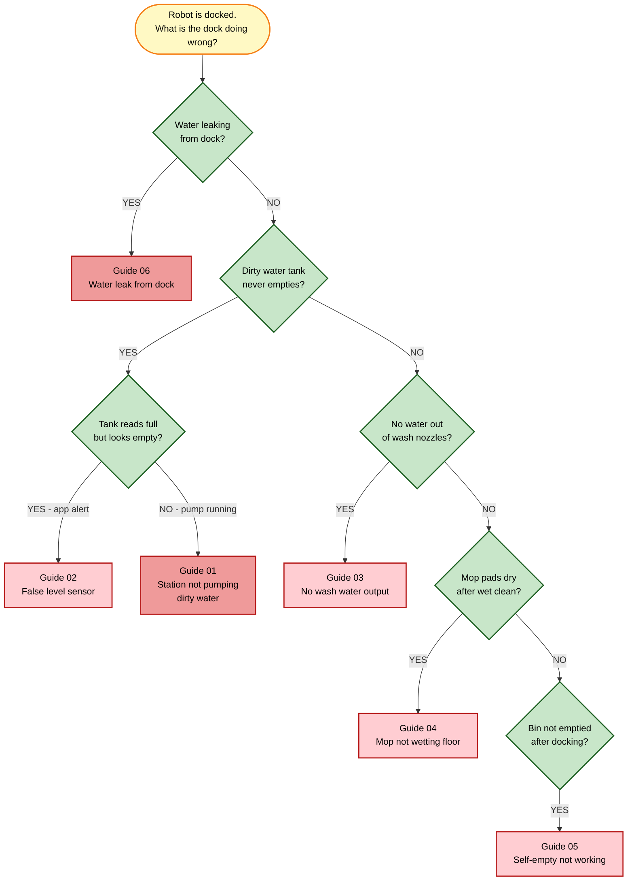
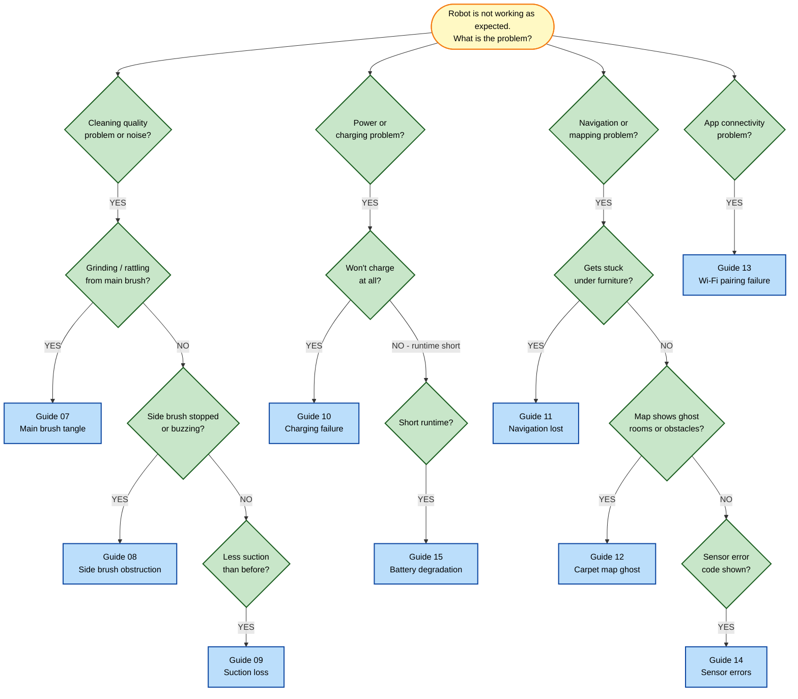

[← Repository index](../README.md)

# Common Problems Overview

This document provides a quick-reference symptom router for all 15 repair guides in this section. Use the tables and decision trees below to identify the most likely cause of your issue and navigate directly to the relevant guide. For numeric error codes shown in the Xiaomi Home app, see [error-codes-reference.md](error-codes-reference.md).

---

## Symptom → Likely cause → Guide

| # | Symptom (user language) | Likely cause | Guide |
|---|------------------------|--------------|-------|
| 01 | Dock makes pump noise but dirty water stays in dirty tank / dirty water never empties | Clogged pump filter, blocked outlet hose, or failed pump motor | [01-station-not-pumping-dirty-water.md](01-station-not-pumping-dirty-water.md) |
| 02 | App says dirty water tank is full but tank looks empty or was just emptied | Float sensor stuck or fouled with debris/scale | [02-dirty-water-tank-false-level.md](02-dirty-water-tank-false-level.md) |
| 03 | Mop wash cycle runs but no water comes out of the wash nozzles | Blocked wash nozzle, empty clean water tank, or clogged inlet filter | [03-no-mop-wash-water-output.md](03-no-mop-wash-water-output.md) |
| 04 | Mop pads are dry or only lightly damp after a wet clean | Low clean-water level, flow restrictor blocked, or mop attachment seated incorrectly | [04-mop-not-wetting-floor.md](04-mop-not-wetting-floor.md) |
| 05 | Station does not suck up debris / robot returns to dock but bin stays full | Blocked self-empty hose, full station bag, or missing bag | [05-self-empty-not-working.md](05-self-empty-not-working.md) |
| 06 | Puddle of water under or around the dock | Loose hose coupling, cracked tank, or worn sealing ring | [06-water-leak-from-dock.md](06-water-leak-from-dock.md) |
| 07 | Robot makes grinding or rattling noise; main brush hard to turn | Hair / thread wrapped around brush axle or bearings | [07-main-brush-tangle.md](07-main-brush-tangle.md) |
| 08 | Side brush spinning slowly, buzzing, or stopped | Debris under side-brush mount, bent bristles, or motor fault | [08-side-brush-obstruction.md](08-side-brush-obstruction.md) |
| 09 | Robot picks up less dirt than usual; low vacuum noise | Clogged HEPA filter, blocked suction path, or worn fan | [09-suction-loss.md](09-suction-loss.md) |
| 10 | Robot does not charge on the dock; app shows charging error | Dirty charging contacts, misaligned dock position, or faulty adapter | [10-charging-failure.md](10-charging-failure.md) |
| 11 | Robot repeatedly bumps into the same low object or gets wedged under furniture | Low-clearance obstacle not in map; cliff sensors confused | [11-navigation-lost-low-clearance.md](11-navigation-lost-low-clearance.md) |
| 12 | Map shows phantom room or ghost obstacle that does not exist | Carpet pattern confusing LiDAR; stale saved map after furniture move | [12-carpet-map-ghost.md](12-carpet-map-ghost.md) |
| 13 | Robot will not connect to Wi-Fi / disappears from Xiaomi Home app | 5 GHz network selected (robot needs 2.4 GHz), wrong password, or app cache | [13-wifi-pairing-failure.md](13-wifi-pairing-failure.md) |
| 14 | App shows sensor error code (1–8, 15, 21); robot stops mid-clean | LiDAR, cliff, bumper, or wall sensors dirty or obstructed | [14-sensors-dirty-errors.md](14-sensors-dirty-errors.md) |
| 15 | Robot runs for a much shorter time than spec; battery drains overnight | Aged battery cells, firmware miscalibration, or parasitic drain | [15-battery-degradation.md](15-battery-degradation.md) |

---

## Summary cards

### 01 — Station not pumping dirty water
**Symptom:** Pump audible but dirty water never leaves dirty tank.
**Top cause:** Clogged pump inlet filter or blocked outlet hose.
**Difficulty:** Medium — requires opening dock body.
**Guide:** [01-station-not-pumping-dirty-water.md](01-station-not-pumping-dirty-water.md) *(flagship guide)*

---

### 02 — Dirty water tank false level
**Symptom:** App reports dirty tank full when it is not.
**Top cause:** Float sensor fouled with limescale or debris.
**Difficulty:** Easy — no tools required.
**Guide:** [02-dirty-water-tank-false-level.md](02-dirty-water-tank-false-level.md)

---

### 03 — No mop-wash water output
**Symptom:** Mop wash cycle runs but pads receive no water.
**Top cause:** Blocked wash nozzles or empty clean-water tank.
**Difficulty:** Easy to Medium — nozzle cleaning may need pin tool.
**Guide:** [03-no-mop-wash-water-output.md](03-no-mop-wash-water-output.md)

---

### 04 — Mop not wetting floor
**Symptom:** Floors remain dry or streaky after a wet-mop run.
**Top cause:** Flow restrictor blocked or mop pad not seated.
**Difficulty:** Easy — cleaning and reseating only.
**Guide:** [04-mop-not-wetting-floor.md](04-mop-not-wetting-floor.md)

---

### 05 — Self-empty not working
**Symptom:** Robot docks but dustbin is never emptied by the station.
**Top cause:** Station bag full, missing, or self-empty hose kinked.
**Difficulty:** Medium — hose inspection may require partial disassembly.
**Guide:** [05-self-empty-not-working.md](05-self-empty-not-working.md)

---

### 06 — Water leak from dock
**Symptom:** Puddle forms under or behind the docking station.
**Top cause:** Loose hose coupling or worn O-ring sealing ring.
**Difficulty:** Medium — requires identifying leak source inside dock.
**Guide:** [06-water-leak-from-dock.md](06-water-leak-from-dock.md)

---

### 07 — Main brush tangle
**Symptom:** Grinding noise; brush hard to spin by hand.
**Top cause:** Hair and thread wrapped tightly around brush axle.
**Difficulty:** Easy — seam ripper or scissors sufficient.
**Guide:** [07-main-brush-tangle.md](07-main-brush-tangle.md)

---

### 08 — Side brush obstruction
**Symptom:** Side brush buzzing, slow, or fully stopped.
**Top cause:** Debris caught under mount; occasionally motor fault.
**Difficulty:** Easy — brush removal requires a single Phillips screw.
**Guide:** [08-side-brush-obstruction.md](08-side-brush-obstruction.md)

---

### 09 — Suction loss
**Symptom:** Noticeably less dirt collected; suction sounds weaker.
**Top cause:** HEPA filter clogged; secondary: blocked suction channel.
**Difficulty:** Easy to Medium — filter rinse and 24-hour dry required.
**Guide:** [09-suction-loss.md](09-suction-loss.md)

---

### 10 — Charging failure
**Symptom:** Robot does not charge; app shows charging error or 0%.
**Top cause:** Oxidised or dirty charging contacts on robot or dock.
**Difficulty:** Easy to Medium — contact cleaning first, then adapter test.
**Guide:** [10-charging-failure.md](10-charging-failure.md)

---

### 11 — Navigation lost / low-clearance stuck
**Symptom:** Robot wedges under furniture or circles repeatedly in one area.
**Top cause:** Low-clearance obstacle absent from map; cliff sensors confused.
**Difficulty:** Easy — add virtual wall or physical barrier; remap.
**Guide:** [11-navigation-lost-low-clearance.md](11-navigation-lost-low-clearance.md)

---

### 12 — Carpet map ghost
**Symptom:** Saved map shows a room or obstacle that is not there.
**Top cause:** High-contrast carpet pattern interpreted as wall by LiDAR.
**Difficulty:** Easy — remap with carpet removed or boundary adjusted.
**Guide:** [12-carpet-map-ghost.md](12-carpet-map-ghost.md)

---

### 13 — Wi-Fi pairing failure
**Symptom:** Robot blinks Wi-Fi light continuously; does not appear in app.
**Top cause:** Router broadcasting 5 GHz only; robot requires 2.4 GHz.
**Difficulty:** Easy — router setting change or app reset.
**Guide:** [13-wifi-pairing-failure.md](13-wifi-pairing-failure.md)

---

### 14 — Sensor-related errors
**Symptom:** Numeric error code 1–8, 15, or 21 displayed; robot stops.
**Top cause:** LiDAR lens, cliff IR windows, or bumper physically obstructed.
**Difficulty:** Easy — wipe sensors with dry microfibre cloth.
**Guide:** [14-sensors-dirty-errors.md](14-sensors-dirty-errors.md)

---

### 15 — Battery degradation
**Symptom:** Runtime dropped significantly vs. initial use; overnight drain.
**Top cause:** Aged lithium cells after 300+ charge cycles.
**Difficulty:** Easy (firmware calibration) to Hard (cell replacement).
**Guide:** [15-battery-degradation.md](15-battery-degradation.md)

---

## Decision trees

### Diagram A — Dock and water system problems

### Diagram B — Robot-side problems

---

## Preventive maintenance calendar

Keeping the robot and dock clean dramatically reduces the frequency of repairs. Follow this schedule to avoid most of the issues covered in this guide section.

| Frequency | Task | Relevant guide |
|-----------|------|----------------|
| **After every run** | Empty the dustbin | [05](05-self-empty-not-working.md) |
| **After every run** | Check mop pads — remove and rinse if soiled | [04](04-mop-not-wetting-floor.md) |
| **Weekly** | Rinse the mop-wash tray and dirty water tank with clean water; let dry | [01](01-station-not-pumping-dirty-water.md), [02](02-dirty-water-tank-false-level.md) |
| **Weekly** | Check dock sealing ring for debris, hair, or distortion | [06](06-water-leak-from-dock.md) |
| **Weekly** | Wipe LiDAR turret lens, cliff sensors, and bumper strip with a dry microfibre cloth | [14](14-sensors-dirty-errors.md) |
| **Weekly** | Cut and remove hair / thread from main brush and side brush | [07](07-main-brush-tangle.md), [08](08-side-brush-obstruction.md) |
| **Monthly** | Wash HEPA filter under cold running water; air-dry for at least 24 hours before reinstalling | [09](09-suction-loss.md) |
| **Monthly** | Clean charging contacts on robot and dock with a dry cloth or isopropyl alcohol swab | [10](10-charging-failure.md) |
| **Monthly** | Check for firmware updates in the Xiaomi Home app | — |
| **Quarterly** | Descale the clean-water tank and wash nozzles with a diluted citric acid solution (rinse thoroughly with clean water before refilling) | [03](03-no-mop-wash-water-output.md) |
| **Quarterly** | Inspect pump inlet filter for mineral build-up; clean or replace | [01](01-station-not-pumping-dirty-water.md) |
| **Every 6 months** | Replace main brush if bristles are worn or deformed | [07](07-main-brush-tangle.md), [Replacement Guides](../replacement-guides/README.md) |
| **Every 6 months** | Replace side brush if bristles are bent flat | [08](08-side-brush-obstruction.md), [Replacement Guides](../replacement-guides/README.md) |
| **Every 12 months** | Replace HEPA filter (do not wait for visible clogging) | [09](09-suction-loss.md), [Replacement Guides](../replacement-guides/README.md) |
| **Every 12 months** | Replace dock station bag (auto-empty models) | [05](05-self-empty-not-working.md), [Replacement Guides](../replacement-guides/README.md) |
| **Every 18–24 months** | Assess battery health; replace cells if runtime is below 50% of rated spec | [15](15-battery-degradation.md), [Replacement Guides](../replacement-guides/README.md) |

---

## Related resources

- [Repair Guides index](README.md)
- [Error Codes Reference](error-codes-reference.md)
- [Architecture Overview](../docs/architecture-overview.md)
- [Technical Specifications](../docs/technical-specifications.md)
- [Replacement Guides](../replacement-guides/README.md)
