# Replacement Guides — Xiaomi Robot Vacuum 5 Pro

[← Repository index](../README.md)

This index covers all user-serviceable consumable and spare-part replacements for the **Xiaomi Robot Vacuum 5 Pro** (robot OV21GL) and its **Omni Station** dock (OV21-JZEU). For internal service-only components and fault diagnosis, see the [Repair Guides](../repair-guides/README.md). For the full parts list with pricing and sourcing, see the [Parts Catalog](../docs/parts-catalog.md).

---

> **SAFETY — Read before any replacement**
>
> 1. **Power off the robot** using the physical button on the robot body before every replacement.
> 2. **Unplug the dock** from the mains outlet before opening any dock panel or tank.
> 3. **Never operate** with a wet HEPA filter — allow 24 hours of air drying after washing.
> 4. **Never run without a dust bag** installed in the dock.
> 5. **Put only clean water** in the clean water tank; no cleaning solutions.
> 6. **Lithium-ion batteries** present fire risk if punctured, short-circuited, or improperly disposed. Follow all safety warnings in [battery-replacement.md](battery-replacement.md).

---

## Replacement Guides

| Guide | Part | Difficulty | Replacement Interval |
|-------|------|-----------|----------------------|
| [Main Brush](main-brush-replacement.md) | Dual rubber anti-tangle blade + cover | Easy | 3–6 months |
| [Side Brush](side-brush-replacement.md) | Single extendable anti-tangle arm | Easy | 3–6 months |
| [HEPA Filter](hepa-filter-replacement.md) | E11 washable filter (dustbin module) | Easy | Wash monthly; replace 3–6 months |
| [Mop Pads](mop-pads-replacement.md) | Round microfiber pads x2 (dual bracket) | Easy | 1–3 months |
| [Dust Bag](dust-bag-replacement.md) | 2.5 L dock auto-empty bag | Easy | ~75 days |
| [Water Tanks and Sealing Ring](water-tanks-and-sealing-ring.md) | Clean tank (4 L), dirty tank (3.8 L), O-ring | Easy | On wear/leak/failure |
| [Battery](battery-replacement.md) | 5 200 mAh 14.4 V Li-ion pack | Hard | On significant capacity degradation |

---

## Maintenance Interval Calendar

The table below shows a simplified maintenance schedule. Adjust based on actual usage (sq. m. per run, floor type, pet hair load).

| Maintenance Task | Monthly | Every 3 Months | Every 6 Months | As Needed |
|-----------------|---------|----------------|----------------|-----------|
| Wash HEPA filter (air dry 24 h) | X | | | |
| Inspect/replace mop pads | X | | | |
| Replace dust bag (~75 day cycle) | X | | | |
| Replace main brush | | X | | |
| Replace side brush | | X | | |
| Replace HEPA filter (new unit) | | X | | |
| Replace battery (capacity test) | | | X | |
| Inspect sealing ring on dirty water tank | | X | | |
| Replace sealing ring (if warped/torn) | | | | X |
| Replace clean or dirty water tank (if cracked/leaking) | | | | X |

```mermaid
gantt
    title Consumable Replacement Schedule (rolling 6-month window)
    dateFormat  MM
    axisFormat  Month %m

    section Monthly
    Wash HEPA filter          :done,  hf1, 01, 1M
    Wash HEPA filter          :done,  hf2, 02, 1M
    Wash HEPA filter          :done,  hf3, 03, 1M
    Wash HEPA filter          :active, hf4, 04, 1M
    Wash HEPA filter          :        hf5, 05, 1M
    Wash HEPA filter          :        hf6, 06, 1M
    Check mop pads            :done,  mp1, 01, 1M
    Check mop pads            :done,  mp2, 02, 1M
    Check mop pads            :done,  mp3, 03, 1M
    Check mop pads            :active, mp4, 04, 1M
    Check mop pads            :        mp5, 05, 1M
    Check mop pads            :        mp6, 06, 1M
    Replace dust bag (~75 d)  :done,  db1, 01, 3M
    Replace dust bag (~75 d)  :        db2, 04, 3M

    section Quarterly
    Replace main brush        :done,  mb1, 01, 3M
    Replace main brush        :        mb2, 04, 3M
    Replace side brush        :done,  sb1, 01, 3M
    Replace side brush        :        sb2, 04, 3M
    Replace HEPA filter       :done,  hfr1, 01, 3M
    Replace HEPA filter       :        hfr2, 04, 3M
    Inspect sealing ring      :done,  sr1, 01, 3M
    Inspect sealing ring      :        sr2, 04, 3M

    section Semi-annual
    Battery capacity test     :done,  bat1, 01, 6M
```

---

## Related Resources

- [Parts Catalog](../docs/parts-catalog.md) — full parts list with pricing and sourcing
- [Repair Guides](../repair-guides/README.md) — fault diagnosis and internal repairs
- Xiaomi Global Support: <https://www.mi.com/global/service/support>
