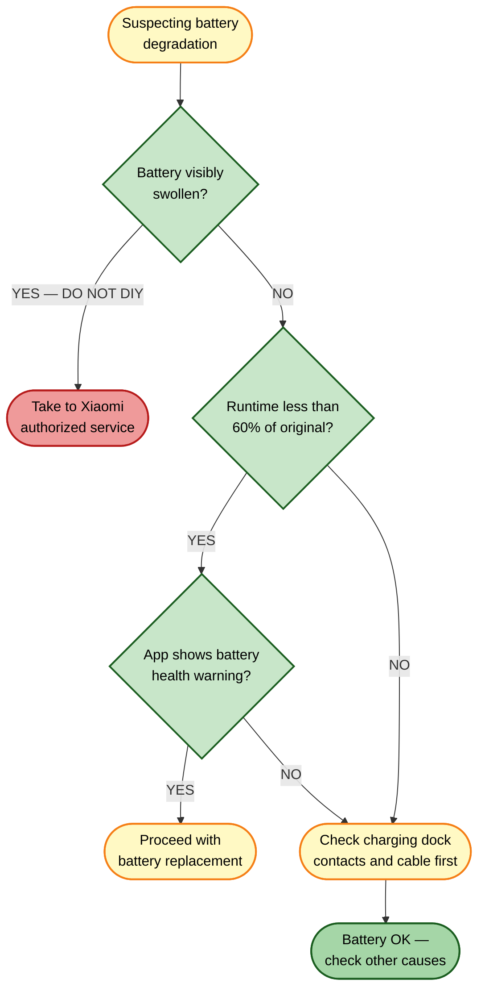

# Battery Replacement

[← Replacement guides index](README.md) | [← Repository index](../README.md)

| Attribute | Detail |
|-----------|--------|
| **Difficulty** | Hard |
| **Estimated time** | 30–45 minutes |
| **Tools required** | Phillips-head screwdriver (PH2 or PH1), plastic spudger or guitar pick, anti-static mat (recommended) |
| **Part type** | Spare |

---

## Battery Specifications

| Parameter | Value |
|-----------|-------|
| Nominal capacity | 5,200 mAh |
| Rated capacity | 4,800 mAh |
| Voltage | 14.4 V nominal |
| Chemistry | Li-ion (lithium-ion) |
| Form factor | Custom flat pack with connector |

> **No official public part number has been confirmed by Xiaomi.** Purchase only from the official Xiaomi service channel or verified sellers who explicitly state compatibility with model OV21GL / Xiaomi Robot Vacuum 5 Pro.

---

## SAFETY — Read before proceeding

> **Lithium-ion batteries present serious risk of fire, burns, and toxic gas release if mishandled. Follow every safety instruction below without exception.**
>
> 1. **Work in a well-ventilated area** away from flammable materials.
> 2. **Never puncture, bend, crush, or short-circuit the battery pack.** Short-circuiting the terminals causes immediate thermal runaway.
> 3. **If the old battery is swollen, puffy, or has a deformed casing, do not continue the DIY procedure.** A swollen Li-ion cell is at elevated risk of venting or igniting. Take the robot to an authorized Xiaomi service center.
> 4. **Use only genuine or verified-compatible replacement packs.** Counterfeit Li-ion packs lack safety protection circuits and are a leading cause of house fires.
> 5. **Disconnect the battery connector before doing anything else** after opening the robot body. Even with the robot powered off, residual charge is present.
> 6. **Do not use metal tools to pry the battery** — risk of short circuit.
> 7. **Recycle the old battery** at a designated Li-ion collection point. Do not dispose of Li-ion batteries in household waste or recycling bins — this is illegal in most jurisdictions and presents a fire hazard at waste-processing facilities.

---

## When to Replace

Battery replacement is indicated when:

- The robot's runtime per full charge has dropped to 60–70% or less of the original value.
- The robot fails to complete its cleaning map and returns to dock prematurely even on low-pile floors.
- The Xiaomi Home app shows persistent "Battery health degraded" or "Battery error" warnings.
- The battery does not charge to 100% even after a long charging session.
- The robot powers off suddenly before the battery indicator shows empty.

---

## Where to Buy

- **Official Xiaomi service:** <https://www.mi.com/global/service/support> — request a replacement battery for model OV21GL. This is the strongly recommended source.
- **Verified third-party sellers:** Search for "Xiaomi Robot Vacuum 5 Pro OV21GL replacement battery 14.4V 5200mAh" on reputable electronics-parts marketplaces. Verify the connector type, voltage, and capacity match exactly before ordering. Read seller reviews carefully and avoid packs with no protection circuit documentation.

---

## Replacement Procedure

### Preparation

1. **Run the robot until its battery is as depleted as possible** before starting. A near-empty cell contains less stored energy and presents lower risk during handling. Power off the robot when it returns to dock or shows low battery.
2. **Power off the robot completely.** Press and hold the power button until all indicators go dark.
3. **Unplug the dock** from the mains outlet.
4. **Prepare your workspace:** lay an anti-static mat or clean dry towel on a table. Have your screwdriver, plastic spudger, and the replacement battery ready.

### Opening the Robot Body

5. **Flip the robot upside down** and place it on the protective mat.
6. **Locate all underbelly screws.** The bottom cover of the OV21GL is secured by multiple Phillips-head screws (typically 4–6) arranged around the perimeter and center. Some may be under labels or rubber plugs — lift these carefully with the spudger and retain them.
7. **Remove all screws.** Keep them in a small tray or piece of tape in removal order — they may be different lengths.
8. **Insert a plastic spudger or guitar pick** into the seam between the bottom cover and the robot body at a corner. Work around the perimeter with gentle prying force to release the retaining clips. Do not use metal tools — they can crack the housing or damage internal connectors.
9. **Lift the bottom cover away.** Set it aside. If a ribbon cable or wire is attached to the cover, stop and disconnect it gently before pulling the cover fully free.

### Battery Disconnection and Removal

10. **Immediately locate the battery connector.** It is a multi-pin JST-style plug connecting the battery to the mainboard. It is typically white and clearly visible.
11. **Disconnect the battery connector before touching anything else.** Use your fingers or a plastic spudger to grip the connector body (not the wires) and pull it straight out of the socket. Never pull by the wires.
12. **Inspect the old battery for swelling.** If the battery is visibly distended, follow the swollen-battery procedure: do not attempt to remove it yourself. Place the robot in a fireproof container and contact Xiaomi support or a certified battery-disposal service.
13. **If the battery is flat and undamaged,** locate the adhesive pads or retention bracket securing it. Gently work a plastic spudger under the battery edges to release the adhesive, starting at the edge opposite the connector. Work slowly to avoid bending the pack.
14. **Remove the battery pack** and set it immediately on a non-conductive surface (not metal). Tape over the connector terminals to prevent accidental short-circuiting.

### Battery Installation

15. **Unpack the new battery.** Verify the connector pin count, voltage label (14.4 V), and physical dimensions match.
16. **Place the new battery in the housing** with the connector facing the correct direction (matching the cable routing of the old battery).
17. **Press the battery down onto the adhesive surface** in the housing. If the new battery includes adhesive pads, apply them before placing. If it does not, use double-sided foam tape rated for the purpose.
18. **Connect the battery connector.** Align the pins carefully and press the connector in firmly until it seats. Never force a misaligned connector.
19. **Route the cable** so it does not cross any sharp edges or get pinched by the cover.

### Closing the Robot Body

20. **Verify that no wires are pinched** in the cover seam.
21. **Align the bottom cover** with the robot body, engaging the clips first.
22. **Press the cover down firmly** around the perimeter until all clips click.
23. **Reinstall all screws** in reverse order of removal. Do not overtighten — the housing is plastic and stripped threads are difficult to repair.
24. **Replace any rubber plugs or labels** over screw heads.

### Battery Calibration After Installation

25. **Power on the robot.** It should start normally.
26. **Place it on the dock and charge it to 100%.** Allow a full charge without interruption.
27. **Run a full cleaning cycle** until the robot returns to dock on low battery (do not charge it mid-cycle). This helps the battery management system (BMS) calibrate the capacity reading.
28. **Charge to 100% again** before normal use.
29. **Repeat the full-discharge / full-charge cycle 2–3 times** in the first week. The app's battery percentage readout will stabilize after calibration cycles.

### Verification

30. **Check the Xiaomi Home app** for battery percentage accuracy after a full charge cycle. It should read 100%.
31. **Run a timed cleaning session** and compare the actual runtime to the expected 150–180 minutes on the lowest suction setting. Significant shortfall after calibration indicates a faulty replacement pack.

---

## Disposal

Li-ion batteries must not enter general household waste or mixed recycling. Improper disposal is illegal in the EU (under the Battery Directive), USA (varies by state), and most other jurisdictions.

**Recycling options:**
- Drop-off points at electronics retailers (Best Buy, MediaMarkt, Fnac, etc.) accept Li-ion batteries in most countries.
- Municipal hazardous-waste collection events.
- Xiaomi service centers may accept old battery packs.

Tape over the connector terminals before transport and place the battery in a plastic bag to prevent contact with other metals.

---

## Related Guides

- [Repair guide 10 — Charging failure](../repair-guides/10-charging-failure.md)
- [Parts catalog](../docs/parts-catalog.md)
- [Replacement guides index](README.md)
