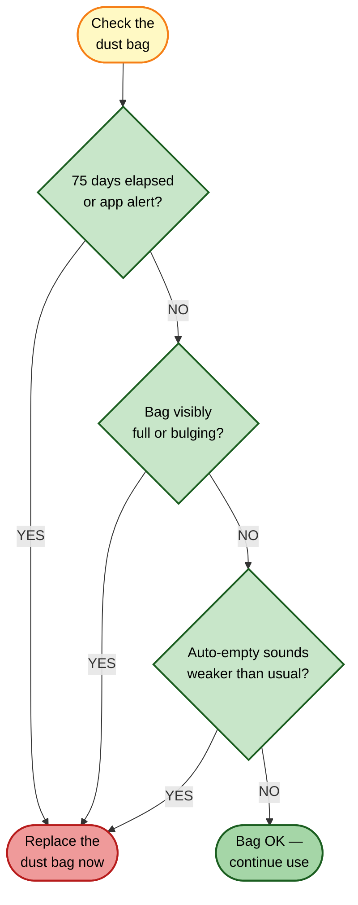

# Dust Bag Replacement

[← Replacement guides index](README.md) | [← Repository index](../README.md)

| Attribute | Detail |
|-----------|--------|
| **Difficulty** | Easy |
| **Estimated time** | 2–3 minutes |
| **Tools required** | None |
| **Part type** | Consumable |

---

## Overview

The Omni Station dock uses a **2.5 L sealed dust bag** to collect debris auto-emptied from the robot's dustbin. The bag's sealed collar automatically closes when removed, preventing dust re-dispersal — a significant advantage for allergy sufferers. The dock's suction fan drives debris from the robot's 290 mL onboard dustbin into the bag after each or scheduled cleaning session.

---

## When to Replace

**Recommended interval:** Approximately every 75 days under typical use (daily cleaning of a 50–100 m² home).

Replace sooner if you observe any of the following:

- The Xiaomi Home app shows a "Dust bag full" notification.
- The dock's auto-empty suction sounds weaker or shorter than usual.
- The bag exterior visibly bulges or the fill indicator (on bags that have one) shows full.
- Dust odors are noticed from the dock exhaust.

---

## Where to Buy

- **Official Xiaomi accessories:** <https://www.mi.com/global> → Accessories → Robot Vacuum 5 Pro dust bag (multi-pack)
- **Third-party kits (verify OV21GL / Robot Vacuum 5 Pro compatibility before purchasing):**
  - [Amazon ASIN B0FXRB7TZT](https://www.amazon.com/dp/B0FXRB7TZT) — multi-part accessory kit including dust bags (~$20–25)
  - [Amazon ASIN B0GTQ91823](https://www.amazon.com/dp/B0GTQ91823) — multi-part accessory kit including dust bags (~$25–30)
  - [Amazon ASIN B0FXRDJM5Z](https://www.amazon.com/dp/B0FXRDJM5Z) — multi-part accessory kit including dust bags (~$25–35)

Bags are typically sold in packs of 3–6. Third-party bags are generally acceptable; verify the bag collar diameter and mounting tab geometry match the OV21-JZEU dock bay.

---

## Replacement Procedure

### Removal

1. **Unplug the dock from the mains outlet.** Although the dust bag compartment is separate from high-voltage parts, disconnecting power is a good practice during any dock servicing.
2. **Open the dust bag compartment door.** On the Omni Station, this is the front-facing panel on the upper portion of the dock. Press the release latch and swing the door open.
3. **Grip the bag pull-tab** (located on the bag collar at the top of the bag) and pull the bag straight out. The auto-seal collar closes automatically as the bag disengages from the dock port, trapping dust inside.
4. **Do not squeeze or compress the bag** — this can force dust through the sealed collar. Carry it directly to a waste bin.

### Inspection

5. **Inspect the dust bag bay** (the cavity inside the dock). Look for dust buildup around the inlet port and on the bay walls. Wipe with a dry cloth if debris is present.
6. **Inspect the rubber inlet gasket** on the dock port. If the gasket is cracked or misshapen, the auto-empty seal is compromised — contact Xiaomi support if the gasket needs replacement.

### Installation

7. **Remove the new bag from its packaging.** Confirm the collar is in the open position.
8. **Align the bag collar with the dock port.** There is typically an alignment notch or tab that ensures the bag is oriented correctly.
9. **Push the collar firmly into the dock port** until you feel/hear a click. The bag should hang freely in the bay without sagging against the sides.
10. **Close the compartment door** until the latch clicks.
11. **Plug the dock back in.**

### Verification

12. **Check the Xiaomi Home app:** go to Consumables → Dust bag. Reset the usage counter.
13. **Run a manual auto-empty cycle** from the app (or let the robot dock and trigger it automatically). Verify that the suction sound is strong and the cycle completes normally.

---

## Disposal

The sealed dust bag contains fine particulate matter, potential allergens, and microplastic fibers from carpet. Place the sealed bag directly into household waste — do not open it. Do not place it in recycling. In regions with separate residual waste streams, use the general residual waste bin.

---

## Related Guides

- [HEPA filter replacement](hepa-filter-replacement.md)
- [Mop pads replacement](mop-pads-replacement.md)
- [Parts catalog](../docs/parts-catalog.md)
