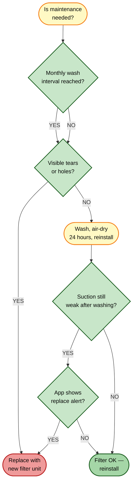

# HEPA Filter Replacement

[← Replacement guides index](README.md) | [← Repository index](../README.md)

| Attribute | Detail |
|-----------|--------|
| **Difficulty** | Easy |
| **Estimated time** | 3–5 minutes (replacement); 24 hours air dry after washing |
| **Tools required** | None |
| **Part type** | Consumable |

---

## Overview

The Xiaomi Robot Vacuum 5 Pro uses an **E11-rated washable HEPA filter** mounted inside the **290 mL dustbin module**. It captures fine dust particles, allergens, and pet dander before air is exhausted back into the room. The filter can be washed and reused multiple times before it needs to be replaced as a unit.

> **Critical:** Never reinstall a wet filter. The filter **must air-dry for a minimum of 24 hours** before being placed back in the robot. Running the robot with a wet HEPA filter damages the motor and voids performance guarantees.

---

## When to Replace

**Wash interval:** Once per month (or more frequently in high-dust or pet-hair environments).  
**Replacement interval:** Every 3–6 months, or immediately if washing no longer restores airflow.

Replace the filter immediately if you observe any of the following:

- Visible tears, holes, or structural damage to the filter media.
- Permanent discoloration or embedded staining that does not clear with washing.
- The robot's suction remains noticeably weak even with a clean, dry filter installed.
- The Xiaomi Home app shows a "HEPA filter worn" or "Replace filter" notification.
- The filter retains odors after washing and drying.

---

## Where to Buy

- **Official Xiaomi accessories:** <https://www.mi.com/global> → Accessories → Robot Vacuum 5 Pro HEPA filter
- **Third-party kits (verify OV21GL / Robot Vacuum 5 Pro compatibility before purchasing):**
  - [Amazon ASIN B0FXRB7TZT](https://www.amazon.com/dp/B0FXRB7TZT) — multi-part accessory kit (~$20–25)
  - [Amazon ASIN B0GTQ91823](https://www.amazon.com/dp/B0GTQ91823) — multi-part accessory kit (~$25–30)
  - [Amazon ASIN B0FXRDJM5Z](https://www.amazon.com/dp/B0FXRDJM5Z) — multi-part accessory kit (~$25–35)

**Counterfeit warning:** Fake HEPA filters are common. A non-genuine filter may not achieve E11 class filtration — always verify the seller and compatibility claim. Genuine filters are marked with the Xiaomi logo and the filter class rating.

---

## Replacement Procedure

```mermaid
flowchart LR
    A([Power off robot]):::action
    B([Open dustbin<br/>module]):::action
    C([Remove filter<br/>from dustbin]):::action
    D([Empty and<br/>tap-clean dustbin]):::action
    E([Install new<br/>filter]):::action
    F([Close dustbin<br/>and reinstall]):::action
    G([Reset counter<br/>in app]):::action
    H([Verify suction]):::ok

    A -->|robot off| B
    B -->|latch open| C
    C -->|filter out| D
    D -->|bin clean| E
    E -->|seated| F
    F -->|latched| G
    G -->|counter reset| H

    classDef action fill:#fff9c4,stroke:#f57f17,stroke-width:2px,color:#000
    classDef ok     fill:#a5d6a7,stroke:#1b5e20,stroke-width:2px,color:#000
```

### Filter Removal

1. **Power off the robot.** Press and hold the power button until the indicator goes dark.
2. **Open the dustbin compartment lid** on the top of the robot body. Press the release latch and lift the dustbin module out of the robot.
3. **Hold the dustbin over a waste bin** and open the dustbin door by pressing the side release tab. Empty all accumulated dust.
4. **Locate the HEPA filter.** It sits inside the dustbin module, secured by a friction fit frame.
5. **Pull the filter frame straight out** of the dustbin. Do not flex or twist the filter media.

### Filter Washing (if washing rather than replacing)

6. **Tap the filter gently** against the inside of a waste bin to dislodge loose dust. Do this outdoors or away from living areas.
7. **Rinse the filter under cool running water.** Run water through the filter in the reverse airflow direction (from the clean side outward). Do not use soap, detergent, or hot water — these degrade the filter media.
8. **Squeeze excess water gently** — do not wring or press hard.
9. **Place the filter in a well-ventilated area and allow it to air dry for a minimum of 24 hours.** Do not use a hair dryer, oven, microwave, or direct sunlight to speed drying. Do not reinstall until completely dry to the touch, including the frame edges.

### Installation (new or washed/dried filter)

10. **Empty and wipe the dustbin module** with a dry cloth to remove residual dust.
11. **Insert the new or dried filter** into the dustbin frame slot. Press firmly until the frame is flush and seated evenly.
12. **Close the dustbin door** until it clicks.
13. **Reinsert the dustbin module** into the robot and close the top lid until it snaps shut.

### Verification

14. **Power on the robot** and start a short cleaning cycle.
15. **Check the Xiaomi Home app:** go to Consumables → HEPA filter. Reset the usage counter if prompted.
16. **Verify that suction sounds normal** — strong airflow with no unusual vibration.

---

## Disposal

A worn HEPA filter contains concentrated fine dust and allergen particles. Place it in a sealed plastic bag before disposal to prevent re-dispersal. Dispose of it as general waste (mixed materials — not recyclable in most regions). Check your local environmental authority's guidelines on filter disposal.

---

## Related Guides

- [Main brush replacement](main-brush-replacement.md)
- [Dust bag replacement](dust-bag-replacement.md)
- [Parts catalog](../docs/parts-catalog.md)
