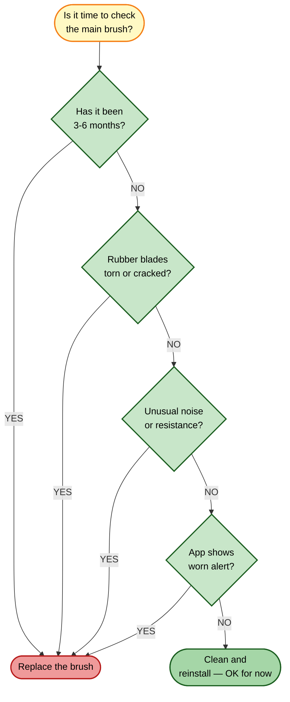

# Main Brush Replacement

[← Replacement guides index](README.md) | [← Repository index](../README.md)

| Attribute | Detail |
|-----------|--------|
| **Difficulty** | Easy |
| **Estimated time** | 5–10 minutes |
| **Tools required** | None (tool-free snap fit) |
| **Part type** | Consumable |

---

## When to Replace

**Recommended interval:** Every 3–6 months under normal use.

Replace sooner if you observe any of the following symptoms:

- Rubber blades are visibly torn, cracked, or deformed.
- Brush rotates with unusual resistance or noise even after cleaning.
- Cleaning performance has noticeably degraded on hard floors or carpet.
- The Xiaomi Home app shows a "Main brush worn" notification.
- Hair or debris is heavily tangled around the central axle and cannot be fully removed.

---

## Where to Buy

- **Official Xiaomi accessories:** <https://www.mi.com/global> → Accessories → Robot Vacuum 5 Pro main brush
- **Third-party kits (verify OV21GL / Robot Vacuum 5 Pro compatibility before purchasing):**
  - [Amazon ASIN B0FXRB7TZT](https://www.amazon.com/dp/B0FXRB7TZT) — multi-part accessory kit (~$20–25)
  - [Amazon ASIN B0GTQ91823](https://www.amazon.com/dp/B0GTQ91823) — multi-part accessory kit (~$25–30)
  - [Amazon ASIN B0FXRDJM5Z](https://www.amazon.com/dp/B0FXRDJM5Z) — multi-part accessory kit (~$25–35)

Third-party brushes are generally suitable for routine replacement. Genuine Xiaomi brushes ensure the exact rubber compound and blade geometry.

---

## Replacement Procedure

### Removal

1. **Power off the robot.** Press and hold the power button on the robot body until the indicator goes dark. Do not proceed with the robot powered on.
2. **Flip the robot upside down** on a flat, clean surface (place a soft cloth underneath to protect the top sensor cover).
3. **Locate the main brush compartment.** It is the rectangular opening at the center-underside of the robot body, flanked by two end caps.
4. **Remove the brush cover.** Grip the yellow tab at the center of the cover and pull upward firmly. The cover unclips without tools.
5. **Remove the main brush.** Grasp the brush body and pull it straight out of the axle housing. If hair is wound tightly around the axle end, use scissors to cut it free before pulling.
6. **Remove hair and debris from the brush axle housing** using a dry cloth or soft brush. Inspect the axle bearing for damage.

### Inspection

7. **Examine the brush axle ends and bearing cups** in the robot housing. They should turn freely with no grinding. If the bearing is damaged, contact Xiaomi support before reassembling.
8. **Examine the brush cover clips** for cracks. Replace the cover if a clip is broken.

### Installation

9. **Unpack the new main brush.** Remove any packaging tape from the rubber blades.
10. **Align the brush axle pegs** with the bearing cups in the housing. The color-coded peg (typically yellow on one end) must align with the matching color socket.
11. **Press the brush firmly into the housing** until both axle ends are fully seated. You should feel and hear a click.
12. **Reattach the brush cover.** Align the two side tabs with their slots and press down until it clicks flat. Verify that the cover sits flush with no gap.

### Verification

13. **Flip the robot upright** and power it on.
14. **Start a short cleaning cycle** and observe that the main brush spins freely with no unusual noise.
15. **Check the Xiaomi Home app:** go to Consumables → Main brush. Reset the usage counter if the app prompts you to (typically via Settings → Consumables → Reset).

---

## Disposal

The worn main brush is composed of rubber and plastic. Dispose of it according to your local household waste or small-appliance recycling regulations. Do not dispose of it in general recycling without checking your local rules on mixed rubber-plastic items.

---

## Related Guides

- [Side brush replacement](side-brush-replacement.md)
- [Repair guide 07 — Main brush tangle](../repair-guides/07-main-brush-tangle.md)
- [Parts catalog](../docs/parts-catalog.md)
