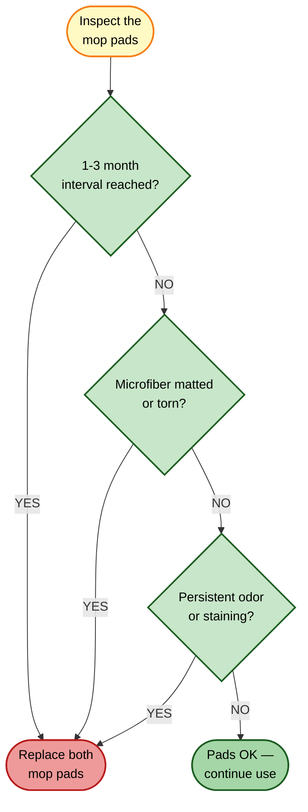

# Mop Pads Replacement

[← Replacement guides index](README.md) | [← Repository index](../README.md)

| Attribute | Detail |
|-----------|--------|
| **Difficulty** | Easy |
| **Estimated time** | 3–5 minutes |
| **Tools required** | None |
| **Part type** | Consumable |

---

## Overview

The Xiaomi Robot Vacuum 5 Pro uses **two round microfiber mop pads** attached to a **dual mop bracket** on the robot's underside. The pads are self-adhesive (hook-and-loop / Velcro-type attachment) and can be removed by hand. The Omni Station dock washes the pads automatically during cleaning cycles and dries them with the built-in 1,600 W heater. Even with regular auto-washing, the microfiber degrades over time and loses mopping effectiveness.

---

## When to Replace

**Recommended interval:** Every 1–3 months, depending on floor area and soiling.

Replace sooner if you observe any of the following:

- Microfiber surface is visibly flattened, matted, or torn.
- Pads retain persistent stains or odors that do not clear after the dock's auto-wash cycle.
- Mopping performance has noticeably decreased (streaks left behind, dirt not lifted).
- Pads have fraying edges that could catch on floor features.

---

## Where to Buy

- **Official Xiaomi accessories:** <https://www.mi.com/global> → Accessories → Robot Vacuum 5 Pro mop pads
- **Third-party kits (verify OV21GL / Robot Vacuum 5 Pro compatibility before purchasing):**
  - [Amazon ASIN B0FXRB7TZT](https://www.amazon.com/dp/B0FXRB7TZT) — multi-part accessory kit (~$20–25)
  - [Amazon ASIN B0GTQ91823](https://www.amazon.com/dp/B0GTQ91823) — multi-part accessory kit (~$25–30)
  - [Amazon ASIN B0FXRDJM5Z](https://www.amazon.com/dp/B0FXRDJM5Z) — multi-part accessory kit (~$25–35)

Always verify that third-party pads are the correct **round** form factor and hook-and-loop diameter for the OV21GL dual bracket. Incorrect pad diameter will result in poor adhesion and reduced mopping contact.

---

## Replacement Procedure

### Removal

1. **Power off the robot.** Press and hold the power button until the indicator goes dark.
2. **Flip the robot upside down** on a flat surface protected by a soft cloth, or place it on a table with the underside accessible.
3. **Locate the dual mop bracket** at the rear of the robot's underside. Two round pads are attached by hook-and-loop fasteners.
4. **Peel each pad off the bracket** by gripping the edge and pulling firmly at a low angle. The hook-and-loop bond is strong — pull steadily rather than jerking.
5. **Discard the old pads** (see Disposal below).

### Inspection

6. **Inspect the hook-and-loop surface of each bracket disk.** If the hook side is clogged with microfiber threads, use a stiff brush or tape to clear it. Clogged hooks will not hold new pads securely.
7. **Check the mop bracket arms** for cracks or deformation. If a bracket arm is bent or broken, contact Xiaomi support — the bracket assembly itself is not a standard user-replaceable consumable.

### Installation

8. **Unpack the new mop pads.** Verify the loop (soft) side is facing outward and the hook-compatible backing is facing the bracket.
9. **Center each pad over its bracket disk.** Press firmly from the center outward to ensure full contact across the hook surface.
10. **Press down on each pad for 5–10 seconds** to maximize adhesion.

### Verification

11. **Power on the robot** and send it to the dock to start a mopping cycle (or run a short manual floor-clean with mopping enabled).
12. **Verify that the pads remain adhered** throughout the cycle and do not detach.
13. **Inspect the floor after the cycle** — the mop track should show even moisture distribution with no dry patches.

---

## Disposal

Worn microfiber pads are synthetic textile waste. Check your local textile or household waste guidelines. Many municipalities accept small synthetic textiles in general household waste. Do not place loose pads in recycling bins.

---

## Related Guides

- [Water tanks and sealing ring](water-tanks-and-sealing-ring.md)
- [Dust bag replacement](dust-bag-replacement.md)
- [Parts catalog](../docs/parts-catalog.md)
