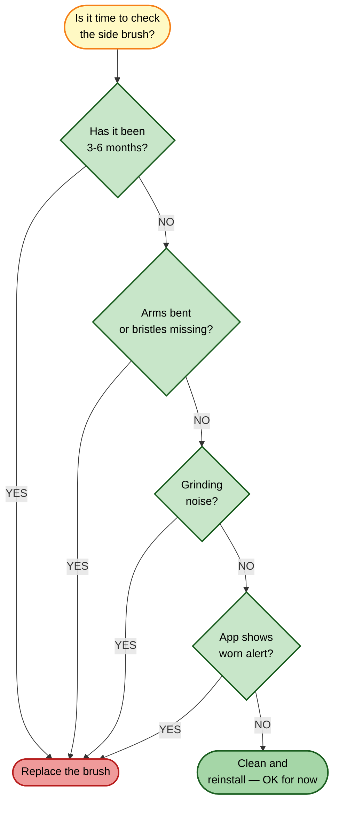

# Side Brush Replacement

[← Replacement guides index](README.md) | [← Repository index](../README.md)

| Attribute | Detail |
|-----------|--------|
| **Difficulty** | Easy |
| **Estimated time** | 3–5 minutes |
| **Tools required** | None (tool-free snap fit) |
| **Part type** | Consumable |

---

## When to Replace

**Recommended interval:** Every 3–6 months under normal use.

Replace sooner if you observe any of the following symptoms:

- Brush arms are bent outward, broken, or missing bristles.
- The brush rotates with a scraping or grinding sound.
- The robot is leaving debris along walls and in corners after a clean.
- The Xiaomi Home app shows a "Side brush worn" notification.
- Hair is so heavily wound around the base shaft that it cannot be cleared by cutting alone.

---

## Where to Buy

- **Official Xiaomi accessories:** <https://www.mi.com/global> → Accessories → Robot Vacuum 5 Pro side brush
- **Third-party kits (verify OV21GL / Robot Vacuum 5 Pro compatibility before purchasing):**
  - [Amazon ASIN B0FXRB7TZT](https://www.amazon.com/dp/B0FXRB7TZT) — multi-part accessory kit (~$20–25)
  - [Amazon ASIN B0GTQ91823](https://www.amazon.com/dp/B0GTQ91823) — multi-part accessory kit (~$25–30)
  - [Amazon ASIN B0FXRDJM5Z](https://www.amazon.com/dp/B0FXRDJM5Z) — multi-part accessory kit (~$25–35)

---

## Replacement Procedure

### Removal

1. **Power off the robot.** Press and hold the power button until the indicator goes dark.
2. **Flip the robot upside down** on a flat, clean surface protected by a soft cloth.
3. **Locate the side brush.** It is the single multi-arm brush on the front-right quadrant of the robot's underside, mounted on a small axle stub.
4. **Pull the side brush directly upward** off the axle stub. It is retained by a simple friction-fit center hole — no screws required. If it is stiff, rock it gently while pulling.
5. **Cut and remove any hair wound around the axle stub** using scissors. Remove all strands before installing the new brush.

### Inspection

6. **Examine the axle stub** for bending or wear. A bent axle stub will cause the new brush to wobble and wear faster — if damaged, contact Xiaomi support.
7. **Inspect the drive socket** (the recess in the robot body) for debris or obstructions. Clear any buildup with a dry cloth.

### Installation

8. **Unpack the new side brush.** Confirm the center hole diameter matches the robot's axle stub.
9. **Align the center hole over the axle stub.** The brush arms should sit level with the floor when the robot is upright.
10. **Press the brush firmly downward** until it is fully seated and sits flat against the robot body. There is no audible click — rely on visual flush fit.

### Verification

11. **Flip the robot upright** and power it on.
12. **Start a short cleaning run** and observe that the side brush rotates smoothly in contact with walls and corners.
13. **Check the Xiaomi Home app:** go to Consumables → Side brush. Reset the usage counter if prompted.

---

## Disposal

Dispose of the worn side brush (plastic arms and nylon bristles) according to your local mixed-plastic waste or household waste regulations. Do not place in glass or cardboard recycling.

---

## Related Guides

- [Main brush replacement](main-brush-replacement.md)
- [Repair guide 07 — Main brush tangle](../repair-guides/07-main-brush-tangle.md)
- [Parts catalog](../docs/parts-catalog.md)
