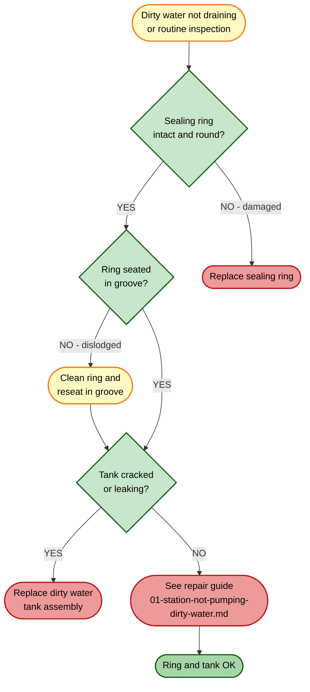

# Water Tanks and Sealing Ring Replacement

[← Replacement guides index](README.md) | [← Repository index](../README.md)

| Attribute | Detail |
|-----------|--------|
| **Difficulty** | Easy |
| **Estimated time** | 5–10 minutes |
| **Tools required** | None |
| **Part type** | Spare / Wear Item |

---

## Overview

The Omni Station dock has two water circuits:

- **Clean water tank (4 L):** Supplies fresh water to the robot's mop module before each mopping run. Fill with **plain water only** — no detergents, cleaning solutions, or additives.
- **Dirty water tank (3.8 L) with lid and sealing ring:** Collects the soiled water extracted from the mop pads after the dock's auto-wash cycle. The tank has a dedicated lid with an integrated **sealing ring (O-ring)**. This ring forms an airtight seal required for the pneumatic sewage pump to create the suction needed to drain dirty water from the robot.

> **Important:** The sealing ring is a **wear item**. A warped, flattened, or torn sealing ring is one of the most common causes of the "dock not pumping dirty water" fault. If you encounter that symptom, inspect the sealing ring before assuming a pump failure.
>
> See also: [Repair guide — Station not pumping dirty water](../repair-guides/01-station-not-pumping-dirty-water.md)

---

## When to Replace

### Clean Water Tank
Replace if:
- Visible crack, chip, or deformation causing leaks.
- Tank lid or seal has failed and water drips from the dock.

### Dirty Water Tank
Replace if:
- Crack, chip, or deformation causing leaks.
- Persistent odors after thorough cleaning with diluted white vinegar and rinsing.

### Sealing Ring (O-ring)
**Inspect every 3 months.** Replace if:
- Ring is visibly flattened, no longer round in cross-section.
- Ring has cracks, tears, or notches.
- Ring has warped out of its groove.
- Dock fails to drain dirty water (and cleaning the ring does not resolve the issue).

---

## Where to Buy

- **Official Xiaomi accessories and spare parts:** <https://www.mi.com/global/service/support> — request tank assemblies and sealing rings through Xiaomi service or authorized retailers.
- Sealing rings (O-rings) may also be available from third-party sellers — verify the exact inner diameter and cross-section before purchasing. Silicone O-rings are preferred over EPDM for longevity in warm-water applications (the dock's heater operates at up to 60 °C).

---

## Routine Cleaning (before replacement)

Regular cleaning prevents mineral scale, mold, and odor buildup that can shorten the life of both tanks and the sealing ring.

### Clean Water Tank
1. **Unplug the dock.**
2. **Remove the clean water tank** by lifting it straight out of the dock bay.
3. **Empty any remaining water.**
4. **Rinse with clean water.** For scale buildup, use a solution of 1 part white vinegar to 10 parts water; let sit 15 minutes, then rinse thoroughly.
5. **Reinstall** when dry or with fresh water only.

### Dirty Water Tank
1. **Unplug the dock.**
2. **Remove the dirty water tank** from the dock.
3. **Remove the lid** by unlatching or unscrewing it (depending on the variant).
4. **Locate and remove the sealing ring** from the lid groove. Inspect it carefully (see decision diagram above).
5. **Empty and rinse the tank** with clean water. For persistent odors, soak with diluted white vinegar (1:10 ratio) for 15–30 minutes, then rinse thoroughly.
6. **Clean the sealing ring** with a damp cloth. If it is intact, re-lubricate the ring with a small amount of food-grade silicone grease before reseating it.
7. **Reseat the ring in the groove** — press it evenly around the full circumference so it sits flush with no lifted sections.
8. **Reinstall the lid and tank.**

---

## Sealing Ring Replacement Procedure

```mermaid
flowchart LR
    A([Unplug dock]):::action
    B([Remove dirty<br/>water tank]):::action
    C([Remove lid and<br/>extract old ring]):::action
    D([Inspect groove<br/>for debris]):::action
    E([Apply silicone grease<br/>to new ring]):::action
    F([Press ring evenly<br/>into groove]):::action
    G([Reattach lid<br/>and tank]):::action
    H([Test dock drain cycle]):::ok

    A -->|powered off| B
    B -->|tank out| C
    C -->|ring removed| D
    D -->|groove clean| E
    E -->|greased| F
    F -->|fully seated| G
    G -->|reinstalled| H

    classDef action fill:#fff9c4,stroke:#f57f17,stroke-width:2px,color:#000
    classDef ok     fill:#a5d6a7,stroke:#1b5e20,stroke-width:2px,color:#000
```

1. **Unplug the dock** from the mains outlet.
2. **Remove the dirty water tank** from the dock bay.
3. **Remove the tank lid.** Note the lid orientation for reassembly.
4. **Peel the old sealing ring out of the groove** using a fingernail or a plastic spudger. Do not use metal tools — the groove plastic is soft and easily scratched.
5. **Inspect the groove** for mineral scale, debris, or mold. Clean with a cotton swab and diluted white vinegar; rinse with water and dry completely.
6. **Apply a thin film of food-grade silicone grease** around the new O-ring. This helps it seat properly and prolongs its life in the warm-water environment.
7. **Press the new sealing ring into the groove** beginning at one point and working around the circumference. Ensure the ring sits flush with no twists or elevated sections. A twisted ring will not seal properly.
8. **Reattach the lid** in the correct orientation and secure it.
9. **Empty and clean the tank** before reinstalling.
10. **Reinstall the dirty water tank** into the dock bay.
11. **Plug the dock in.**

### Verification

12. **Trigger a manual cleaning cycle** from the Xiaomi Home app. The dock should wash the mop pads and then drain the dirty water.
13. **After the cycle, remove and check the dirty water tank.** It should contain visibly dirty water — confirming that the pump is now drawing through the sealed lid correctly.
14. **Check underneath the dock** for any drips or pooling, which would indicate the ring is still not fully sealed.

If the dock still does not drain dirty water after a verified ring replacement, refer to **[Repair guide 01 — Station not pumping dirty water](../repair-guides/01-station-not-pumping-dirty-water.md)** for further fault isolation.

---

## Tank Replacement Procedure

If a tank (clean or dirty) is cracked, chipped, or cannot hold water:

1. **Unplug the dock.**
2. **Remove the faulty tank** from the dock bay.
3. **If replacing the dirty water tank,** transfer the sealing ring to the new tank lid or install a new ring (follow the sealing ring replacement steps above).
4. **Inspect the dock bay** for water damage or scale deposits. Wipe dry before installing the new tank.
5. **Insert the new tank** and verify it locks into the bay correctly.
6. **Plug the dock in** and fill the clean water tank with fresh water.
7. **Run a cleaning cycle** to verify no leaks.

---

## Disposal

- Empty tanks should be rinsed and recycled as mixed plastic (PP/PE) if your local recycling accepts them.
- Old sealing rings (silicone or EPDM) are classified as general waste in most regions. Check local guidelines.

---

## Related Guides

- [Mop pads replacement](mop-pads-replacement.md)
- [Repair guide 01 — Station not pumping dirty water](../repair-guides/01-station-not-pumping-dirty-water.md)
- [Repair guide 02 — Dirty water tank false level](../repair-guides/02-dirty-water-tank-false-level.md)
- [Parts catalog](../docs/parts-catalog.md)
